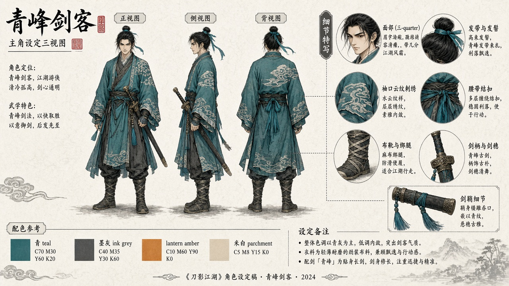
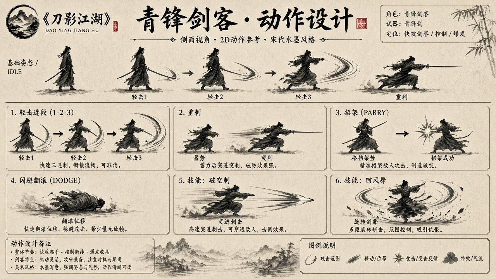
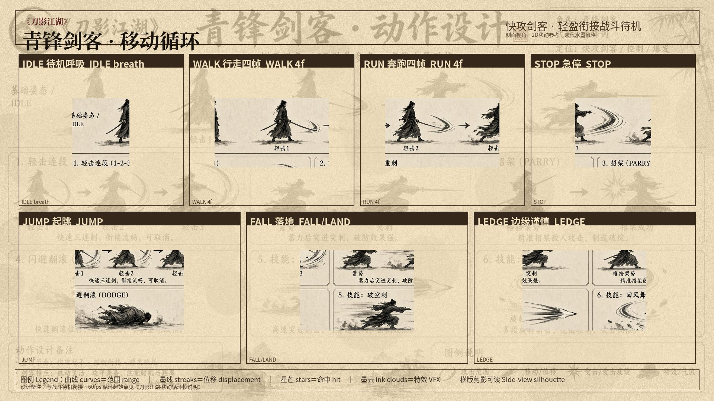

# 刀影江湖

横版武侠 ARPG。买断制、无抽卡。引擎为 **团结引擎 1.10.2**（对应 Unity 2022.3.62t14）。

| 项 | 内容 |
|---|---|
| 类型 | 横版动作角色扮演 |
| 主角 | 青锋剑客 |
| 工程 | `New Tuanjie Project/` |
| 设计 | `设计/` |

---

## 本次进展（青锋剑客精灵）

按青袍侧视设定，用 generate2dsprite 做出可进游戏的待机 / 行走帧，并接到 Animator：`Speed > 0.1` 切行走，松开回到待机。预览场景 `Assets/Scenes/SpritePreview.unity`，战斗原型 `Assets/Scenes/CombatPrototype.unity` 里玩家也会用这套图。Play 后先点 Game 窗口，再按 **A / D**。

参考设定：

### 待机 · 6 帧（2×3）

侧视持剑站立，只做呼吸与衣发微动。脚底对齐，尺度配置写在 `character-scale-profile.json`，后续动作共用。

| 文件 | 说明 |
|---|---|
| `New Tuanjie Project/Assets/Sprites/Player/Idle/idle-1.png` … `idle-6.png` | 单帧 |
| `Idle/sheet-transparent.png` | 透明图集 |
| `Idle/PlayerIdle.anim` | 循环剪辑 |
| `Idle/PlayerIdle.controller` | Idle ↔ Walk 状态机 |

### 行走 · 8 帧（2×4，12 FPS）

Contact / Down / Passing / Up ×2：脚跟先着地，F2/F6 重心下沉，F4/F8 头与支撑最高，袍摆分开露出双靴。

| 文件 | 说明 |
|---|---|
| `Walk/walk-1.png` … `walk-8.png` | 单帧 |
| `Walk/walk-stride.json` | 支撑脚位移与设计移速（约 2.21 单位/秒） |
| `Walk/PlayerWalk.anim` | 循环剪辑（每帧 83ms） |

行走时世界移速必须和脚步后移匹配，否则会打滑。预览按设计移速平移；战斗里 `CharacterFootskateFix` 按「实际移速 / 设计移速」缩放 Animator。预览地面有刻度线，可对支撑脚。

菜单 **刀影江湖 → 生成待机与行走帧动画** 会把 png 重新写成剪辑并挂到控制器。

---

## 概念图

目录：`设计/刀影江湖-概念图/`（主视觉 01–42、人物设定表、动作设计、场景地图）。索引见同目录 `README-概念图索引.md`。

### 动作设计

`设计/刀影江湖-概念图/人物设定/动作设计/`

| 文件 | 内容 |
|---|---|
| `01-青锋剑客-动作设计.png` | 待机 / 轻连 / 重刺 / 招架 / 闪避等 |
| `11-青锋剑客-移动循环.jpg` | 本次行走帧的姿势参考 |
| `02`–`10` | 魔刀、落云、Boss、敌人、NPC |
| `12`–`15` | 各势力移动循环 |

### 人物设定表

`设计/刀影江湖-概念图/人物设定/`：青锋模板、三门弟子、杂兵、Boss、NPC 三视图。

### 场景地图

`设计/刀影江湖-概念图/场景地图/`：清河、夜奔官道、雁门、南屿等枢纽与 Boss 场。

---

## 设计文档

| 文件 | 内容 |
|---|---|
| `设计/刀影江湖-游戏设计文档.md` | GDD v1.0 |
| `设计/刀影江湖-任务流程.md` | 任务流程 |
| `设计/刀影江湖-战斗帧数据表-v0.1.md` | 战斗帧 |
| `设计/刀影江湖-剧情对白旁白全本.md` | 对白旁白 |
| `设计/刀影江湖-场景镜头描述本.md` | 镜头 |

---

## 工程入口

- 团结工程：`New Tuanjie Project/`
- 玩家脚本：`Assets/Scripts/Player/`、`Assets/Scripts/Combat/`
- 预览输入：`PlayerSpriteLocomotion.cs`（A/D 改 Speed，按设计移速横移）
- 打滑修正：`CharacterFootskateFix.cs`、`QingfengWalkStride.cs`
- 战斗里玩家精灵：`CombatActor` 加载 `PlayerIdle.controller`
