# 刀影江湖 (Blade Shadows: Jianghu)

> **水墨国风硬派 2D 横版武侠动作游戏 · 纯运动学物理实机战斗原型**

《刀影江湖》是一款水墨国风硬派写实风格的 2D 横版动作游戏。核心战斗设计秉持 **“严谨帧数据、刀刀入肉、架势破绽、精准招架、剑意绽放”** 的理念，融入中国传统武术套路与冷兵器碰撞的沉浸打击感。

---

## 目录

- [一、 实机战斗原型场景](#一-实机战斗原型场景)
- [二、 角色动作全览与动态展示](#二-角色动作全览与动态展示)
  - [1. 青锋剑客（玩家）基础动作全套](#1-青锋剑客玩家基础动作全套)
  - [2. 青锋剑派技能一：破空刺全案与剑意绽放体系](#2-青锋剑派技能一破空刺全案与剑意绽放体系)
  - [3. 青锋剑派技能二：回风舞 (Whirling Wind Dance 全解)](#3-青锋剑派技能二回风舞-whirling-wind-dance-全解)
  - [4. 青锋剑派技能三：一剑霜寒 (Frostbound Slash 全解)](#4-青锋剑派技能三一剑霜寒-frostbound-slash-全解)
  - [5. 杂兵刀手（敌人）全套动作序列](#5-杂兵刀手敌人全套动作序列)
  - [6. 青锋 vs 杂兵 行进步伐同步对比](#6-青锋-vs-杂兵-行进步伐同步对比)
- [三、 完整设计报告与文档索引](#三-完整设计报告与文档索引)
- [四、 概念设计与美术资产](#四-概念设计与美术资产)
- [五、 操作指南与战斗系统](#五-操作指南与战斗系统)
- [六、 技术架构与工程入口](#六-技术架构与工程入口)

---

## 一、 实机战斗原型场景

实机战斗场景：**`New Tuanjie Project/Assets/Scenes/CombatPrototype.unity`**  
动作与技能独立预览场景：**`New Tuanjie Project/Assets/Scenes/SpritePreview.unity`**

* **双角色与技能完整接入**：
  * **青锋剑客（玩家）**：12 个基础动作 + 破空刺（常态与剑意绽放双形态）全链路无缝流转，涵盖地面机动、空中机动、轻连三段、蓄力重刺、三段防御弹反与剑意绝技。
  * **杂兵刀手（AI 敌人）**：基于真实视频扣帧精雕的 8 帧持刀呼吸待机循环、15 帧同步巡逻行步、近战横斩蓄力突袭。
* **纯运动学物理对地吸附（彻底解决“卡脚”/打滑）**：
  * 基于 `KinematicBody2D` 运动学底座，采用贴合足底的向下盒形扫掠（$y=+0.15$ 向下检测 $0.20 - dy$），确保角色移动与站立时绝对稳固贴地，杜绝微悬空误判与伪落地硬直抖动。
* **高打击感顿挫机制**：
  * 全局固定 60FPS 逻辑帧，融合 **顿帧（Hitstop 2~8 帧）**、**时空慢放（Chrono Pause / SlowMo）**、**全屏水墨震颤** 与受击后退卸力。
  * 命中敌兵显示伤害飘字；精准弹反触发金色“弹反!”暴击星芒并强制打断敌招，赋予 28 帧追击破绽。

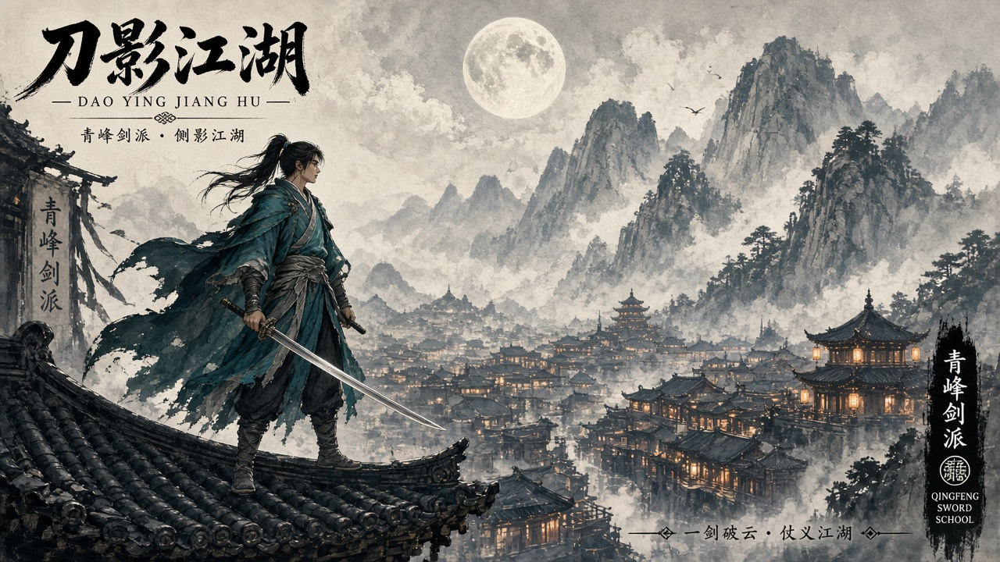

---

## 二、 角色动作全览与动态展示

### 1. 青锋剑客（玩家）基础动作全套

青锋剑客采用统一标准的 680×480 透明精灵，像素单位比（PPU）为 214，足底基准线锁定。

#### 动态动作循环展示

| 1. 原地待机 (Idle · 8f) | 2. 慢步走 (Walk · 15f) | 3. 疾奔 (Run · 9f) | 4. 轻功跳跃 (Jump · 8f) |
|:---:|:---:|:---:|:---:|
|  |  |  |  |

| 5. 翻滚闪避 (Dodge · 8f) | 6. 重击突刺 (Heavy · 8f) | 7. 轻击三连段 (Attack · 12f) |
|:---:|:---:|:---:|
|  |  |  |

#### 三段式格挡防御与精准弹反体系

| 一、 没挡刀（纯防守架势） | 二、 普通格挡成功（微弱亮光） | 三、 完美格挡成功（暴烈大特效） |
|:---:|:---:|:---:|
|  |  |  |
| 7 帧，支持按住 `F` 持续固守防御 | 4 帧，刃口十字微光，后错 3px 卸力，减伤 70% | 6 帧，前 0.18s 精准弹反窗触发，100% 免疫伤害，刺目星芒与水墨爆裂，破敌硬直 |

#### 青锋横向帧序列图集

* **待机序列（8 帧）**：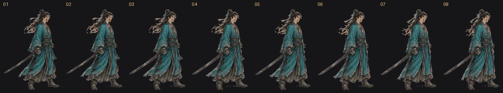
* **慢步行走序列（15 帧）**：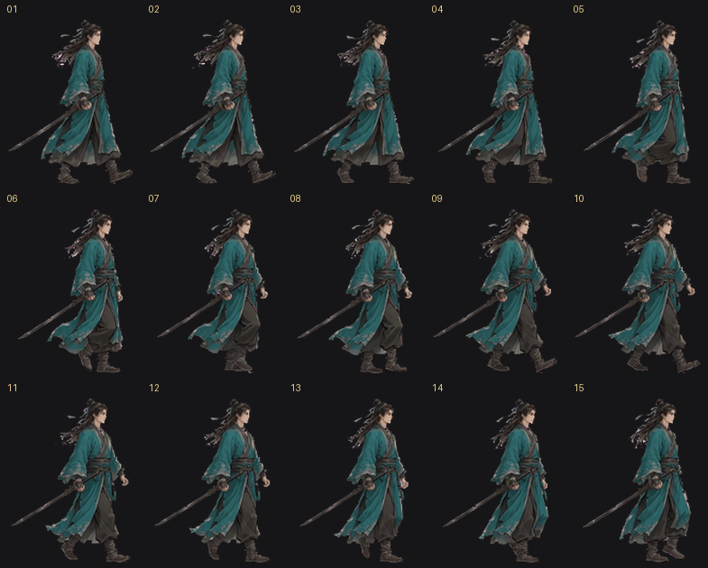
* **快步疾奔序列（9 帧）**：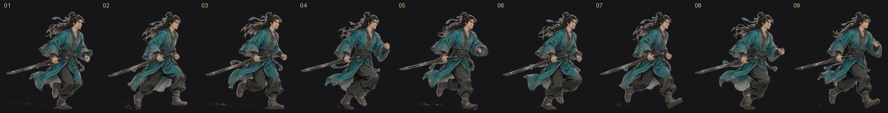
* **轻攻击三连段序列（12 帧）**：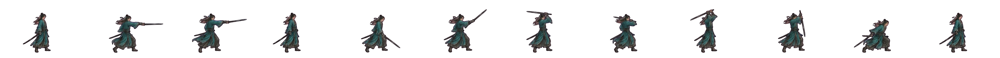
* **重刺破防突进序列（8 帧）**：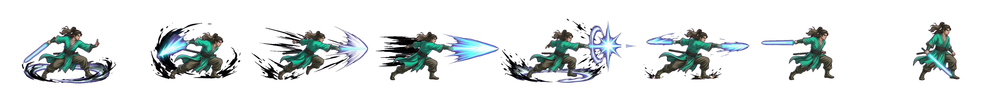
* **翻滚闪避序列（8 帧）**：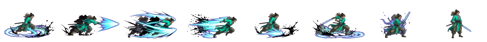
* **轻功跳跃序列（8 帧）**：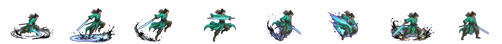
* **三段式防御与弹反长序列（8 帧复合）**：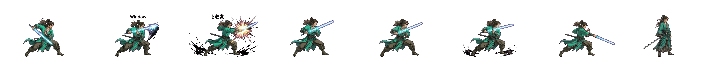

---

### 2. 青锋剑派技能一：破空刺全案与剑意绽放体系

青锋剑派以**“剑气流动、墨迹晕染、冰霜凝结”**为核心美学，配备 **5 阶剑意槽（Sword Intent Bar）** 与 **剑意绽放（Sword Intent Bloom）** 机制。

#### 破空刺双形态动图演示与连续序列帧 (680×480 PPU 214)

| 常态版：破空刺 (QF-1 · 瞬透飞身刺) | 剑意绽放强化版：极·破空刺 (QF-1E · 裂空时空穿透) |
|:---:|:---:|
| 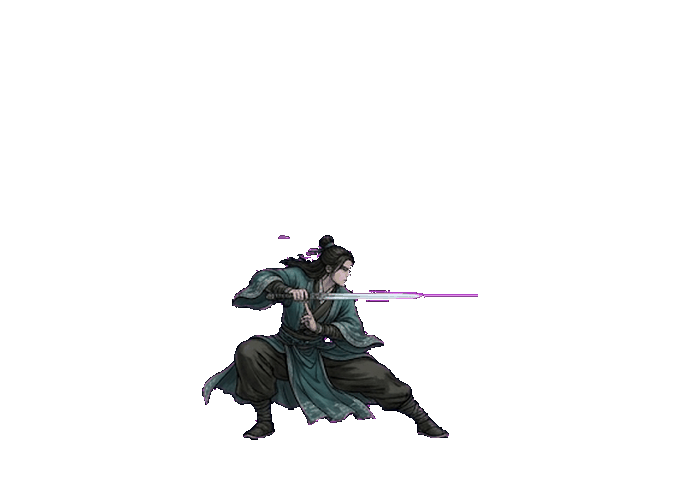 | 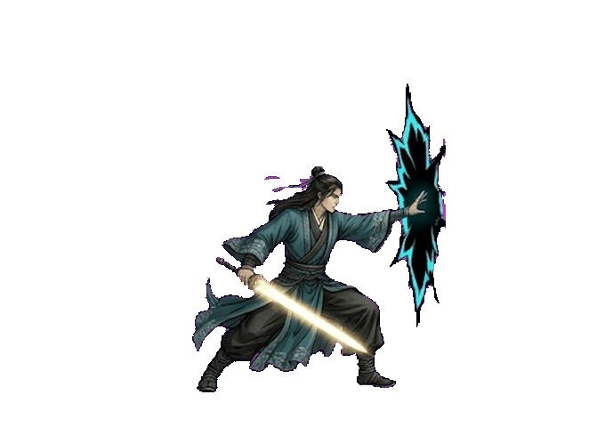 |
| **8 阶段错身穿透剑法**（贴地敛气·离弦激射·瞬影贯体·单膝跪滑·延时墨爆·回锋抽意·导刃回鞘·秋水归渊） | **8 阶段毁灭空间穿透**（龙吟聚风·金芒破空·错身碎空·金刚逆滑·暗渊沉爆·金墨断脉·玄冰冻空·万象乾坤） |

#### 破空刺双形态完整序列帧 (F1~F8 严格对齐足底基准线 Y=437，标准画布 680×480)

* **常态版·破空刺 8 阶段序列图**：
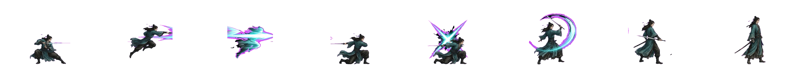

* **剑意绽放强化版·极破空刺 8 阶段序列图**：
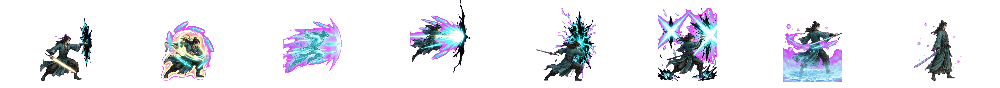

#### 剑意绽放强化版·极破空刺 电影级特效全案设计图
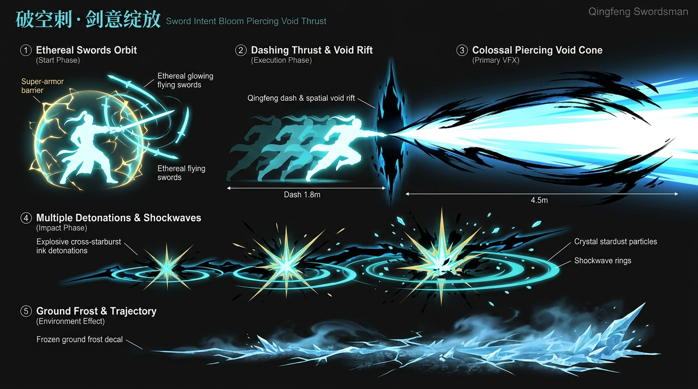

* **五大电影级视觉特效演进 (16:9 工业级分镜全案剖析)**：
  1. **① 蓄力与霸体判定 (Startup & Super Armor)**：金青罡气护罩笼罩周身，4 柄青芒飞剑超高速螺旋环绕形成高压风切压缩区，蓄势待发（刚体免断）。
  2. **② 破空瞬身与穿梭突刺 (Phasing Dash & Colossal Void Cone)**：人剑合一突破音障，身后留下 5 重幽蓝水墨残影重叠，向前爆发 4.5 米极白破空能量巨锥。
  3. **③ 空间撕裂与时停定帧 (Spatial Void Rift & Chrono Hitstop)**：突刺轨迹撕裂开一道深黑空间裂隙，周围迸溅电告青蓝高频火花与全屏色差故障，进入 6f 时空凝滞。
  4. **④ 敌后急刹与三度墨爆 (Brake Glider & Triple Detonation)**：穿透至敌后 1.5 米处单膝擦地滑行刹车；穿透路径上 3 处爆裂交叉点连环触发十字星芒爆破与环形水墨冲击波。
  5. **⑤ 霜华结界与收剑归鞘 (Ground Frost Decal & Resonant Settle)**：地面生成半径 4 米的晶莹玄冰霜华结界并升腾冷冽白雾（附带 30% 减速），剑客从容挽花入鞘。

#### 三招核心体验与战术定位对比 (彻底解决招式撞车)

```
【重刺】：刚猛千钧 · 正面重炮 ──> 双足死踏地面 ──> 16f长蓄力推击 ──> 撞在敌人胸前停住 ──> 破防断盾
【破空刺·常态】：身法错身 · 瞬透敌后 ──> 贴地掠风飞身 ──> 5f极速出剑 ──> 直接穿透敌躯直达敌后1.3m ──> 延时剑气爆裂
【极·破空刺·绽放】：虚空撕裂 · 毁灭终结 ──> 四灵飞剑环绕 ──> 4.5m裂空巨锥全穿透1.8m ──> 时空静止 ──> 三度断空墨爆 + 冰霜结界
```

| 招式阶梯 | 键位 | 空间身位交互 | 核心战斗用途 | 视听特效语言 |
| :--- | :--- | :--- | :--- | :--- |
| **重刺 (`A_H`)** | `K` / 鼠标右键 | **正前身前停住 (+0.4m)** | **打防守与硬刚**：破盾破防，削减巨额架势，击碎敌人前摇。 | 粗圆锥物理气爆 + 地面碎石迸溅，沉实金属撞击 |
| **常态破空刺 (`QF-1`)** | `Q` / `U` | **直接穿透敌躯，瞬移敌后 (+1.3m)** | **换位突刺与切入**：穿过群怪包围圈、瞬移敌后破侧防（可接 `J` 转身背刺）。 | 极细青白激光斩线 + 水墨平切风刃 + 敌后单次延时破空墨爆 |
| **极·破空刺·绽放 (`QF-1E`)** | 满剑意 `Q` / `U` | **全穿透无敌冲刺 (+1.8m)** | **毁灭终结与群杀**：穿透一切重型霸体与 Boss，造成 3.4× 毁灭伤害与冰霜控场。 | 四灵飞剑环绕 + 4.5m 裂空巨锥 + 6f 时空停滞 + 虚空裂痕 + 三度断空墨爆 + 4m 冰霜结界 |

---

### 3. 青锋剑派技能二：回风舞 (Whirling Wind Dance 全解)

回风舞为青锋剑派核心**360°全方位解围与范围绞杀**技能。摒弃传统尴尬的套圈龙卷风视觉，升级为**国风狂草剑意·凌厉残月斩**：剑走龙蛇，剑尖爆绽寒芒星火，双层横掠与斜切残月剑芒交叠成暴风剑幕，配合剑气真空牵引形成绝对杀阵。

#### 回风舞双形态动图演示与连续序列帧 (680×480 PPU 214)

| 常态版：回风舞 (QF-2 · 双层残月破围) | 剑意绽放强化版：青鸾风暴 (QF-2E · 5段狂风黑洞绞杀) |
|:---:|:---:|
| 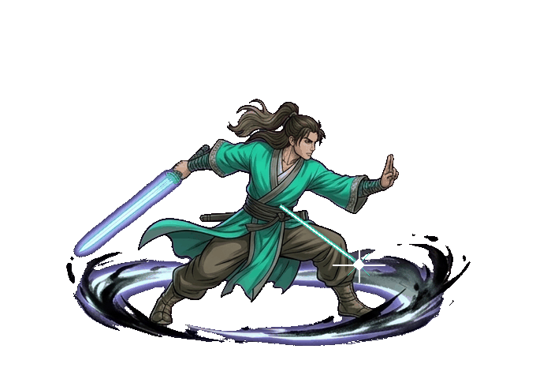 | 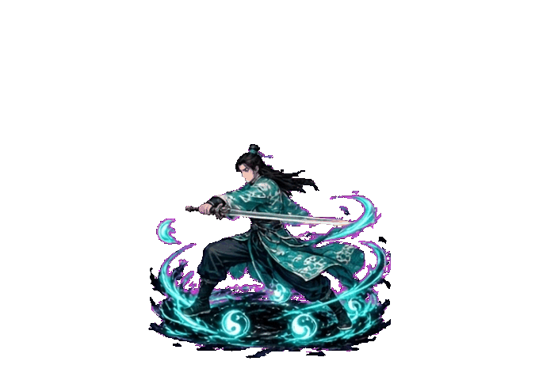 |
| **8 阶段纯实打实双手挥剑**（蓄势·起势·凌空·舒臂·双月交叉·定地·挽花·归鞘） | **青鸾法相神鸟振翼**（太极引力涡·青鸾振翼·双风连环·法相冲霄·双鸾绞刃·破岚定地·散羽·归渊） |

#### 回风舞双形态完整序列帧 (F1~F8 严格对齐足底基准线 Y=437，标准画布 680×480)

* **常态版·回风舞 8 阶段序列图**：
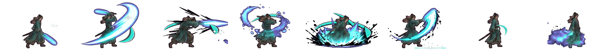

* **剑意绽放强化版·青鸾风暴 8 阶段序列图**：
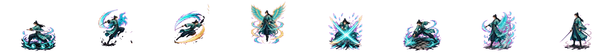

#### 强化版·回风舞（青鸾风暴）电影级特效全案设计图 (1920×1080)
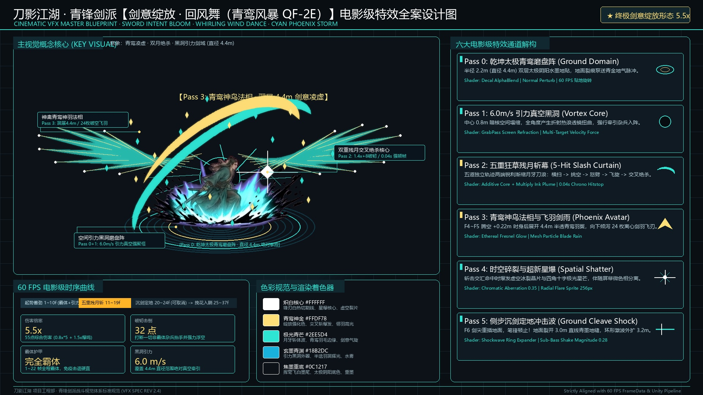

#### 回风舞双形态战斗数值对比

| 维度 | 常态：回风舞 (`QF-2`) | 强化：青鸾风暴 (`QF-2E`) | 战术定位与核心价值 |
| :--- | :--- | :--- | :--- |
| **触发按键** | `E` 或 `O` / `LB` | 满 5 层剑意按 `E` 或 `O` | 瞬间范围解围 / 团控清场 |
| **判定范围** | **半径 1.4m 环形圆周** (直径 2.8m) | **半径 2.2m 极域风暴** (直径 4.4m) | 覆盖身前、身后及斜上方全角度 |
| **聚怪牵引** | **微风牵引** (引力速度 1.5m/s) | **青鸾黑洞** (极强引力 6.0m/s) | 强行将周围围攻杂兵聚拢在剑圈内绞杀 |
| **伤害倍率** | **1.2x + 1.4x = 2.6x** (26点) | **0.8x × 5 + 1.5x = 5.5x** (55点) | 强化版 5 段高速连斩破甲爆发 |
| **破韧压制** | **7 + 8 = 15 点** | **32 点 (打断一切杂兵前摇)** | 强制破除围攻敌人的霸体与攻击动作 |
| **霸体状态** | 6~19 帧 **软霸体** (防轻击打断) | 1~22 帧 **完全霸体** (免疫击倒) | 保证在被围攻绝境中能稳定完整出手 |
| **位移与身位** | 原地中心旋转 ($v_x = 0$) | 原地微浮空 ($v_x = 0, v_y = +0.2\text{m}$) | 不会产生错位偏差，原地强控中心点 |

---

### 4. 青锋剑派技能三：一剑霜寒 (Frostbound Slash 全解)

> **“满堂花醉三千客，一剑霜寒十四州。”**

一剑霜寒为青锋剑派核心**直线破防、远程贯穿与绝对压制**绝技。区别于重刺的贴身推撞、破空刺的身法穿透和回风舞的环形绞杀，一剑霜寒专注于**超远距离（2.6m~3.8m）** 直线穿导霜线，必定击溃敌方格挡并破盾，在地面留存减速冰雾，为玩家创造完美的突进输出窗口。

#### 一剑霜寒动图演示与连续序列帧 (680×480 PPU 214)

| 一剑霜寒 8 阶段循环动图 (GIF) |
|:---:|
|  |

#### 一剑霜寒 8 阶段关键帧序列图 (F1~F8 严格对齐 Y=437，足底锁死，杜绝抖动)
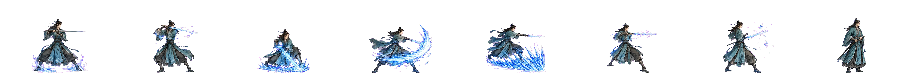

#### 动作阶段与武学解构 (60 FPS)

```
[结势立基] ──> F1 (1~6f):   结势·冰霜凝聚 (双足拉开扎马，双手握剑横胸，脚下初结微霜花环)
[寒气灌刃] ──> F2 (7~14f):  提剑·寒气汇聚 (双手提剑斜举右肩，极寒冻气化作漩涡向剑刃螺旋汇聚)
[蓄力极峰] ──> F3 (15~20f): 蓄力·冰刃成型 [可蓄至45f] (整柄剑凝结为深蓝透明玄冰巨剑，地表炸裂深蓝冰纹)
[雷霆横斩] ──> F4 (21~24f): 斩出·霜寒剑芒 (Active 1 · 后足猛蹬爆发超宽极寒冰刃横扫，1.6x 伤害 + 15 破韧)
[霜线破空] ──> F5 (25~28f): 前刺·冰锋破地 (Active 2 · 贴地狂飙 2.6m 锐利霜线，拔地突刺整排尖锐冰棱，必破重盾)
[踏雪止动] ──> F6 (29~36f): 进步·寒气延绵 (弓步踏实，前方留存 2.0s 减速冰雾带 · 开放闪避/破空刺取消窗)
[振刃碎霜] ──> F7 (37~44f): 振刃·冰晶碎散 (手腕轻抖挽剑，剑身微震震碎薄冰，菱形冰晶爆散四溅)
[敛气归鞘] ──> F8 (45~54f): 入鞘·风息归平 (双手收剑入怀，秋水敛锋入鞘，从容无缝衔接待机 Idle)
```

#### 剑意绽放强化版·极一剑霜寒（冰魄玄峰）动图与序列帧

> **“冰魄玄峰拔地起，寒绝千丈冻九垓。”**

当玩家积攒满 5 层剑意释放一剑霜寒时，招式发生剧烈质变：**霜线贯穿全屏（3.8m+），拔地而起整排高达 2 米的晶莹冰魄玄峰，对全场敌军施加「绝对霜冻」强制定身 1.5 秒，并在定身结束瞬间引发毁灭性的万晶碎峰二次爆破（总伤 8.0x）！**

| 极·一剑霜寒（冰魄玄峰）8 阶段循环动图 (GIF) |
|:---:|
| 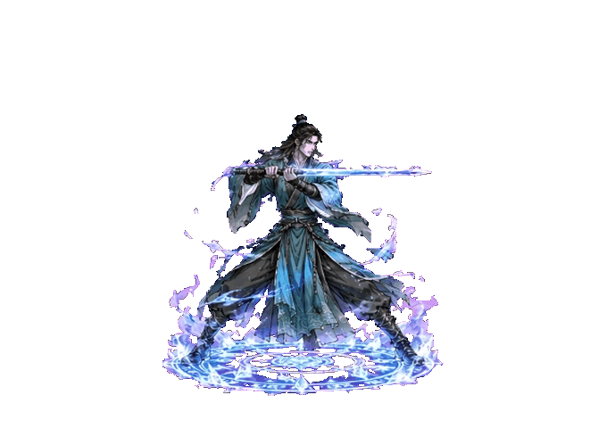 |

#### 极·一剑霜寒 8 阶段关键帧序列图 (F1~F8 严格对齐 Y=437，足底锁死)
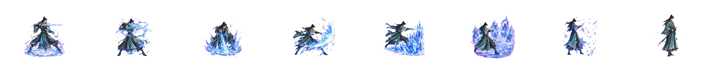

#### 剑意绽放强化版·一剑霜寒 电影级特效全案设计图 (UE5 规格)
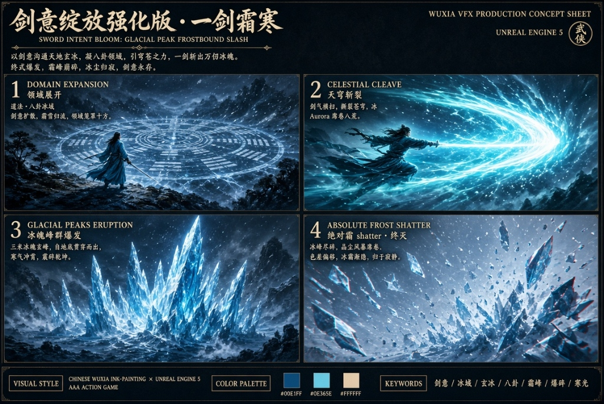

#### 一剑霜寒双形态战斗数值对比

| 维度 | 常态：一剑霜寒 (`QF-3`) | 强化：冰魄玄峰 (`QF-3E`) | 战术定位与核心价值 |
| :--- | :--- | :--- | :--- |
| **触发按键** | `I` / `RT` | 满 5 层剑意按 `I` / `RT` | 超远破防 / 全屏绝对定身 |
| **判定距离** | **直线 2.6m 破防霜线** | **直线 3.8m+ 全屏极光穿透** | 无视敌群阻挡，全屏直线贯穿 |
| **视觉场域** | 地面尖锐冰棱小晶簇 | **拔地而起 2 米高冰魄玄峰群** | 战场地形改变，巍峨耸立 |
| **伤害倍率** | **3.4x (满蓄 4.5x)** | **6.2x + 1.8x = 8.0x 终极爆发** | 门派单次输出最高的终极大招 |
| **削韧压制** | **35 点 (必定破盾破防)** | **55 点 (彻底击碎一切重盾与姿态)** | 摧毁敌方任何形式的格挡与霸体 |
| **异常控制** | 减速 40% (冰霜带留存 2.0s) | **【绝对霜冻】强制冰封定身 1.5 秒** | 无法受身打断的最强控制时间窗 |
| **二次爆破** | 无 | **碎峰万晶杀 (千片菱形冰晶溅射)** | 1.5s 后玄峰爆碎，范围二次收割 |

#### 青锋剑客四大核心攻击/绝技战术矩阵 (彻底解决招式撞车)

| 招式阶梯 | 键位 | 空间身位交互 | 核心战斗定位 | 视听特效语言 |
| :--- | :--- | :--- | :--- | :--- |
| **重刺 (`A_H`)** | `K` / 鼠标右键 | 正前身前停住 (+0.4m) | **打防守与硬刚**：削减巨额架势，击碎敌人前摇 | 粗圆锥物理气爆 + 地面碎石迸溅，沉实金属撞击 |
| **破空刺 (`QF-1`)** | `Q` 或 `U` | 穿透敌躯，瞬移敌后 (+1.3m) | **身法错位与背刺**：穿透包围圈，打背身破绽 | 极细青白激光斩线 + 水墨风刃 + 延时单次破空墨爆 |
| **回风舞 (`QF-2`)** | `E` 或 `O` | 原地 360° 中心旋转 ($v_x=0$) | **群体解围与范围绞杀**：微风牵引聚怪，打散围攻 | 狂草残月斩 + 双重风刃交错 + 剑尖寒芒星火 |
| **一剑霜寒 (`QF-3`)** | `I` / `RT` | 稳踏地面，向前贯刺 (+0.35m) | **超远程直线破防**：2.6m 直线霜线必破盾，留存减速带 | 深蓝玄冰巨剑 + 贴地撕裂激光霜线 + 拔地冰棱尖刺 |
| **极·一剑霜寒 (`QF-3E`)**| 满剑意 `I` / `RT` | 稳踏地面，前冲突进 (+0.55m) | **全屏斩杀与绝对冰封**：3.8m+ 冰魄玄峰破土，定身1.5s，二次爆破 8.0x | 霜降八卦冰阵 + 天幕极光裂斩 + 2米高耸冰峰 + 绝对霜冻 + 万晶爆碎 |

---

### 5. 杂兵刀手（敌人）全套动作序列

杂兵刀手为最基础的敌方近战单位，采用江湖刀客的水墨粗布风格，佩戴单手雁翎短刀。所有动作规格严格对齐青锋基准线（680×480 画布，PPU 214，足底锁定 Y=435）。

| 1. 原地警戒待机 (Idle · 8f) | 2. 巡逻步伐 (Walk · 15f) | 3. 横斩挥砍 (AttackA · 4f) |
|:---:|:---:|:---:|
|  |  |  |

#### 杂兵设计与立绘图

| 杂兵立绘概念图 | 杂兵动作设计全套原画 |
|:---:|:---:|
| 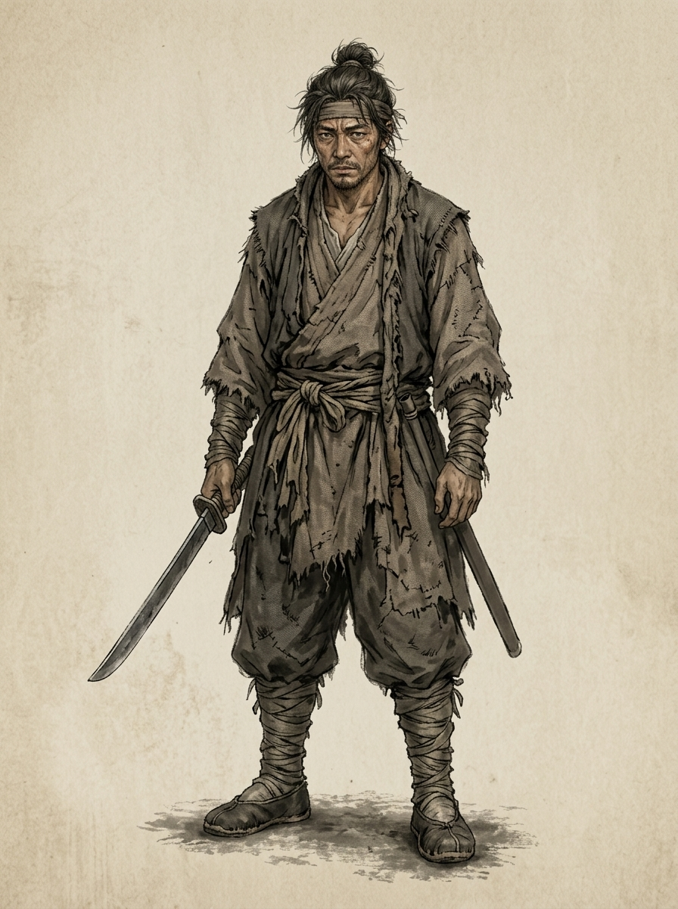 | 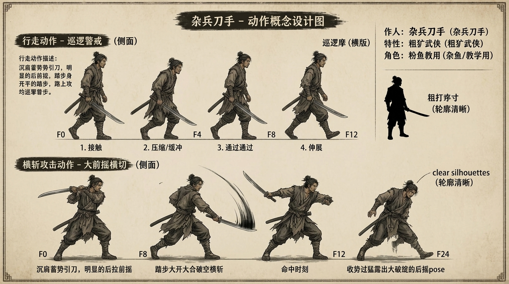 |

#### 杂兵帧序列图集

* **待机警戒序列图（8 帧循环）**：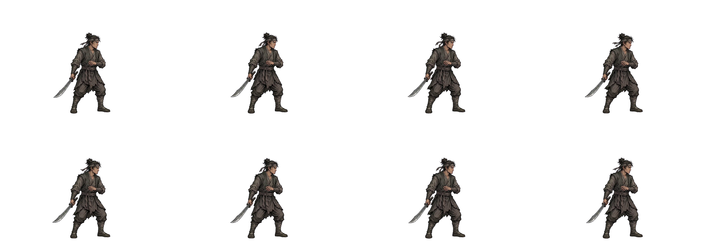
* **巡逻行步序列图（15 帧标准步伐）**：
* **横斩挥击序列图（4 帧蓄力前挥）**：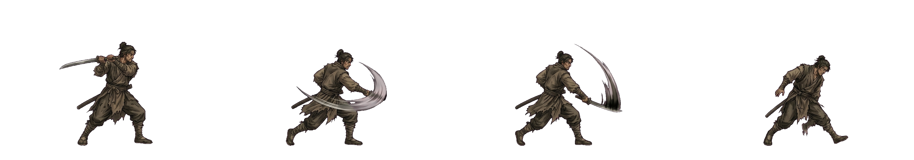

---

### 6. 青锋 vs 杂兵 行进步伐同步对比

青锋与杂兵刀手的慢步行走均采用严格对齐的 **15 帧步幅设计**，落地接触相位相差精准，步幅与位移完全匹配地面摩擦力，杜绝溜冰打滑与长短脚现象。

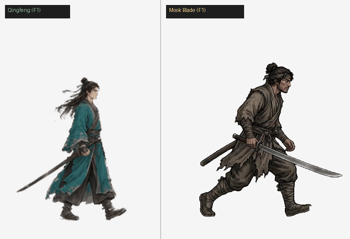

---

## 三、 完整设计报告与文档索引

所有设计文档均位于 `设计/` 目录下，包含详细的世界观、系统规则、剧情全本、关卡镜头及所有动作的精确帧级拆解报告：

### 核心系统与剧情文档

| 文档名称 | 链接 | 核心内容概要 |
|---|---|---|
| **游戏设计文档 (GDD v1.0)** | [刀影江湖-游戏设计文档.md](设计/刀影江湖-游戏设计文档.md) | 总体架构、核心循环、三大门派、资源设定、Boss阶段流转 |
| **战斗帧数据表 v0.1** | [刀影江湖-战斗帧数据表-v0.1.md](设计/刀影江湖-战斗帧数据表-v0.1.md) | 全动作起手/判定/后摇帧数、取消窗、无敌帧、击退距离 |
| **任务流程规划** | [刀影江湖-任务流程.md](设计/刀影江湖-任务流程.md) | 序章夜奔、清河寻医、雪夜雁门、南屿绝杀等四幕任务流 |
| **剧情对白旁白全本** | [刀影江湖-剧情对白旁白全本.md](设计/刀影江湖-剧情对白旁白全本.md) | 全过场对白、旁白诵诗、NPC 互动台词与分支文本 |
| **场景镜头描述本** | [刀影江湖-场景镜头描述本.md](设计/刀影江湖-场景镜头描述本.md) | 2D 电影感镜头景深、运镜轨迹、特写机位与环境气氛 |

### 动作帧与技能全案设计报告

| 动作规范报告 | 链接 | 核心设计拆解 |
|---|---|---|
| **青锋破空刺动作帧设计表 (重塑版)** | [刀影江湖-破空刺动作帧设计表.md](设计/刀影江湖-破空刺动作帧设计表.md) | 彻底区别于重刺：贴地掠飞、+1.3m 错身穿透敌后、延时单次破空墨爆、极细激光斩线 |
| **破空刺·剑意绽放强化版全案** | [刀影江湖-破空刺(剑意绽放强化版)动作帧设计表.md](设计/刀影江湖-破空刺(剑意绽放强化版)动作帧设计表.md) | 8 相位 P1~P8 60fps 时序、四灵飞剑、4.5m 裂空巨锥、时空停滞、三度断空墨爆、冰霜结界 |
| **青锋剑术技能动画设计全案** | [刀影江湖-青锋剑术技能动画设计表.md](设计/刀影江湖-青锋剑术技能动画设计表.md) | 6 大门派技能（破空刺、回风舞、一剑霜寒、御剑飞来、以剑御气、万剑归宗）与 5 阶剑意机制 |
| **青锋一剑霜寒动作帧设计表** | [刀影江湖-一剑霜寒动作帧设计表.md](设计/刀影江湖-一剑霜寒动作帧设计表.md) | 8 相位时序、超远直线破防霜线、必破重盾破架势、地表拔起尖锐冰棱群、减速冰雾带 |
| **一剑霜寒·剑意绽放强化版全案** | [刀影江湖-一剑霜寒(剑意绽放强化版)动作帧设计表.md](设计/刀影江湖-一剑霜寒(剑意绽放强化版)动作帧设计表.md) | 8 相位 F1~F8 时序、3.8m+全屏贯穿、2米高耸冰魄玄峰群、绝对霜冻1.5s、万晶碎爆8.0x |
| **青锋重刺动作帧设计表** | [刀影江湖-重刺动作帧设计表.md](设计/刀影江湖-重刺动作帧设计表.md) | 概念图贯穿突进重现、霸体蓄力前摇、破防削韧、正面推刺不换位 |
| **青锋格挡动作帧设计表** | [刀影江湖-格挡动作帧设计表.md](设计/刀影江湖-格挡动作帧设计表.md) | 三段防御体系（架势/微光/星芒）、0.18s 精准弹反窗、大反震破绽 |
| **青锋闪避动作帧设计表** | [刀影江湖-闪避动作帧设计表.md](设计/刀影江湖-闪避动作帧设计表.md) | 8 相位残影翻滚、3~12 帧无敌窗、擦地刹车与位移手感 |
| **青锋跳跃动作帧设计表** | [刀影江湖-跳跃动作帧设计表.md](设计/刀影江湖-跳跃动作帧设计表.md) | 3 帧起跳深蹲、40~44 帧滞空腾跃、空中轻重攻击派生与落地缓冲 |
| **青锋行走动作帧设计表** | [刀影江湖-行走动作帧设计表.md](设计/刀影江湖-行走动作帧设计表.md) | 36 帧周期、短步轻走、Walk 前倾 0~3°、脚底贴地锁定 |
| **青锋跑步动作帧设计表** | [刀影江湖-跑步动作帧设计表.md](设计/刀影江湖-跑步动作帧设计表.md) | 26 帧周期、中长快步、腾空 40~45%、急停立直与飘带极值 |
| **杂兵刀手动作帧设计表** | [刀影江湖-杂兵刀手动作帧设计表.md](设计/刀影江湖-杂兵刀手动作帧设计表.md) | 刀兵待机呼吸周期、15 帧行步挂点、挥砍前摇与受击结算 |

---

## 四、 概念设计与美术资产

概念图目录位于 `设计/刀影江湖-概念图/`，详细索引请参阅 [README-概念图索引.md](设计/刀影江湖-概念图/README-概念图索引.md)。

* **青锋剑派技能特效设定表**：
  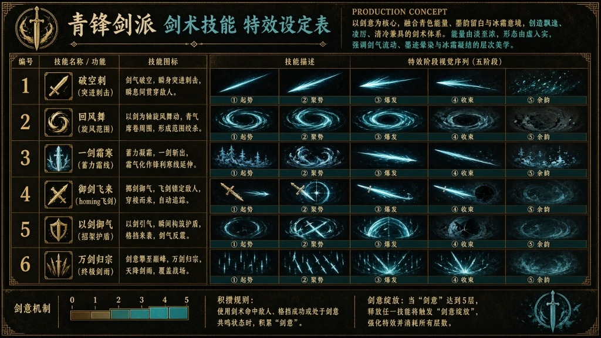
* **主角三视图与细节拆解**：
  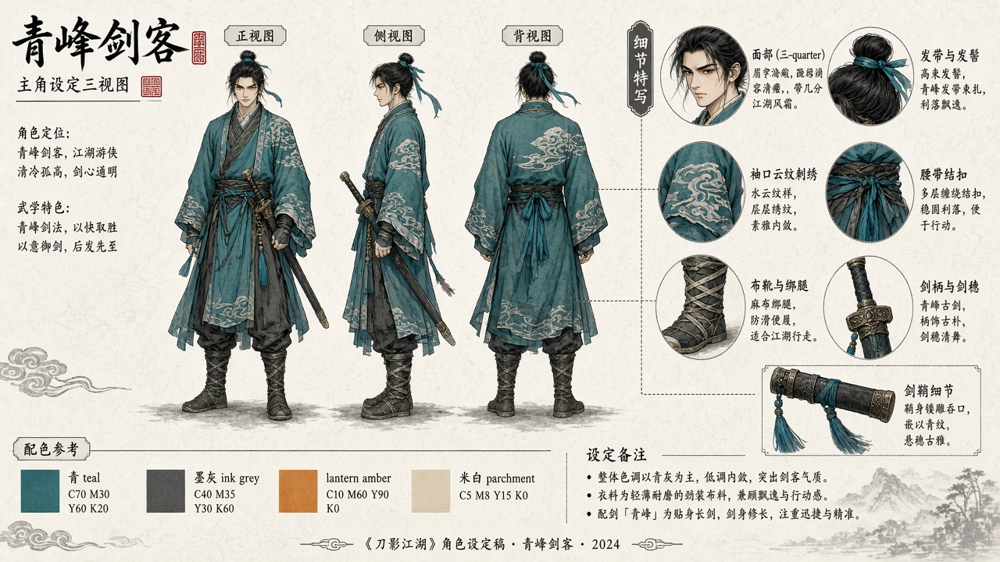
* **人物设定集**：`设计/刀影江湖-概念图/人物设定/`（青锋剑客、魔刀弟子、落云枪客、黑衣头目、红甲捕头、平民 NPC）
* **场景设计集**：`设计/刀影江湖-概念图/场景地图/`（清河城枢纽、夜奔官道、雁门关绝壁、南屿水泊）

---

## 五、 操作指南与战斗系统

支持键盘与 Xbox/PS 手柄：

| 操作类型 | 键盘键位 | 鼠标 / 手柄 | 动作与战术说明 |
|---|---|---|---|
| **移动 (慢步走)** | `A` / `D` | 左摇杆水平 | 触发 15 帧行进步法，移速约 1.6 单位/秒 |
| **疾奔 (冲刺跑)** | 按住 `Shift` + `A`/`D` | `L3` (按下摇杆) | 触发 9 帧大步疾奔，移速约 5.5 单位/秒 |
| **轻攻击 (三连击)** | `J` | 鼠标左键 / `X (Xbox)` | 依次派生平斩 $\rightarrow$ 上挑 $\rightarrow$ 回旋力劈，压制敌兵架势 |
| **重击突刺** | `K` | 鼠标右键 / `Y (Xbox)` | 正面重刺推击（位移 +0.4m 不换位）；破盾削盾主力 |
| **破空刺 (常态)** | `Q` 或 `U` | `RB / R1` | **飞身错身穿透**：瞬移穿透敌人直达敌后 (+1.3m)，延时引爆剑气，绕过盾牌防守 |
| **极·破空刺 (绽放)** | 满 5 阶剑意按 `Q` / `U` | 同上 | **剑意绽放强化版**：无敌全穿透 (+1.8m) + 4.5m 巨锥 + 时空停滞 + 三度断空墨爆 + 冰霜霜痕 |
| **回风舞** | `E` 或 `O` | `LB / L1` | 360° 身周双段范围旋风剑气，清杂聚怪 |
| **一剑霜寒 (常态)** | `I` | `RT / R2` | 长距离蓄力冰霜拔剑斩，必破敌盾 |
| **极·一剑霜寒 (绽放)** | 满 5 阶剑意按 `I` | 同上 | **终极冰魄玄峰**：全屏贯穿 + 2米高耸玄峰 + 绝对霜冻1.5s + 万晶爆破8.0x |
| **御剑飞来** | `R` 或 `P` | `RS (按下右摇杆)` | 自动索敌追踪飞剑，中远距离打断牵制 |
| **翻滚闪避** | `Space` | `B / Circle` | 朝移动方向翻滚，享受 8~12 帧无敌判定，带擦地制动 |
| **轻功跳跃** | `W` 或 `W + Space` | `A / Cross` | 起跳升空；空中可接空中轻攻击或下砸劈击 |
| **持剑防御** | 按住 `F` | `LT / L2` | 维持持剑格挡架势；移动速度降低至 35%；被击中消耗微量耐力 |
| **精准弹反** | 敌击命中前 0.18s 按 `F` | 同上 | **完美格挡**：免疫伤害，触发金色星芒特效与 8 帧顿帧，破敌招式并罚站 28 帧 |

> **提示**：在 `SpritePreview.unity` 预览场景中，屏幕左上角提供**可视化交互控制台 (OnGUI)**，支持实时充能剑意，并一键鼠标点击测试/对比任意招式与特效！

---

## 六、 技术架构与工程入口

* **开发引擎**：团结引擎 (Tuanjie) 2022.3 LTS
* **代码目录结构**：
  * `Assets/Scripts/Combat/`：战斗核心机能（`CombatActor.cs` 角色实体、`States.cs` 状态机与连段链、`KinematicBody2D.cs` 运动学物理、`CombatDirector.cs` 顿帧与慢放指挥）
  * `Assets/Scripts/Player/`：
    * `PlayerBrain.cs`：实机战斗输入缓冲与连击驱动
    * `PlayerSpriteLocomotion.cs`：`SpritePreview` 交互测试器（WASD、J/K、Q/U、E/O、I，带 OnGUI 触控面板）
    * `PokongciBloomFX.cs`：**极·破空刺电影级特效驱动系统**（程序化生成星芒、冲击波、光锥、飞剑、空间裂纹、地表霜痕与相机震颤）
    * `CharacterFootskateFix.cs`：防滑步脚跟速度动态补偿器
  * `Assets/Scripts/Enemy/`：敌人行为树与状态控制（`SwordsmanBrain.cs`、`MookPreviewActor.cs`）
  * `Assets/Scripts/Core/`：主逻辑引导与战斗场地灰盒搭建（`GameBootstrap.cs`）
* **自动化资产与图像管线** (`scripts/`)：
  * [clean_sprites.py](scripts/clean_sprites.py)：洋红纯底全自动去杂色、抗锯齿羽化、透明 PNG 与 GIF 导出管线。
  * [process_yijianshuanghan_sheet.py](scripts/process_yijianshuanghan_sheet.py)：一剑霜寒常态版母图切片、255色调色板无黑影GIF导出与Unity精灵.meta注入。
  * [process_yijianshuanghan_bloom_sheet.py](scripts/process_yijianshuanghan_bloom_sheet.py)：一剑霜寒剑意绽放强化版（冰魄玄峰）母图切片、足底锁定Y=437、255色全彩GIF导出与Unity精灵.meta注入。
  * [rebuild_all_controllers.py](scripts/rebuild_all_controllers.py)：自动化构建控制器状态机。
  * [build_mook_unity_anims.py](scripts/build_mook_unity_anims.py)：根据动作序列生成 Unity 动画片段。
