# 刀影江湖 (Blade Shadows: Jianghu)

> **水墨国风硬派 2D 横版武侠动作游戏 · 纯运动学物理实机战斗原型**

《刀影江湖》是一款水墨国风硬派写实风格的 2D 横版动作游戏。核心战斗设计秉持 **“严谨帧数据、刀刀入肉、架势破绽、精准招架、剑意绽放”** 的理念，融入中国传统武术套路与冷兵器碰撞的沉浸打击感。

---

## 目录

- [一、 实机战斗原型场景](#一-实机战斗原型场景)
- [二、 角色动作全览与动态展示](#二-角色动作全览与动态展示)
  - [1. 青锋剑客（玩家）基础动作全套 (含格挡防守流转与连段取消网络)](#1-青锋剑客玩家基础动作全套)
  - [2. 青锋剑派技能一：破空刺全案与剑意绽放体系](#2-青锋剑派技能一破空刺全案与剑意绽放体系)
  - [3. 青锋剑派技能二：回风舞 (Whirling Wind Dance 全解)](#3-青锋剑派技能二回风舞-whirling-wind-dance-全解)
  - [4. 青锋剑派技能三：一剑霜寒 (Frostbound Slash 全解)](#4-青锋剑派技能三一剑霜寒-frostbound-slash-全解)
  - [5. 青锋剑派技能四：引剑诀与剑意绽放强化版 (流光溯影 / 万剑归宗)](#5-青锋剑派技能四引剑诀与剑意绽放强化版-流光溯影--万剑归宗)
  - [6. 青锋剑派技能五：以剑御气与剑意绽放强化版 (苍龙玄天钟 / 万仞诛魔金刚剑界)](#6-青锋剑派技能五以剑御气与剑意绽放强化版-苍龙玄天钟--万仞诛魔金刚剑界)
  - [6.5 剑意积累与五大门派绝技进化树 (Sword Intent Bloom Matrix)](#65-剑意积累与五大门派绝技进化树-sword-intent-bloom-matrix)
  - [7. 杂兵刀手（敌人）全套动作序列 (含 AI 决策状态机)](#7-杂兵刀手敌人全套动作序列)
  - [8. 青锋 vs 杂兵 行进步伐同步对比](#8-青锋-vs-杂兵-行进步伐同步对比)
- [三、 完整设计报告与文档索引](#三-完整设计报告与文档索引)
- [四、 概念设计与美术资产](#四-概念设计与美术资产)
- [五、 操作指南与战斗系统 (含攻防博弈与架势削韧微循环)](#五-操作指南与战斗系统)
- [六、 技术架构与工程入口](#六-技术架构与工程入口)

---

## 一、 实机战斗原型场景

实机战斗场景：**`New Tuanjie Project/Assets/Scenes/CombatPrototype.unity`**  
动作与技能独立预览场景：**`New Tuanjie Project/Assets/Scenes/SpritePreview.unity`**

* **双角色与技能完整接入**：
  * **青锋剑客（玩家）**：12 个基础动作 + 破空刺（常态与剑意绽放双形态）全链路无缝流转，涵盖地面机动、空中机动、轻连三段、蓄力重刺、三段防御弹反与剑意绝技。
  * **杂兵刀手（AI 敌人）**：基于真实视频扣帧精雕的 8 帧持刀呼吸待机循环、15 帧同步巡逻行步、近战横斩蓄力突袭。
* **纯运动学物理对地吸附（彻底解决“卡脚”/打滑）**：
  * 基于 `KinematicBody2D` 运动学底座，采用贴合足底的向下盒形扫掠（$y=+0.15$ 向下检测 $0.20 - dy$），确保角色移动与站立时绝对稳固贴地，杜绝微悬空误判与伪落地硬直抖动。
* **高打击感顿挫机制**：
  * 全局固定 60FPS 逻辑帧，融合 **顿帧（Hitstop 2~8 帧）**、**时空慢放（Chrono Pause / SlowMo）**、**全屏水墨震颤** 与受击后退卸力。
  * 命中敌兵显示伤害飘字；精准弹反触发金色“弹反!”暴击星芒并强制打断敌招，赋予 28 帧追击破绽。


---

## 二、 角色动作全览与动态展示

### 1. 青锋剑客（玩家）基础动作全套

青锋剑客采用统一标准的 680×480 透明精灵，像素单位比（PPU）为 214，足底基准线锁定。

#### 动态动作循环展示

| 1. 原地待机 (Idle · 8f) | 2. 慢步走 (Walk · 15f) | 3. 疾奔 (Run · 9f) | 4. 轻功跳跃 (Jump · 8f) |
|:---:|:---:|:---:|:---:|
|  |  |  |  |

| 5. 翻滚闪避 (Dodge · 8f) | 6. 重击突刺 (Heavy · 8f) | 7. 轻击三连段 (Attack · 12f) |
|:---:|:---:|:---:|
|  |  |  |

#### 三段式格挡防御与精准弹反体系

| 一、 没挡刀（纯防守架势） | 二、 普通格挡成功（微弱亮光） | 三、 完美格挡成功（暴烈大特效） |
|:---:|:---:|:---:|
|  |  |  |
| 4 帧进入 + `guard-4` 稳态定格；支持按住 `F` 持续固守防御，随维持时间效能线性衰减至 30%；松手触发 3 帧收招卸劲（0.24s）回正 | 4 帧，刃口十字微光，后错 3px 卸力，减免 70% 伤害，承载架势负荷 | 6 帧，前 0.18s 精准弹反窗触发，100% 免疫伤害，刺目星芒与水墨爆裂，打断敌招并罚站 28 帧 |

##### 三段式格挡防御、松手收招与受击弹刀状态流转图

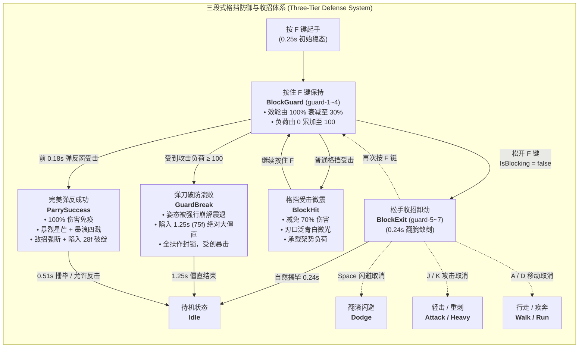
```mermaid
flowchart TD
    subgraph DEFENSE ["三段式格挡防御与收招体系 (Three-Tier Defense System)"]
        direction TB
        START["按 F 键起手<br/>(0.25s 初始稳态)"] --> HOLD["按住 F 键保持<br/><b>BlockGuard</b> (guard-1~4)<br/>• 效能由 100% 衰减至 30%<br/>• 负荷由 0 累加至 100"]
        
        HOLD -->|松开 F 键<br/>IsBlocking = false| EXIT["松手收招卸劲<br/><b>BlockExit</b> (guard-5~7)<br/>(0.24s 翻腕敛剑)"]
        
        EXIT -->|自然播毕 0.24s| IDLE["待机状态<br/><b>Idle</b>"]
        EXIT -.->|Space 闪避取消| DODGE["翻滚闪避<br/><b>Dodge</b>"]
        EXIT -.->|J / K 攻击取消| ATK["轻击 / 重刺<br/><b>Attack / Heavy</b>"]
        EXIT -.->|A / D 移动取消| MOVE["行走 / 疾奔<br/><b>Walk / Run</b>"]
        EXIT -.->|再次按 F 键| HOLD
        
        HOLD -->|前 0.18s 弹反窗受击| PARRY["完美弹反成功<br/><b>ParrySuccess</b><br/>• 100% 伤害免疫<br/>• 暴烈星芒 + 墨浪四溅<br/>• 敌招强断 + 陷入 28f 破绽"]
        HOLD -->|普通格挡受击| HIT["格挡受击微震<br/><b>BlockHit</b><br/>• 减免 70% 伤害<br/>• 刃口泛青白微光<br/>• 承载架势负荷"]
        HIT -->|继续按住 F| HOLD
        
        HOLD -->|受到攻击负荷 ≥ 100| BREAK["弹刀破防溃败<br/><b>GuardBreak</b><br/>• 姿态被强行崩解震退<br/>• 陷入 1.25s (75f) 绝对大僵直<br/>• 全操作封锁，受创暴击"]
        BREAK -->|1.25s 僵直结束| IDLE
        PARRY -->|0.51s 播毕 / 允许反击| IDLE
    end
```

#### 青锋横向帧序列图集

* **待机序列（8 帧）**：
* **慢步行走序列（15 帧）**：
* **快步疾奔序列（9 帧）**：
* **轻攻击三连段序列（12 帧）**：
* **重刺破防突进序列（8 帧）**：
* **翻滚闪避序列（8 帧）**：
* **轻功跳跃序列（8 帧）**：
* **三段式防御与弹反长序列（8 帧复合）**：

##### 青锋剑客全动作状态机与即时连招取消网络

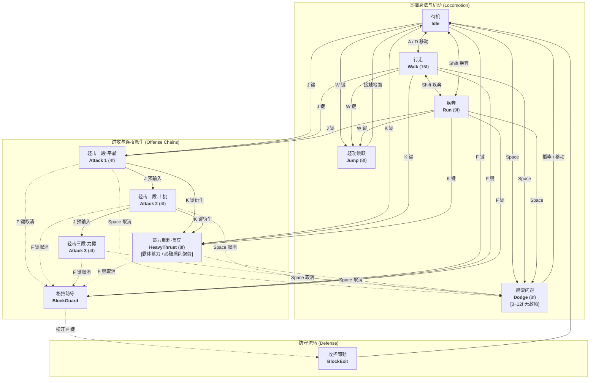
```mermaid
flowchart TD
    subgraph LOCOMOTION ["基础身法与机动 (Locomotion)"]
        IDLE["待机<br/><b>Idle</b>"] <-->|A / D 移动| WALK["行走<br/><b>Walk</b> (15f)"]
        WALK <-->|Shift 疾奔| RUN["疾奔<br/><b>Run</b> (9f)"]
        IDLE <-->|Shift 疾奔| RUN
        IDLE & WALK & RUN -->|Space| DODGE["翻滚闪避<br/><b>Dodge</b> (8f)<br/>[3~12f 无敌帧]"]
        IDLE & WALK & RUN -->|W 键| JUMP["轻功跳跃<br/><b>Jump</b> (8f)"]
        DODGE -->|播毕 / 移动| IDLE
        JUMP -->|接触地面| IDLE
    end

    subgraph OFFENSE ["进攻与连招派生 (Offense Chains)"]
        IDLE & WALK & RUN -->|J 键| ATK1["轻击一段·平斩<br/><b>Attack 1</b> (4f)"]
        ATK1 -->|J 预输入| ATK2["轻击二段·上挑<br/><b>Attack 2</b> (4f)"]
        ATK2 -->|J 预输入| ATK3["轻击三段·力劈<br/><b>Attack 3</b> (4f)"]
        
        ATK1 & ATK2 -->|K 键衍生| HEAVY["蓄力重刺·贯穿<br/><b>HeavyThrust</b> (8f)<br/>[霸体蓄力 / 必破盾削架势]"]
        IDLE & WALK & RUN -->|K 键| HEAVY
        
        ATK1 & ATK2 & ATK3 & HEAVY -.->|Space 取消| DODGE
        ATK1 & ATK2 & ATK3 & HEAVY -.->|F 键取消| BLOCK["格挡防守<br/><b>BlockGuard</b>"]
    end

    subgraph DEFENSE_LINK ["防守流转 (Defense)"]
        IDLE & WALK & RUN -->|F 键| BLOCK
        BLOCK -.->|松开 F 键| EXIT_NODE["收招卸劲<br/><b>BlockExit</b>"]
        EXIT_NODE --> IDLE
    end
```

---

### 2. 青锋剑派技能一：破空刺全案与剑意绽放体系

青锋剑派以**“剑气流动、墨迹晕染、冰霜凝结”**为核心美学，配备 **5 阶剑意槽（Sword Intent Bar）** 与 **剑意绽放（Sword Intent Bloom）** 机制。

#### 破空刺双形态动图演示与连续序列帧 (680×480 PPU 214)

| 常态版：破空刺 (QF-1 · 瞬透飞身刺) | 剑意绽放强化版：极·破空刺 (QF-1E · 裂空时空穿透) |
|:---:|:---:|
|  |  |
| **8 阶段错身穿透剑法**（贴地敛气·离弦激射·瞬影贯体·单膝跪滑·延时墨爆·回锋抽意·导刃回鞘·秋水归渊） | **8 阶段毁灭空间穿透**（龙吟聚风·金芒破空·错身碎空·金刚逆滑·暗渊沉爆·金墨断脉·玄冰冻空·万象乾坤） |

#### 破空刺双形态完整序列帧 (F1~F8 严格对齐足底基准线 Y=437，标准画布 680×480)

* **常态版·破空刺 8 阶段序列图**：


* **剑意绽放强化版·极破空刺 8 阶段序列图**：


#### 剑意绽放强化版·极破空刺 电影级特效全案设计图


* **五大电影级视觉特效演进 (16:9 工业级分镜全案剖析)**：
  1. **① 蓄力与霸体判定 (Startup & Super Armor)**：金青罡气护罩笼罩周身，4 柄青芒飞剑超高速螺旋环绕形成高压风切压缩区，蓄势待发（刚体免断）。
  2. **② 破空瞬身与穿梭突刺 (Phasing Dash & Colossal Void Cone)**：人剑合一突破音障，身后留下 5 重幽蓝水墨残影重叠，向前爆发 4.5 米极白破空能量巨锥。
  3. **③ 空间撕裂与时停定帧 (Spatial Void Rift & Chrono Hitstop)**：突刺轨迹撕裂开一道深黑空间裂隙，周围迸溅电告青蓝高频火花与全屏色差故障，进入 6f 时空凝滞。
  4. **④ 敌后急刹与三度墨爆 (Brake Glider & Triple Detonation)**：穿透至敌后 1.5 米处单膝擦地滑行刹车；穿透路径上 3 处爆裂交叉点连环触发十字星芒爆破与环形水墨冲击波。
  5. **⑤ 霜华结界与收剑归鞘 (Ground Frost Decal & Resonant Settle)**：地面生成半径 4 米的晶莹玄冰霜华结界并升腾冷冽白雾（附带 30% 减速），剑客从容挽花入鞘。

#### 三招核心体验与战术定位对比 (彻底解决招式撞车)

```
【重刺】：刚猛千钧 · 正面重炮 ──> 双足死踏地面 ──> 16f长蓄力推击 ──> 撞在敌人胸前停住 ──> 破防断盾
【破空刺·常态】：身法错身 · 瞬透敌后 ──> 贴地掠风飞身 ──> 5f极速出剑 ──> 直接穿透敌躯直达敌后1.3m ──> 延时剑气爆裂
【极·破空刺·绽放】：虚空撕裂 · 毁灭终结 ──> 四灵飞剑环绕 ──> 4.5m裂空巨锥全穿透1.8m ──> 时空静止 ──> 三度断空墨爆 + 冰霜结界
```

| 招式阶梯 | 键位 | 空间身位交互 | 核心战斗用途 | 视听特效语言 |
| :--- | :--- | :--- | :--- | :--- |
| **重刺 (`A_H`)** | `K` / 鼠标右键 | **正前身前停住 (+0.4m)** | **打防守与硬刚**：破盾破防，削减巨额架势，击碎敌人前摇。 | 粗圆锥物理气爆 + 地面碎石迸溅，沉实金属撞击 |
| **常态破空刺 (`QF-1`)** | `Q` / `U` | **直接穿透敌躯，瞬移敌后 (+1.3m)** | **换位突刺与切入**：穿过群怪包围圈、瞬移敌后破侧防（可接 `J` 转身背刺）。 | 极细青白激光斩线 + 水墨平切风刃 + 敌后单次延时破空墨爆 |
| **极·破空刺·绽放 (`QF-1E`)** | 满剑意 `Q` / `U` | **全穿透无敌冲刺 (+1.8m)** | **毁灭终结与群杀**：穿透一切重型霸体与 Boss，造成 3.4× 毁灭伤害与冰霜控场。 | 四灵飞剑环绕 + 4.5m 裂空巨锥 + 6f 时空停滞 + 虚空裂痕 + 三度断空墨爆 + 4m 冰霜结界 |

---

### 3. 青锋剑派技能二：回风舞 (Whirling Wind Dance 全解)

回风舞为青锋剑派核心**360°全方位解围与范围绞杀**技能。摒弃传统尴尬的套圈龙卷风视觉，升级为**国风狂草剑意·凌厉残月斩**：剑走龙蛇，剑尖爆绽寒芒星火，双层横掠与斜切残月剑芒交叠成暴风剑幕，配合剑气真空牵引形成绝对杀阵。

#### 回风舞双形态动图演示与连续序列帧 (680×480 PPU 214)

| 常态版：回风舞 (QF-2 · 双层残月破围) | 剑意绽放强化版：青鸾风暴 (QF-2E · 5段狂风黑洞绞杀) |
|:---:|:---:|
|  |  |
| **8 阶段纯实打实双手挥剑**（蓄势·起势·凌空·舒臂·双月交叉·定地·挽花·归鞘） | **青鸾法相神鸟振翼**（太极引力涡·青鸾振翼·双风连环·法相冲霄·双鸾绞刃·破岚定地·散羽·归渊） |

#### 回风舞双形态完整序列帧 (F1~F8 严格对齐足底基准线 Y=437，标准画布 680×480)

* **常态版·回风舞 8 阶段序列图**：


* **剑意绽放强化版·青鸾风暴 8 阶段序列图**：


#### 强化版·回风舞（青鸾风暴）电影级特效全案设计图 (1920×1080)


#### 回风舞双形态战斗数值对比

| 维度 | 常态：回风舞 (`QF-2`) | 强化：青鸾风暴 (`QF-2E`) | 战术定位与核心价值 |
| :--- | :--- | :--- | :--- |
| **触发按键** | `E` 或 `O` / `LB` | 满 5 层剑意按 `E` 或 `O` | 瞬间范围解围 / 团控清场 |
| **判定范围** | **半径 1.4m 环形圆周** (直径 2.8m) | **半径 2.2m 极域风暴** (直径 4.4m) | 覆盖身前、身后及斜上方全角度 |
| **聚怪牵引** | **微风牵引** (引力速度 1.5m/s) | **青鸾黑洞** (极强引力 6.0m/s) | 强行将周围围攻杂兵聚拢在剑圈内绞杀 |
| **伤害倍率** | **1.2x + 1.4x = 2.6x** (26点) | **0.8x × 5 + 1.5x = 5.5x** (55点) | 强化版 5 段高速连斩破甲爆发 |
| **破韧压制** | **7 + 8 = 15 点** | **32 点 (打断一切杂兵前摇)** | 强制破除围攻敌人的霸体与攻击动作 |
| **霸体状态** | 6~19 帧 **软霸体** (防轻击打断) | 1~22 帧 **完全霸体** (免疫击倒) | 保证在被围攻绝境中能稳定完整出手 |
| **位移与身位** | 原地中心旋转 ($v_x = 0$) | 原地微浮空 ($v_x = 0, v_y = +0.2\text{m}$) | 不会产生错位偏差，原地强控中心点 |

---

### 4. 青锋剑派技能三：一剑霜寒 (Frostbound Slash 全解)

> **“满堂花醉三千客，一剑霜寒十四州。”**

一剑霜寒为青锋剑派核心**直线破防、远程贯穿与绝对压制**绝技。区别于重刺的贴身推撞、破空刺的身法穿透和回风舞的环形绞杀，一剑霜寒专注于**超远距离（2.6m~3.8m）** 直线穿导霜线，必定击溃敌方格挡并破盾，在地面留存减速冰雾，为玩家创造完美的突进输出窗口。

#### 一剑霜寒动图演示与连续序列帧 (680×480 PPU 214)

| 一剑霜寒 8 阶段循环动图 (GIF) |
|:---:|
|  |

#### 一剑霜寒 8 阶段关键帧序列图 (F1~F8 严格对齐 Y=437，足底锁死，杜绝抖动)


#### 动作阶段与武学解构 (60 FPS)

```
[结势立基] ──> F1 (1~6f):   结势·冰霜凝聚 (双足拉开扎马，双手握剑横胸，脚下初结微霜花环)
[寒气灌刃] ──> F2 (7~14f):  提剑·寒气汇聚 (双手提剑斜举右肩，极寒冻气化作漩涡向剑刃螺旋汇聚)
[蓄力极峰] ──> F3 (15~20f): 蓄力·冰刃成型 [可蓄至45f] (整柄剑凝结为深蓝透明玄冰巨剑，地表炸裂深蓝冰纹)
[雷霆横斩] ──> F4 (21~24f): 斩出·霜寒剑芒 (Active 1 · 后足猛蹬爆发超宽极寒冰刃横扫，1.6x 伤害 + 15 破韧)
[霜线破空] ──> F5 (25~28f): 前刺·冰锋破地 (Active 2 · 贴地狂飙 2.6m 锐利霜线，拔地突刺整排尖锐冰棱，必破重盾)
[踏雪止动] ──> F6 (29~36f): 进步·寒气延绵 (弓步踏实，前方留存 2.0s 减速冰雾带 · 开放闪避/破空刺取消窗)
[振刃碎霜] ──> F7 (37~44f): 振刃·冰晶碎散 (手腕轻抖挽剑，剑身微震震碎薄冰，菱形冰晶爆散四溅)
[敛气归鞘] ──> F8 (45~54f): 入鞘·风息归平 (双手收剑入怀，秋水敛锋入鞘，从容无缝衔接待机 Idle)
```

#### 剑意绽放强化版·极一剑霜寒（冰魄玄峰）动图与序列帧

> **“冰魄玄峰拔地起，寒绝千丈冻九垓。”**

当玩家积攒满 5 层剑意释放一剑霜寒时，招式发生剧烈质变：**霜线贯穿全屏（3.8m+），拔地而起整排高达 2 米的晶莹冰魄玄峰，对全场敌军施加「绝对霜冻」强制定身 1.5 秒，并在定身结束瞬间引发毁灭性的万晶碎峰二次爆破（总伤 8.0x）！**

| 极·一剑霜寒（冰魄玄峰）8 阶段循环动图 (GIF) |
|:---:|
|  |

#### 极·一剑霜寒 8 阶段关键帧序列图 (F1~F8 严格对齐 Y=437，足底锁死)


#### 剑意绽放强化版·一剑霜寒 电影级特效全案设计图 (UE5 规格)


#### 一剑霜寒双形态战斗数值对比

| 维度 | 常态：一剑霜寒 (`QF-3`) | 强化：冰魄玄峰 (`QF-3E`) | 战术定位与核心价值 |
| :--- | :--- | :--- | :--- |
| **触发按键** | `I` / `RT` | 满 5 层剑意按 `I` / `RT` | 超远破防 / 全屏绝对定身 |
| **判定距离** | **直线 2.6m 破防霜线** | **直线 3.8m+ 全屏极光穿透** | 无视敌群阻挡，全屏直线贯穿 |
| **视觉场域** | 地面尖锐冰棱小晶簇 | **拔地而起 2 米高冰魄玄峰群** | 战场地形改变，巍峨耸立 |
| **伤害倍率** | **3.4x (满蓄 4.5x)** | **6.2x + 1.8x = 8.0x 终极爆发** | 门派单次输出最高的终极大招 |
| **削韧压制** | **35 点 (必定破盾破防)** | **55 点 (彻底击碎一切重盾与姿态)** | 摧毁敌方任何形式的格挡与霸体 |
| **异常控制** | 减速 40% (冰霜带留存 2.0s) | **【绝对霜冻】强制冰封定身 1.5 秒** | 无法受身打断的最强控制时间窗 |
| **二次爆破** | 无 | **碎峰万晶杀 (千片菱形冰晶溅射)** | 1.5s 后玄峰爆碎，范围二次收割 |

#### 青锋剑客四大核心攻击/绝技战术矩阵 (彻底解决招式撞车)

| 招式阶梯 | 键位 | 空间身位交互 | 核心战斗定位 | 视听特效语言 |
| :--- | :--- | :--- | :--- | :--- |
| **重刺 (`A_H`)** | `K` / 鼠标右键 | 正前身前停住 (+0.4m) | **打防守与硬刚**：削减巨额架势，击碎敌人前摇 | 粗圆锥物理气爆 + 地面碎石迸溅，沉实金属撞击 |
| **破空刺 (`QF-1`)** | `Q` 或 `U` | 穿透敌躯，瞬移敌后 (+1.3m) | **身法错位与背刺**：穿透包围圈，打背身破绽 | 极细青白激光斩线 + 水墨风刃 + 延时单次破空墨爆 |
| **回风舞 (`QF-2`)** | `E` 或 `O` | 原地 360° 中心旋转 ($v_x=0$) | **群体解围与范围绞杀**：微风牵引聚怪，打散围攻 | 狂草残月斩 + 双重风刃交错 + 剑尖寒芒星火 |
| **一剑霜寒 (`QF-3`)** | `I` / `RT` | 稳踏地面，向前贯刺 (+0.35m) | **超远程直线破防**：2.6m 直线霜线必破盾，留存减速带 | 深蓝玄冰巨剑 + 贴地撕裂激光霜线 + 拔地冰棱尖刺 |
| **极·一剑霜寒 (`QF-3E`)**| 满剑意 `I` / `RT` | 稳踏地面，前冲突进 (+0.55m) | **全屏斩杀与绝对冰封**：3.8m+ 冰魄玄峰破土，定身1.5s，二次爆破 8.0x | 霜降八卦冰阵 + 天幕极光裂斩 + 2米高耸冰峰 + 绝对霜冻 + 万晶爆碎 |
| **引剑诀 (`QF-4`)** | `R` 或 `P` | 原地虚引，合刃定格 ($v_x=0$) | **全场贯通与近身爆震**：天外飞剑 35m/s 穿透全场 + 归渊合刃冲击波 | 掐诀音爆 + 全屏飞剑流光拖尾 + 握柄雷爆冲击波环 + 360° 水墨残月剑花 |
| **极·万剑归宗 (`QF-4E`)** | 满剑意 `R` / `P` | 原地虚引，合刃破界 ($v_x=0$) | **太虚剑阵与核爆终结**：万剑穿屏 40m/s + 混元归渊双层金青冲击波 | 太虚聚灵核 + 黄金雷霆音爆 + 6柄灵剑齐发弹幕 + 0.12s 极强时空凝滞 + 4.5m 乾坤震波 + 双重残月剑幕 |

---

### 5. 青锋剑派技能四：引剑诀与剑意绽放强化版 (流光溯影 / 万剑归宗)

> **“袖手凭虚，意动剑随；天外惊鸿，白虹贯日；握柄雷动，万象归鞘；万道朝宗，混元归渊！”**

引剑诀为青锋剑派核心**远程唤剑、全场直线贯通与近身爆发合刃**绝技。区别于贴身刺杀与原地旋风，引剑诀展现了剑修最高境界的“虚引唤剑”——角色在原地捏剑诀虚引，远方飞剑如天外流光横贯全屏穿透群敌，飞至身前瞬间五指暴烈死扣剑柄，触发沉重时空停滞与环形水墨冲击波，顺势挽出 360° 水墨残月剑花从容收剑。满 5 阶剑意时更可极尽升华，召唤**万剑归宗·混元归渊**！

---

#### 5.1 常态引剑诀 · 流光溯影 (`QF-4`)

##### 动图演示与连续序列帧 (680×480 PPU 214)

| 引剑诀 8 阶段循环动图 (GIF · 255色全彩无黑影) |
|:---:|
| 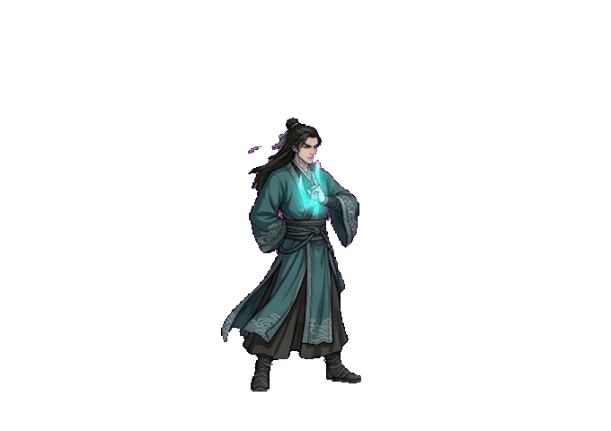 |

##### 引剑诀 8 阶段关键帧序列图 (F1~F8 严格对齐 Y=437，足底锁死)
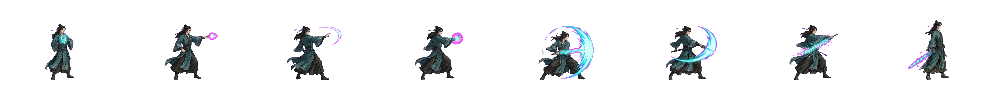

##### 动作阶段与武学解构 (60 FPS)

```
[结印聚气] ──> F1 (1~7f):   结印·引灵指 (丁字步站定，左手反背，右手剑指横胸，两手空空聚气)
[凌空遥召] ──> F2 (8~14f):  遥召·破空鸣 (右臂凌空前指，空气音爆波纹，引动天外飞剑破空尖啸)
[白虹贯日] ──> F3 (15~22f): 牵引·流光穿 [Active 1] (右手虚引后撤，飞剑化作白虹以 35m/s 横贯全场穿透)
[侧身候刃] ──> F4 (23~28f): 候刃·展臂迎 (飞剑射至身前 0.3m，侧身展臂成爪状虚抓，剑气呼啸)
[万钧合刃] ──> F5 (29~39f): 握柄·雷爆定 [Active 2] (五指死死咬合剑柄！后错沉马，炸开环形水墨冲击波 + 5f Hitstop)
[顺势旋风] ──> F6 (40~46f): 旋腕·剑花破 (借回握惯性顺势反手挽出 360° 水墨残月剑花，开放闪避/轻击取消)
[展袖抚刃] ──> F7 (47~53f): 拂袖·振刃鸣 (长身而起，左手大袖轻抚剑脊，清脆龙吟金石交鸣)
[敛息入鞘] ──> F8 (54~62f): 敛息·垂剑立 (反手垂剑于右侧 45°，青丝落定，气沉丹田，无缝切入待机 Idle)
```

---

#### 5.2 强化版引剑诀 · 万剑归宗 · 混元归渊 (`QF-4E`)

##### 极·万剑归宗 动图演示与连续序列帧 (680×480 PPU 214)

| 极·万剑归宗 8 阶段循环动图 (GIF · 255色全彩透明底) |
|:---:|
| 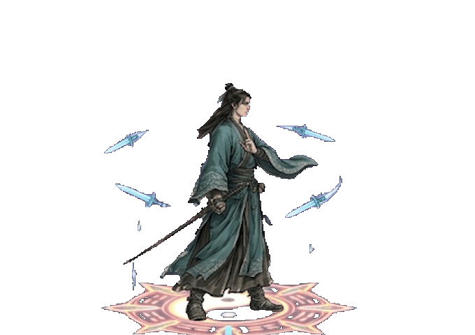 |

##### 极·万剑归宗 8 阶段关键帧序列图 (F1~F8 严格对齐 Y=437，站立高 328px)
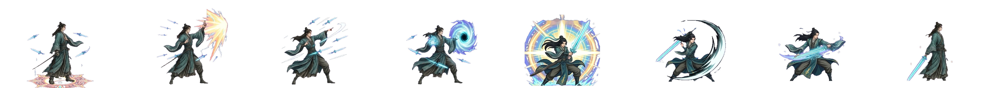

##### 极·引剑诀·万剑归渊 电影级特效全案分镜设定图 (五大阶段全景拆解)
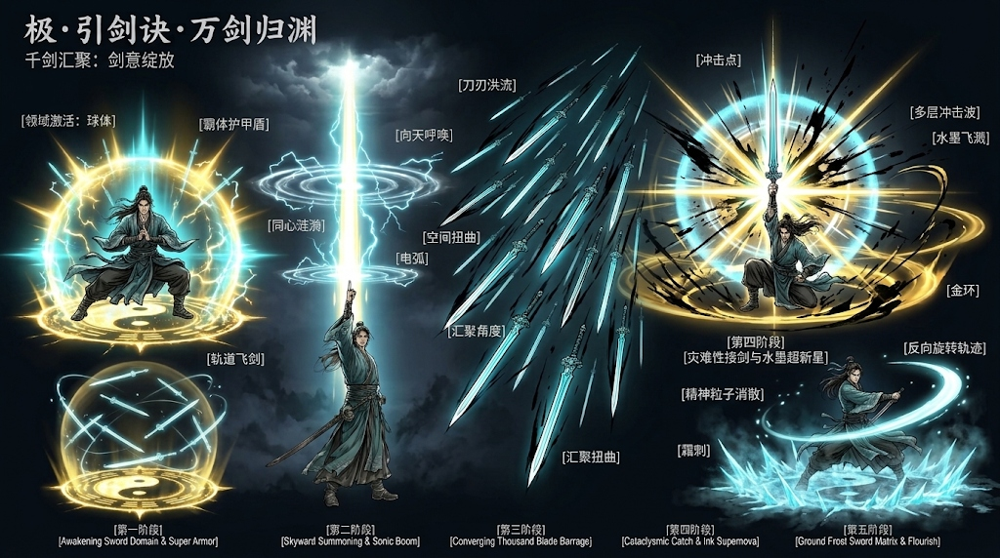

##### 电影级特效五大阶段武学与视效设定拆解

| 阶段 | 核心设定名称 | 英文标识 | 视觉表象与特效图层 | 战斗机制与手感反馈 |
|:---:|---|---|---|---|
| **第一阶段** | **领域激活与绝对霸体** | `[Awakening Sword Domain & Super Armor]` | **【太极球体与轨道飞剑】**<br>剑客深马步双手掐诀结印于胸前；脚下展开金色八卦太极阵盘，周身笼罩青蓝半透明球体防御光罩，多柄白色晶莹灵剑如天体卫星般在光罩内外高速交错盘旋护体。 | 激活剑意领域护盾，获得**绝对霸体 (Super Armor)** 与 50% 伤害减免，免疫一切击退硬直。 |
| **第二阶段** | **向天呼唤与雷霆音爆** | `[Skyward Summoning & Sonic Boom]` | **【九霄贯日神光柱】**<br>剑客侧身独立，剑指破空直插苍穹！一道耀眼通天的白金激光光柱贯穿九天十地；光柱周围激荡两重向外高速扩散的同心青蓝音爆涟漪环与交织狂舞的青黄雷霆电弧。 | 音爆震荡引发轻微震屏（`0.18f, 0.08f`），向全图敌人传递超远呼唤威慑信号。 |
| **第三阶段** | **千剑汇聚与刀刃洪流** | `[Converging Thousand Blade Barrage]` | **【破空倾泻飞剑洪流】**<br>九霄天门大开，数以千计的青白仙剑群带黑色水墨流动尾迹，呈 $45^\circ$ 密集阵列自天际狂暴俯冲贯射；剧烈的能量汇聚造成空间扭曲凹陷与折射光晕。 | **全屏穿透打击 (Active 1)**：多柄灵剑穿透全场所有敌人，造成高频贯穿硬直与破韧削减。 |
| **第四阶段** | **灾难性接剑与水墨超新星** | `[Cataclysmic Catch & Ink Supernova]` | **【极·万钧合刃水墨超新星】**<br>剑客单膝马步冲顶暴握神剑！神剑直插风暴聚点核心，引发天崩地裂般的多层超音速冲击波、外圈金色强力光环与四向喷薄飞溅的浓墨水墨超新星！ | **极·万钧合刃 (Active 2)**：触发 **$0.12\text{s}$ 全屏时空停滞 (Hitstop)** 与镜头强震（`0.45f`），近身爆发 $65$ 点破界伤害。 |
| **第五阶段** | **冰霜剑阵与回锋漫花** | `[Ground Frost Sword Matrix & Flourish]` | **【玄冰八卦阵与残月斩】**<br>借回握伟力反向旋身扫剑，划出一道天青色半月弧光斩幕；脚下地面瞬间冻结并拔地而起簇簇剔透冰霜玄针地刺，金青星尘粒子与碎玉冰晶漫天消散。 | **回锋清场 (Recovery)**：双层残月剑幕扫除近身残存威胁，开放闪避/轻击快速取消后摇。 |

##### 动作阶段与武学解构 (60 FPS)

```
[剑阵起势] ──> F1 (1~6f):   剑阵起势·万道朝宗 (丁字步沉稳站定，心口前凝聚青金混元太虚聚灵核)
[雷霆破晓] ──> F2 (7~13f):  雷霆破晓·神剑初醒 (剑指凌空裂穹前点，指尖绽放黄金雷霆电芒与超音速激波)
[混元万剑] ──> F3 (14~21f): 白虹贯日·太虚横空 [Active 1] (主神剑以 40m/s 穿透全场，伴生 6 柄混元灵剑弧线弹幕轰击)
[混元归渊] ──> F4 (22~28f): 混元归渊·诸天合一 (鹰爪展臂，掌心强压形成青金气流黑洞涡旋，万剑急速汇聚)
[万钧合刃] ──> F5 (29~40f): 极·万钧合刃·冰破乾坤 [Active 2] (五指死扣剑柄！双层金青震波(4.5m) + 0.12s 强力顿帧 + 剧震)
[八荒扫尽] ──> F6 (41~48f): 八荒扫尽·万劫成空 (反手旋斩出内外双层金青太虚残月剑幕，横扫八荒)
[龙吟归袖] ──> F7 (49~56f): 龙吟归袖·风雷渐歇 (大袖拂剑脊，龙吟清越，漫天青碧碎钻与碎玉冰霜随风飘坠)
[万道归一] ──> F8 (57~67f): 万道归一·天人合道 (反手敛剑垂立，青丝与道袍平息，周身太虚神光收敛，无缝归入 Idle)
```

---

### 6. 青锋剑派技能五：以剑御气与剑意绽放强化版 (苍龙玄天钟 / 万仞诛魔金刚剑界)

> **“以剑引气，苍龙盘虚；琉璃玄钟，万劫不侵；周天星斗，八剑引雷；万仞诛魔，超新星爆！”**

以剑御气为青锋剑派核心**全向招架、绝对防守、反震推敌与守势反击**绝技。普通版以剑引动水墨苍龙真气，于身周凝结多面体青玉琉璃玄天钟，反震击退近身强敌并反弹弹道；满 5 阶剑意释放时极尽升华，开启**万仞诛魔金刚剑界**——踏碎大地铺展周天星斗太极八卦大阵，8 柄神圣青金飞剑伴生天雷超音速环绕公转，结界外壁暴突数十柄向外激射的倒刺剑芒刺林（形成高速切割光轮杀阵），承击瞬间引爆毁天灭地的水墨超新星大核爆，全场拔地而起整排 2 米高的晶莹冰魄神峰！

---

#### 6.1 以剑御气双形态动图演示与连续序列帧 (680×480 PPU 214)

| 常态版：以剑御气 (QF-5 · 苍龙玄天钟) | 剑意绽放强化版：极·以剑御气 (QF-5E · 万仞诛魔金刚剑界) |
|:---:|:---:|
| 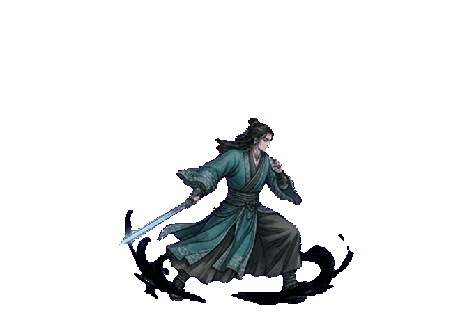 | 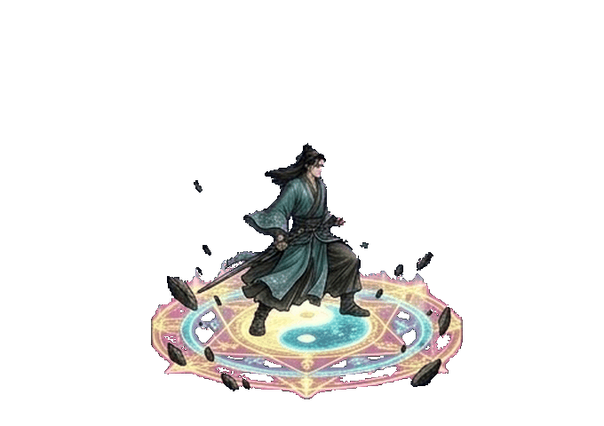 |
| **16 阶段苍龙玄钟剑法**（沉步敛气·立桩引气·苍龙盘虚·双龙合钟·琉璃晶壁·刃芒流转·八卦金印·触界星爆·墨痕裂钟·暴烈推刃·龙吟破壁·漫天碎晶·星尘飞瀑·狂草残月·龙吟振雪·敛息入道） | **16 阶段周天诛魔杀阵**（星斗太极·神霄天雷·八剑飞旋·金青力场·万仞刺林·金青光轮·虚空裂隙·聚变日珥·时空凝滞·极空推刃·双重激波·玄冰拔地·银河倒泻·双层太虚·神剑龙吟·天人合道） |

#### 6.2 以剑御气双形态完整序列帧 (F1~F16 严格对齐 Y=437，标准画布 680×480)

* **常态版·以剑御气 16 阶段序列图**：


* **剑意绽放强化版·万仞剑界 16 阶段序列图**：


#### 6.3 剑意绽放强化版·以剑御气 电影级特效全案设定图 (16:9 AAA 工业级 Storyboard)
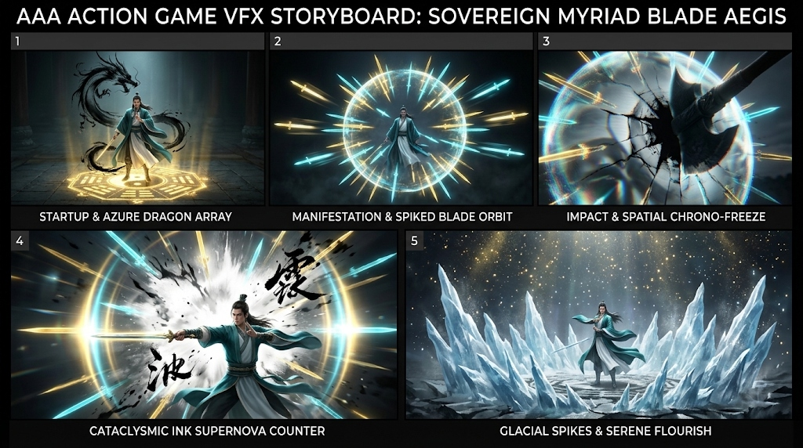

##### 电影级特效五大阶段武学与视效设定拆解

| 阶段 | 核心设定名称 | 英文标识 | 视觉表象与特效图层 | 战斗机制与手感反馈 |
|:---:|---|---|---|---|
| **第一阶段** | **起势引龙与太极阵盘** | `[Startup & Azure Dragon Array]` | **【水墨苍龙与星斗八卦】**<br>暗调殿堂中水墨苍龙咆哮盘旋，脚下金色太极八卦大阵炽烈旋转，引动天地灵气，碎石失重悬浮。 | 激活剑意领域护盾，获得**绝对霸体**与 50% 伤害减免。 |
| **第二阶段** | **万仞成罡与八剑星环** | `[Manifestation & Spiked Blade Orbit]` | **【8 柄神剑与倒刺剑林】**<br>8 柄神圣青金飞剑高速环绕，3 米多面金刚剑界外壁暴突尖锐倒刺剑林，形成高速切割绞肉光轮。 | **Active 1 启动**：身周 1.5 米每 0.15 秒高频割裂伤害与削韧。 |
| **第三阶段** | **承击冲击与时空凝滞** | `[Impact & Spatial Chrono-Freeze]` | **【空间裂隙与时空色差】**<br>敌方巨斧轰击结界触发 **0.15s 绝对顿帧 (Hitstop)** 与色差故障，蛛网空间裂缝蔓延，空气凹陷产生微型引力黑洞。 | 强行定格敌方所有招式，进入绝对无敌反震时间窗。 |
| **第四阶段** | **推刃反震与水墨超新星** | `[Cataclysmic Ink Supernova Counter]` | **【核爆逆震与双重激波】**<br>剑客双手推刃引发水墨超新星核爆，双重大同心激波环粉碎全场，两侧“震波”水墨笔力遒劲，50 颗流星火雨喷薄。 | **Active 2 核心爆发**：全屏破一切霸体，造成 **4.8×** 暴击伤害与 70 点破防击飞。 |
| **第五阶段** | **参天玄峰与双层残月** | `[Glacial Spikes & Serene Flourish]` | **【拔地冰峰与太虚残月】**<br>拔地而起整排 2 米高的通透晶莹玄冰神峰群，身前挥出金内青外双重月牙剑幕，漫天金色星尘如银河倒泻。 | **扫尾与控制**：全场冰封强控，开放闪避/轻击取消后摇。 |

#### 6.4 以剑御气双形态战斗数值对比

| 维度 | 常态：以剑御气 (`QF-5`) | 强化：万仞诛魔剑界 (`QF-5E`) | 战术定位与核心价值 |
| :--- | :--- | :--- | :--- |
| **触发按键** | `Shift + F` 或 `LT + RT` | 满 5 层剑意按 `Shift + F` / 组合键 | 绝对全向招架 / 终极反震爆发 |
| **判定范围** | 半径 1.2m 琉璃气钟 | **半径 2.4m 混沌力场 + 全屏冲击波** | 护体光轮 + 2米玄冰神峰群 |
| **伤害倍率** | 0.8x + 2.4x = **3.2x** | 0.6x × 4 + 4.8x = **7.2x** | 防守反击顶级爆发伤害 |
| **削韧压制** | 16 + 28 = **44 点** | 20 + 50 = **70 点 (击碎一切霸体与重盾)** | 彻底摧毁全场敌人前摇与姿态 |
| **异常控制** | 反弹飞行道具，震退杂兵 2.2m | **0.15s 强时停 + 范围击飞 + 冰峰封场** | 无法被击退打断的最强绝对无敌防御 |
| **霸体状态** | 1~30f 刚体护体 | **1~48f 全程绝对无敌帧** | 绝境反杀与 Boss 绝技绝对对撞器 |

---

### 6.5 剑意积累与五大门派绝技进化树 (Sword Intent Bloom Matrix)

青锋剑派特有的 **5 阶剑意槽（Sword Intent Bar）** 贯穿全套核心绝技体系。玩家通过实战中的平砍命中、完美弹反与化解敌招不断积攒剑意，在达到满额（5 阶）时即可突破物理招式极限，释放毁天灭地的**「剑意绽放强化版」**终结绝技：

```mermaid
flowchart LR
    subgraph INTENT ["剑意积累体系 (Sword Intent System)"]
        direction TB
        B1["平砍命中 (+1 剑意)"] --> BAR["5 阶剑意槽<br/><b>Sword Intent Bar</b><br/>[ 1 ➔ 2 ➔ 3 ➔ 4 ➔ 5 ]"]
        B2["精准弹反 (+2 剑意)"] --> BAR
        B3["化解敌招 (+1 剑意)"] --> BAR
    end

    subgraph SKILLS ["青锋五大绝技进化树 (Skill Evolution Tree)"]
        direction TB
        
        BAR -->|< 5 阶释放<br/>(常规消耗)| NORM["常态技能群 (Normal Skills)"]
        BAR -->|满 5 阶释放<br/>(消耗全槽)| BLOOM["剑意绽放强化版 (Bloom Skills)"]
        
        NORM --> S1["<b>破空刺 (QF-1)</b> [Q/U]<br/>• 错身瞬移敌后 +1.3m<br/>• 绕盾背刺 + 延时墨爆"]
        BLOOM --> S1E["<b>极·破空刺 (QF-1E)</b><br/>• 4.5m 裂空巨锥 + 6f 时停<br/>• 三度断空墨爆 + 冰霜结界"]
        
        NORM --> S2["<b>回风舞 (QF-2)</b> [E/O]<br/>• 360° 狂草双月斩<br/>• 微风牵引解围 2.6x 伤害"]
        BLOOM --> S2E["<b>极·回风舞 (QF-2E)</b><br/>• 青鸾风暴法相冲霄<br/>• 极强黑洞聚怪 + 5段高速绞杀"]
        
        NORM --> S3["<b>一剑霜寒 (QF-3)</b> [I]<br/>• 2.6m 直线破防霜线<br/>• 必破重盾 + 留存减速冰雾"]
        BLOOM --> S3E["<b>极·一剑霜寒 (QF-3E)</b><br/>• 3.8m+ 冰魄玄峰拔地 2 米<br/>• 绝对霜冻 1.5s + 万晶爆破 8.0x"]
        
        NORM --> S4["<b>引剑诀 (QF-4)</b> [R/P]<br/>• 35m/s 飞剑横贯全屏穿透<br/>• 握柄水墨冲击波 + 残月剑花"]
        BLOOM --> S4E["<b>极·万剑归宗 (QF-4E)</b><br/>• 混元聚灵 + 6柄飞剑弧线轰击<br/>• 4.5m 同心震波 + 双重残月剑幕"]
        
        NORM --> S5["<b>以剑御气 (QF-5)</b> [Shift+F]<br/>• 2.4m 琉璃苍龙玄天钟<br/>• 反弹飞行道具 + 反震推敌 2.2m"]
        BLOOM --> S5E["<b>极·万仞诛魔 (QF-5E)</b><br/>• 8柄金青神剑公转切割光轮<br/>• 超新星核爆 + 4.8x + 冰峰群拔地"]
    end
```

---

### 7. 杂兵刀手（敌人）全套动作序列

杂兵刀手为最基础的敌方近战单位，采用江湖刀客的水墨粗布风格，佩戴单手雁翎短刀。所有动作规格严格对齐青锋基准线（680×480 画布，PPU 214，足底锁定 Y=435）。

| 1. 原地警戒待机 (Idle · 8f) | 2. 巡逻步伐 (Walk · 15f) | 3. 横斩挥砍 (AttackA · 4f) |
|:---:|:---:|:---:|
|  |  |  |

#### 杂兵设计与立绘图

| 杂兵立绘概念图 | 杂兵动作设计全套原画 |
|:---:|:---:|
|  |  |

#### 杂兵帧序列图集

* **待机警戒序列图（8 帧循环）**：
* **巡逻行步序列图（15 帧标准步伐）**：
* **横斩挥击序列图（4 帧蓄力前挥）**：

#### 杂兵刀手 AI 行为决策与状态转移图

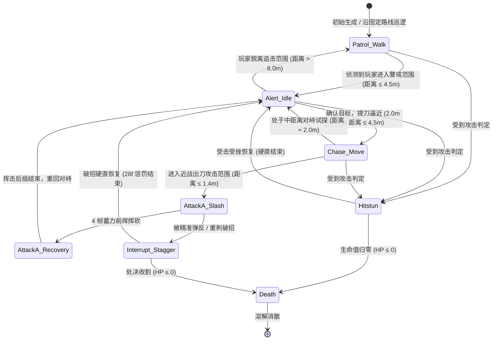
```mermaid
stateDiagram-v2
    [*] --> Patrol_Walk: 初始生成 / 沿固定路线巡逻
    
    Patrol_Walk --> Alert_Idle: 侦测到玩家进入警戒范围 (距离 ≤ 4.5m)
    Alert_Idle --> Patrol_Walk: 玩家脱离追击范围 (距离 > 6.0m)
    
    Alert_Idle --> Chase_Move: 确认目标，提刀逼近 (2.0m < 距离 ≤ 4.5m)
    Chase_Move --> Alert_Idle: 处于中距离对峙试探 (距离 ≈ 2.0m)
    
    Chase_Move --> AttackA_Slash: 进入近战出刀攻击范围 (距离 ≤ 1.4m)
    AttackA_Slash --> AttackA_Recovery: 4 帧蓄力前挥挥砍
    AttackA_Recovery --> Alert_Idle: 挥击后摇结束，重回对峙
    
    Patrol_Walk --> Hitstun: 受到攻击判定
    Alert_Idle --> Hitstun: 受到攻击判定
    Chase_Move --> Hitstun: 受到攻击判定
    AttackA_Slash --> Interrupt_Stagger: 被精准弹反 / 重刺破招
    
    Hitstun --> Alert_Idle: 受击受挫恢复 (硬直结束)
    Interrupt_Stagger --> Alert_Idle: 破招硬直恢复 (28f 惩罚结束)
    
    Hitstun --> Death: 生命值归零 (HP ≤ 0)
    Interrupt_Stagger --> Death: 处决收割 (HP ≤ 0)
    
    Death --> [*]: 溶解消散
```

---

### 8. 青锋 vs 杂兵 行进步伐同步对比

青锋与杂兵刀手的慢步行走均采用严格对齐的 **15 帧步幅设计**，落地接触相位相差精准，步幅与位移完全匹配地面摩擦力，杜绝溜冰打滑与长短脚现象。


---

## 三、 完整设计报告与文档索引

所有设计文档均位于 `设计/` 目录下，包含详细的世界观、系统规则、剧情全本、关卡镜头及所有动作的精确帧级拆解报告：

### 核心系统与剧情文档

| 文档名称 | 链接 | 核心内容概要 |
|---|---|---|
| **游戏设计文档 (GDD v1.0)** | [刀影江湖-游戏设计文档.md](设计/刀影江湖-游戏设计文档.md) | 总体架构、核心循环、三大门派、资源设定、Boss阶段流转 |
| **战斗帧数据表 v0.1** | [刀影江湖-战斗帧数据表-v0.1.md](设计/刀影江湖-战斗帧数据表-v0.1.md) | 全动作起手/判定/后摇帧数、取消窗、无敌帧、击退距离 |
| **任务流程规划** | [刀影江湖-任务流程.md](设计/刀影江湖-任务流程.md) | 序章夜奔、清河寻医、雪夜雁门、南屿绝杀等四幕任务流 |
| **剧情对白旁白全本** | [刀影江湖-剧情对白旁白全本.md](设计/刀影江湖-剧情对白旁白全本.md) | 全过场对白、旁白诵诗、NPC 互动台词与分支文本 |
| **场景镜头描述本** | [刀影江湖-场景镜头描述本.md](设计/刀影江湖-场景镜头描述本.md) | 2D 电影感镜头景深、运镜轨迹、特写机位与环境气氛 |

### 动作帧与技能全案设计报告

| 动作规范报告 | 链接 | 核心设计拆解 |
|---|---|---|
| **青锋以剑御气动作帧设计表** | [刀影江湖-以剑御气动作帧设计表.md](设计/刀影江湖-以剑御气动作帧设计表.md) | 16 相位 4x4 时序、以剑引气、苍龙盘虚、2.4m多面琉璃玄钟、受击墨痕裂钟、苍龙破壁三重反震激波、360°狂草残月剑花 |
| **以剑御气·剑意绽放强化版全案** | [刀影江湖-以剑御气(剑意绽放强化版)动作帧设计表.md](设计/刀影江湖-以剑御气(剑意绽放强化版)动作帧设计表.md) | 16 相位 4x4 时序、周天星斗太极八卦大阵、8柄神圣青金飞剑公转、万仞刺林光轮风暴、0.15s时停色差、水墨超新星核爆、2米高耸玄冰神峰地刺 |
| **青锋引剑诀动作帧设计表** | [刀影江湖-引剑诀动作帧设计表.md](设计/刀影江湖-引剑诀动作帧设计表.md) | 虚引唤剑、全场直线贯穿、暴烈合刃接剑、360°行云流水挽花、双段伤害判定 |
| **引剑诀·剑意绽放强化版全案** | [刀影江湖-引剑诀剑意绽放动作帧设计表.md](设计/刀影江湖-引剑诀剑意绽放动作帧设计表.md) | 8 相位 F1~F8 60fps 时序、万剑归宗飞剑弹幕、6柄混元灵剑齐发、4.5m同心震波、0.12s时空静止、双重残月剑幕 |
| **青锋破空刺动作帧设计表 (重塑版)** | [刀影江湖-破空刺动作帧设计表.md](设计/刀影江湖-破空刺动作帧设计表.md) | 彻底区别于重刺：贴地掠飞、+1.3m 错身穿透敌后、延时单次破空墨爆、极细激光斩线 |
| **破空刺·剑意绽放强化版全案** | [刀影江湖-破空刺(剑意绽放强化版)动作帧设计表.md](设计/刀影江湖-破空刺(剑意绽放强化版)动作帧设计表.md) | 8 相位 P1~P8 60fps 时序、四灵飞剑、4.5m 裂空巨锥、时空停滞、三度断空墨爆、冰霜结界 |
| **青锋剑术技能动画设计全案** | [刀影江湖-青锋剑术技能动画设计表.md](设计/刀影江湖-青锋剑术技能动画设计表.md) | 6 大门派技能（破空刺、回风舞、一剑霜寒、御剑飞来、以剑御气、万剑归宗）与 5 阶剑意机制 |
| **青锋一剑霜寒动作帧设计表** | [刀影江湖-一剑霜寒动作帧设计表.md](设计/刀影江湖-一剑霜寒动作帧设计表.md) | 8 相位时序、超远直线破防霜线、必破重盾破架势、地表拔起尖锐冰棱群、减速冰雾带 |
| **一剑霜寒·剑意绽放强化版全案** | [刀影江湖-一剑霜寒(剑意绽放强化版)动作帧设计表.md](设计/刀影江湖-一剑霜寒(剑意绽放强化版)动作帧设计表.md) | 8 相位 F1~F8 时序、3.8m+全屏贯穿、2米高耸冰魄玄峰群、绝对霜冻1.5s、万晶碎爆8.0x |
| **青锋重刺动作帧设计表** | [刀影江湖-重刺动作帧设计表.md](设计/刀影江湖-重刺动作帧设计表.md) | 概念图贯穿突进重现、霸体蓄力前摇、破防削韧、正面推刺不换位 |
| **青锋格挡动作帧设计表** | [刀影江湖-格挡动作帧设计表.md](设计/刀影江湖-格挡动作帧设计表.md) | 三段防御体系（架势/微光/星芒）、0.18s 精准弹反窗、大反震破绽 |
| **青锋闪避动作帧设计表** | [刀影江湖-闪避动作帧设计表.md](设计/刀影江湖-闪避动作帧设计表.md) | 8 相位残影翻滚、3~12 帧无敌窗、擦地刹车与位移手感 |
| **青锋跳跃动作帧设计表** | [刀影江湖-跳跃动作帧设计表.md](设计/刀影江湖-跳跃动作帧设计表.md) | 3 帧起跳深蹲、40~44 帧滞空腾跃、空中轻重攻击派生与落地缓冲 |
| **青锋行走动作帧设计表** | [刀影江湖-行走动作帧设计表.md](设计/刀影江湖-行走动作帧设计表.md) | 36 帧周期、短步轻走、Walk 前倾 0~3°、脚底贴地锁定 |
| **青锋跑步动作帧设计表** | [刀影江湖-跑步动作帧设计表.md](设计/刀影江湖-跑步动作帧设计表.md) | 26 帧周期、中长快步、腾空 40~45%、急停立直与飘带极值 |
| **杂兵刀手动作帧设计表** | [刀影江湖-杂兵刀手动作帧设计表.md](设计/刀影江湖-杂兵刀手动作帧设计表.md) | 刀兵待机呼吸周期、15 帧行步挂点、挥砍前摇与受击结算 |

---

## 四、 概念设计与美术资产

概念图目录位于 `设计/刀影江湖-概念图/`，详细索引请参阅 [README-概念图索引.md](设计/刀影江湖-概念图/README-概念图索引.md)。

* **极·以剑御气·万仞诛魔·电影级特效全案分镜设定图**：
  
* **极·引剑诀·万剑归渊·电影级特效全案分镜设定图**：
  
* **青锋剑派技能特效设定表**：
  
* **主角三视图与细节拆解**：
  
* **人物设定集**：`设计/刀影江湖-概念图/人物设定/`（青锋剑客、魔刀弟子、落云枪客、黑衣头目、红甲捕头、平民 NPC）
* **场景设计集**：`设计/刀影江湖-概念图/场景地图/`（清河城枢纽、夜奔官道、雁门关绝壁、南屿水泊）

---

## 五、 操作指南与战斗系统

支持键盘与 Xbox/PS 手柄：

| 操作类型 | 键盘键位 | 鼠标 / 手柄 | 动作与战术说明 |
|---|---|---|---|
| **移动 (慢步走)** | `A` / `D` | 左摇杆水平 | 触发 15 帧行进步法，移速约 1.6 单位/秒 |
| **疾奔 (冲刺跑)** | 按住 `Shift` + `A`/`D` | `L3` (按下摇杆) | 触发 9 帧大步疾奔，移速约 5.5 单位/秒 |
| **轻攻击 (三连击)** | `J` | 鼠标左键 / `X (Xbox)` | 依次派生平斩 $\rightarrow$ 上挑 $\rightarrow$ 回旋力劈，压制敌兵架势 |
| **重击突刺** | `K` | 鼠标右键 / `Y (Xbox)` | 正面重刺推击（位移 +0.4m 不换位）；破盾削盾主力 |
| **破空刺 (常态)** | `Q` 或 `U` | `RB / R1` | **飞身错身穿透**：瞬移穿透敌人直达敌后 (+1.3m)，延时引爆剑气，绕过盾牌防守 |
| **极·破空刺 (绽放)** | 满 5 阶剑意按 `Q` / `U` | 同上 | **剑意绽放强化版**：无敌全穿透 (+1.8m) + 4.5m 巨锥 + 时空停滞 + 三度断空墨爆 + 冰霜霜痕 |
| **回风舞** | `E` 或 `O` | `LB / L1` | 360° 身周双段范围旋风剑气，清杂聚怪 |
| **一剑霜寒 (常态)** | `I` | `RT / R2` | 长距离蓄力冰霜拔剑斩，必破敌盾 |
| **极·一剑霜寒 (绽放)** | 满 5 阶剑意按 `I` | 同上 | **终极冰魄玄峰**：全屏贯穿 + 2米高耸玄峰 + 绝对霜冻1.5s + 万晶爆破8.0x |
| **御剑飞来** | `R` 或 `P` | `RS (按下右摇杆)` | 自动索敌追踪飞剑，中远距离打断牵制 |
| **翻滚闪避** | `Space` | `B / Circle` | 朝移动方向翻滚，享受 8~12 帧无敌判定，带擦地制动 |
| **轻功跳跃** | `W` 或 `W + Space` | `A / Cross` | 起跳升空；空中可接空中轻攻击或下砸劈击 |
| **持剑防御** | 按住 `F` | `LT / L2` | 维持持剑格挡架势；移动速度降低至 35%；随维持时间效能由 100% 衰减至 30%；松手触发 3 帧收招卸劲（0.24s）回正 |
| **精准弹反** | 敌击命中前 0.18s 按 `F` | 同上 | **完美格挡**：免疫伤害，触发金色星芒特效与 8 帧顿帧，打断敌招并罚站 28 帧 |

> **提示**：在 `SpritePreview.unity` 预览场景中，屏幕左上角提供**可视化交互控制台 (OnGUI)**，支持实时充能剑意，并一键鼠标点击测试/对比任意招式与特效！

### 核心攻防博弈与架势削韧微循环机制

《刀影江湖》的实机战斗并非单纯的血量数值换血，而是深度融合了**肉身命中、无敌闪避、精准弹反、持刀格挡、动态架势承压与弹刀破防大僵直**的硬核攻防闭环：

```mermaid
flowchart TD
    subgraph CLASH ["攻防接触判定 (Hit Detection & Interaction)"]
        ATK_IN["攻击方招式发起<br/>(伤害值 + 架势冲击力)"] --> CLASH_CHECK{"受击方当前状态?"}
        
        CLASH_CHECK -->|处于普通状态 / 前摇中| HIT_BODY["<b>直接肉身命中</b><br/>• 扣除 100% 满额 HP<br/>• 承受完整受击硬直 (Hitstun 12~24f)<br/>• 角色后退卸力位移"]
        
        CLASH_CHECK -->|闪避有效帧内 (3~12f)| DODGE_EVADE["<b>闪避无敌规避</b><br/>• 0 伤害，穿身而过<br/>• 触发水墨残影与地面擦地碎屑"]
        
        CLASH_CHECK -->|按下 F 键且在 0.18s 内| PARRY_WIN["<b>精准弹反 (Perfect Parry)</b><br/>• 100% 免疫伤害<br/>• 全场 8f 强烈顿帧 (Hitstop) + 镜头震颤<br/>• 攻击方招式强制中断并陷入 28f 破绽<br/>• 防守方 +2 剑意，开启反击追杀窗"]
        
        CLASH_CHECK -->|持续持刀防守 (BlockGuard)| BLOCK_CALC["<b>格挡吸收判定</b><br/>• 减免 70% 伤害 (随维持时间漏伤 12%~50%)<br/>• 刃口泛青白微光<br/>• 承受架势负荷 = 基础 / 效能 (最高 3.3x)"]
        
        BLOCK_CALC --> POISE_CHECK{"架势负荷是否 ≥ 100?"}
        POISE_CHECK -->|否 (架势尚存)| BLOCK_HOLD["<b>守势维持</b><br/>吸收冲击，持续保持架刀稳态"]
        POISE_CHECK -->|是 (负荷爆满)| GUARD_BREAK["<b>【弹刀破防！】</b><br/>• 强制击碎防御姿态，后退震退<br/>• 触发 1.25 秒 (75f) 全操作封锁大僵直<br/>• 角色虚弱闪烁，任由敌方处决追击"]
    end
```

---

## 六、 技术架构与工程入口

* **开发引擎**：团结引擎 (Tuanjie) 2022.3 LTS
* **代码目录结构**：
  * `Assets/Scripts/Combat/`：战斗核心机能（`CombatActor.cs` 角色实体、`States.cs` 状态机与连段链、`KinematicBody2D.cs` 运动学物理、`CombatDirector.cs` 顿帧与慢放指挥）
  * `Assets/Scripts/Player/`：
    * `PlayerBrain.cs`：实机战斗输入缓冲与连击驱动
    * `PlayerSpriteLocomotion.cs`：`SpritePreview` 交互测试器（WASD、J/K、Q/U、E/O、I，带 OnGUI 触控面板）
    * `PokongciBloomFX.cs`：**极·破空刺电影级特效驱动系统**（程序化生成星芒、冲击波、光锥、飞剑、空间裂纹、地表霜痕与相机震颤）
    * `CharacterFootskateFix.cs`：防滑步脚跟速度动态补偿器
  * `Assets/Scripts/Enemy/`：敌人行为树与状态控制（`SwordsmanBrain.cs`、`MookPreviewActor.cs`）
  * `Assets/Scripts/Core/`：主逻辑引导与战斗场地灰盒搭建（`GameBootstrap.cs`）
* **自动化资产与图像管线** (`scripts/`)：
  * [clean_sprites.py](scripts/clean_sprites.py)：洋红纯底全自动去杂色、抗锯齿羽化、透明 PNG 与 GIF 导出管线。
  * [process_yijianshuanghan_sheet.py](scripts/process_yijianshuanghan_sheet.py)：一剑霜寒常态版母图切片、255色调色板无黑影GIF导出与Unity精灵.meta注入。
  * [process_yijianshuanghan_bloom_sheet.py](scripts/process_yijianshuanghan_bloom_sheet.py)：一剑霜寒剑意绽放强化版（冰魄玄峰）母图切片、足底锁定Y=437、255色全彩GIF导出与Unity精灵.meta注入。
  * [rebuild_all_controllers.py](scripts/rebuild_all_controllers.py)：自动化构建控制器状态机。
  * [build_mook_unity_anims.py](scripts/build_mook_unity_anims.py)：根据动作序列生成 Unity 动画片段。
