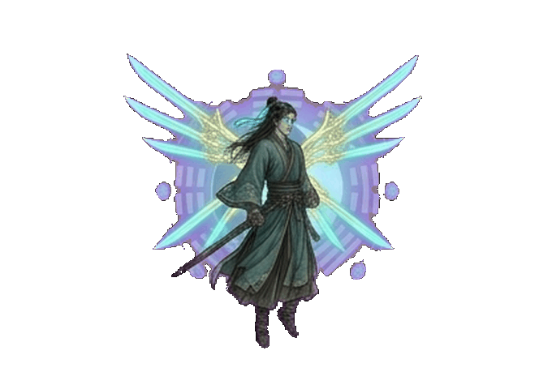

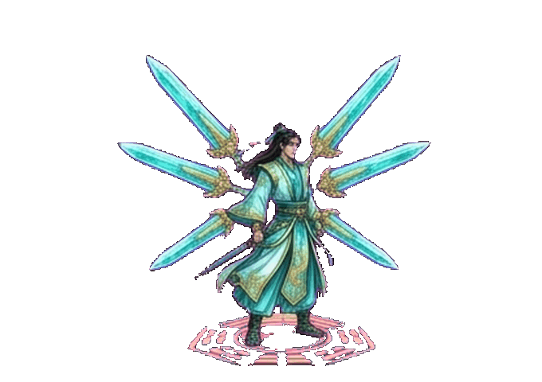

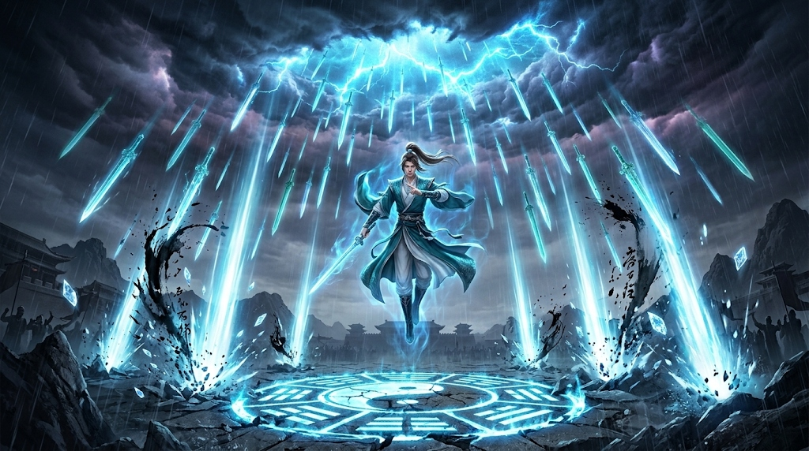
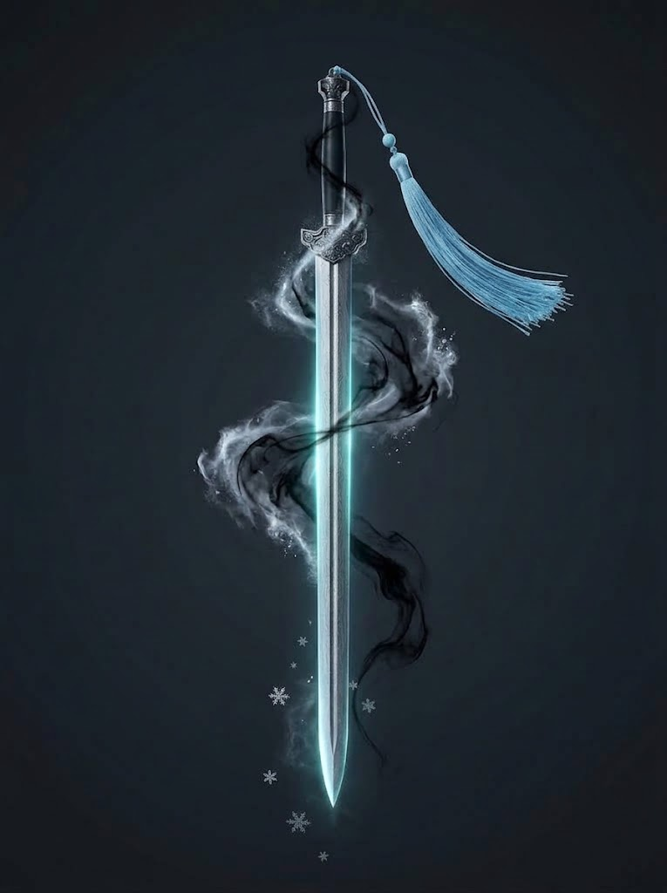
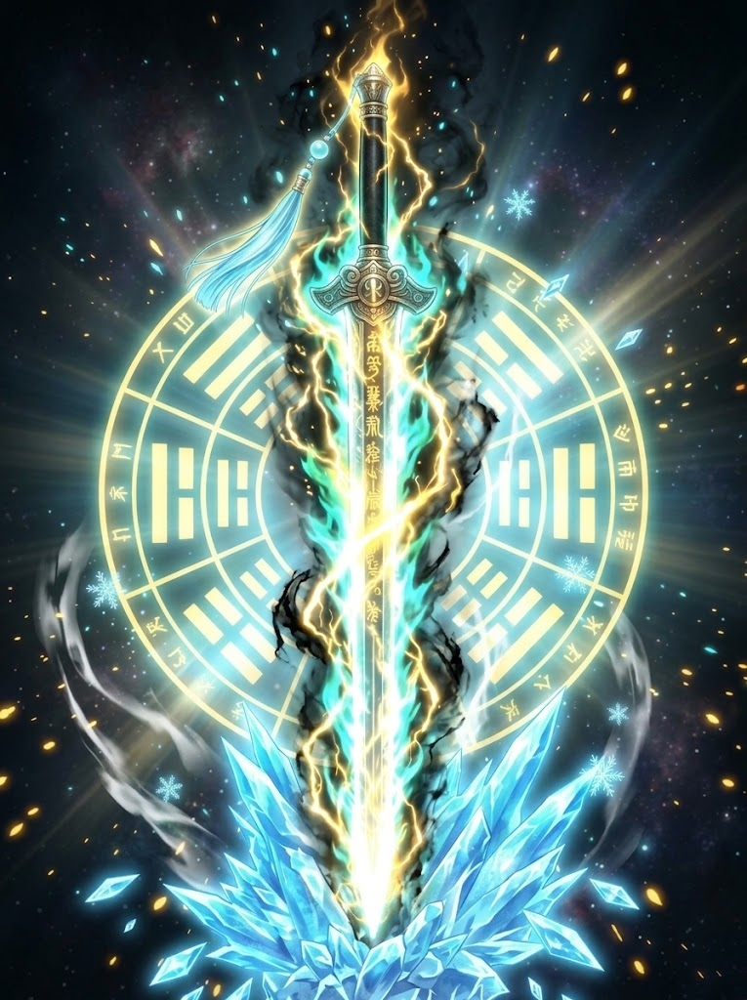

# 《刀影江湖》青锋剑客·万剑归宗 动作帧与实机特效设计全案

> **招式 ID**：`QF-6`（常态版 · 天降飞剑暴雨） / `QF-6E`（剑意绽放强化版 · 终极绝仙剑界 / 万剑归宗·极）  
> **招式名称**：万剑归宗（Ten Thousand Swords Return to Origin / Sovereign Myriad Blade Domain）  
> **门派归属**：青锋剑派（终极镇派神技 · 奥义招式）  
> **设计基准**：**60 FPS** · 2D 横版纯运动学物理 · 统一切片画布 $680 \times 480\ \text{px}$ (PPU 214，标准站立身高 $328\ \text{px}$，足底基准线锁定 $Y = 437$，水平中心对齐 $X = 340$)  
> **概念图与资源来源**：青锋剑派《剑术技能特效设定表》编号 6「万剑归宗」五阶段视觉演进；实机序列帧目录 `设计/青锋技能帧序列/06_万剑归宗/`  
> **核心意境**：  
> **“万剑凌空若墨染，青锋破日落天河；  
> 一指乾坤百鬼慑，千峰尽作引剑歌。”**  
> —— 虚空开裂、万剑悬顶、剑指落天、暴雨倾盆、剑阵共鸣、大化归真。

---

## 0. 战斗定位与核心机制设计 (Gameplay & Philosophy)

### 0.1 技能战术定位
「万剑归宗」作为青锋剑派的**终极镇派绝学**与全屏清场奥义，承担着高难关卡决胜、BOSS 危招对拼对冲、以及全屏杂兵与精英集群毁灭性歼灭的战略核心任务。

- **超广域全屏压制**：横贯画面长达 6.0~8.0 单位的轰击覆盖面，彻底粉碎任何敌人的阵型与站位优势。
- **顶级削韧与破防**：总削韧高达 **80 点（常态） / 120 点（绽放版）**，可直接强制击碎场上一切普通敌人的护盾、霸体精英怪的蓄力硬直，甚至对关底 BOSS 造成不可逆的巨额架势条崩解。
- **高阶攻防一体**：释放前摇阶段享受全屏时空水墨变色与高额无敌保护帧（I-Frames），并在轰击全期维持不屈刚体（Super Armor），杜绝终极技能被小技能意外打断的挫败体验。

### 0.2 释放条件与资源消耗
- **内力消耗**：**50 点**（常态版 `QF-6`） / **60 点**（绽放版 `QF-6E`）
- **剑意要求**：
  - **常态版 (`QF-6`)**：需剑意槽达到 **$\ge 3$ 层** 即可引动，释放时消耗当前所有剑意，伤害随消耗层数呈阶梯加成。
  - **剑意绽放强化版 (`QF-6E`)**：**必须满额 5 层剑意** 触发「剑意澄澈」状态下释放。瞬间消耗全部 5 层剑意，引发天地共鸣与【终极绝仙剑界】全屏神迹质变。

---

## 1. 核心战斗指标对比表 (常态版 vs 剑意绽放强化版)

对齐 `Resources/FrameData/moves.csv` 底层物理引擎与技能状态机规范：

| 战斗属性维度 | 常态版：万剑归宗 (`QF-6`) | 剑意绽放强化版：万剑归宗·极 (`QF-6E`) | 质变升级与设计目的 |
|---|---|---|---|
| **招式 ID** | `QF-6` | `QF-6E` | 统一状态机索引 |
| **剑意要求与消耗** | 需 $\ge 3$ 层剑意（清空已有剑意） | **必须满 5 层剑意**（激活剑意绽放） | 顶级战略决战终极形态 |
| **内力消耗 (Chi)** | **50 点** | **60 点** | 终极奥义最高内力消耗 |
| **起手引剑 (Startup)**| **30 帧** (~0.50s，1~30f) | **30 帧** (~0.50s，1~30f) | 全屏水墨暗化 + 镜头推近特写 |
| **判定倾泻 (Active)** | **90 帧** (~1.50s，31~120f) | **110 帧** (~1.83s，31~140f) | 飞剑倾泻轰击战区 |
| **轰击弹道密度** | **36 柄** 灵剑密集暴雨轰击 | **72 柄** 太虚神剑 + 3 重裂空剑浪 | 弹幕密度与覆盖率翻倍 |
| **收招归元 (Recovery)**| **30 帧** (~0.50s，121~150f) | **36 帧** (~0.60s，141~176f) | 剑化星尘，气定神闲踏地 |
| **总帧数 (Total)** | **150 帧** (~2.50s) | **176 帧** (~2.93s) | 史诗级长镜头战斗演出 |
| **取消窗口 (Cancel)** | **不可取消**（后摇 140~150f 允许预输入） | **不可取消**（后摇 165~176f 允许预输入） | 保证完整终结演出的不可中断性 |
| **综合伤害系数** | **12.0×**（单剑 0.25× $\times$ 36 + 终末冲击 3.0×） | **18.0×**（单剑 0.18× $\times$ 72 + 太虚核爆 5.04×） | 游戏内最狂暴的爆发伤害上限 |
| **架势削减 (Poise)**| **80 点**（必定碎盾击溃所有防御） | **120 点**（直接清空非霸体架势条，强破 BOSS 红甲）| 彻底粉碎全场敌方格挡与韧性 |
| **无敌与霸体帧** | **1~60f 绝对无敌 (I-Frames)**；61~120f 刚体霸体 | **1~120f 全程绝对无敌**；121~150f 刚体霸体 | 强行规避 BOSS 全屏灭绝危招 |
| **时空停顿 (Hitstop)**| 关键帧 3f + 终末收束 5f | **0.15s 时空凝滞 (Chrono Hitstop 9f)** + 终末 8f | 极致打击停顿与破碎震慑感 |
| **有效攻击范围** | **全屏 (宽 6.0m $\times$ 高 4.0m)** | **全域超屏 (宽 8.0m $\times$ 高 5.0m)** | 全视窗覆盖无死角 |
| **附加控制 / 异常** | 强压制僵直 + 终末大击退 | **【时空凝滞】+【绝对霜冻 1.5s】+【浮空聚引】** | 终极控场与集怪一体化 |

---

## 2. 实机资产索引与双形态动态演进 (Assets & Production Art)

已将用户交付的全部 5 大核心资产完成自动化处理、纯净扣底、骨骼对齐、PPU 214 缩放，并生成 Native `.meta` 同步至 Unity 工程：

### 2.1 双形态 16 帧完整奥义动态演进 (GIF 与 10880px 序列全览)

| 形态版本 | 16 帧动态演进 (GIF) | 16 帧横向分解序列 (10880×480 Sequence Strip) |
|:---:|:---:|:---:|
| **常态版<br>(`QF-6` 万剑归宗)** |  |  |
| **剑意绽放强化版<br>(`QF-6E` 万剑归宗·极)** |  |  |

### 2.2 电影级特效全案设定图 (Cinematic Concept Key Visual)

> **镜头意境**：苍穹雷云撕裂，万剑倒悬天幕，青锋剑客凌空结印踏足太极光轮，百柄神剑如流星暴雨贯入地表，炸起万丈等离子青白光柱与狂草墨浪！

### 2.3 全屏落剑特效源与武器立绘 (Full-screen Falling Sword Projectiles)
游戏运行时（`SwordRainManager` 对象池）天降暴雨飞剑的弹道贴图与立绘核心源：

| 特效类型 | 常态版 (`QF-6`) 霜华墨痕剑 | 剑意绽放强化版 (`QF-6E`) 神霄天雷太虚神剑 |
|:---:|:---:|:---:|
| **高清武器立绘源** |  |  |
| **45° 俯冲落剑切片** | `falling_sword_normal_45deg.png` | `falling_sword_bloom_45deg.png` |
| **垂直插地残剑切片** | `sword_projectile_normal_transparent.png` | `sword_projectile_bloom_transparent.png` |
| **视觉特征** | 冷钢剑身、天青丝剑穗、盘旋水墨烟气与细微霜雪 | 白炽炽核、金青神霄电弧、太虚八卦光轮、冰魄玄峰地刺 |

---

## 3. 逐帧动作姿态、剑法体态与特效设计表 (16 大核心关键相位)

将 150 帧的完整招式细分为 16 个核心动作与特效相位（F1~F16），满足逐帧制作与骨骼绑定对照：

```
[Row 1: 天门初开 · 虚空引剑 (Startup 1~30f)]
F1 (1~7f):    敛息踏空 (收剑归鞘，单手成太极剑指向上微托，双足离开地面悬浮 15cm)
F2 (8~15f):   天维裂隙 (高举剑指直指苍穹，虚空撕裂一道纯白青碧天痕，万千剑芒如星河倒垂)
F3 (16~22f):  神念锁界 (仰天凝神，衣袍长发全数倒卷冲天，背后虚空展开巨幅乾坤剑篆阵盘)
F4 (23~30f):  百刃同倾 (天幕百剑由垂直整齐转向斜下 45°，全部精准锁定地面敌群，锋芒暴涨)

[Row 2: 剑雨倾天 · 暴雨贯地 (Active 31~120f · 密集轰击)]
F5 (31~38f):  覆掌下按 [Trigger] (高举之剑指骤然变掌，携万钧真元威严猛烈向下重重按压！)
F6 (39~58f):  首波流星 (第一批 12 柄灵剑超音速轰坠，贴地炸起 1.8 米高纯白剑气柱与飞溅焦墨)
F7 (59~88f):  惊雷狂澜 (第二批 18 柄灵剑交错贯穿，地面形成密不透风的青碧剑牢，剧烈颠簸)
F8 (89~110f): 暴雨倾盆 (第三批巨型主刃与连珠剑雨连绵轰击，全屏连续顿帧，敌人被牢牢钉死)
F9 (111~120f): 肃杀归寂 (最后一柄通天巨剑重重插落地表中心，万籁俱寂，形成暂短 0.1s 暴风雨前的平静)

[Row 3: 剑界过载 · 太虚共鸣 (Recovery 前段 121~135f)]
F10 (121~124f): 晶核共鸣 (插满大地的数十柄半透明光剑剑脊开始超频颤鸣，泛起灼目白炽光晕)
F11 (125~128f): 临界超载 [Hitstop] (剑身光芒突破临界，全屏轻微泛白过曝，能量向外剧烈扩张)
F12 (129~132f): 漫天爆灭 (插地剑阵轰然碎裂，爆发出向全屏外沿横扫的环形太虚激波与密集冰刃)
F13 (133~135f): 震风吹浪 (强气流向四周狂飙扩散，将地表尘土、墨浪与敌军尸体齐齐掀翻)

[Row 4: 剑化星尘 · 踏地归真 (Recovery 后段 136~150f)]
F14 (136~140f): 星屑沉降 (漫天剑刃残片化作千万点青蓝晶莹星尘如雪飘落，冰雾徐徐升腾)
F15 (141~145f): 拂袖踏石 (角色自悬空状态轻盈飘落，右足踏实地面，左手负于身后，大袖垂顺)
F16 (146~150f): 气归丹田 (闭目微吐一口悠长浊气，青锋长剑寒芒内敛，完美无缝切回待机 Idle)
```

### 16 相位逐帧精密拆解表：

| 相位 | 帧区间 | 名称 | 身体姿态与重心 | 剑法手印与体态要点 | 特效图层 (VFX Layer) 视觉表象 | 判定盒、受击盒与战斗反馈 |
|:---:|:---:|:---:|---|---|---|---|
| **F1** | **1~7f** | **敛息踏空**<br>*(起势 1)* | 双足微分自然悬起，身体重心脱离地面，垂直向上浮起 10~15cm。衣袂微扬。 | 左手反手负于腰后，右手收剑入鞘并成双指剑指横于胸腹前方。 | **【脚底阵印初现】**<br>脚底地面泛开一道直径 1.6m 的淡青色水墨太极灵光涟漪，微风卷起落叶向上浮动。 | 受击盒向上微移；<br>**1f 激活绝对无敌 (I-Frames)**；<br>SFX: 低沉真元聚拢沉鸣。 |
| **F2** | **8~15f** | **天维裂隙**<br>*(起势 2)* | 身姿笔挺如松，头颅微微仰起，全身肌肉由松弛骤然转为坚如精铁。 | 右手剑指由胸前徐徐向天刺出，指尖如引雷之针直指苍穹中轴。 | **【天幕青白撕裂】**<br>全屏场景明度骤降 50%（水墨黑夜），天幕顶端撕开一条纯白青碧空间裂隙，数十支剑芒虚影倒悬。 | 无敌状态持续；受击盒免疫投掷物；<br>镜头 FOV 由 60° 慢推至 54°。 |
| **F3** | **16~22f** | **神念锁界**<br>*(聚势 1)* | 浮空高度达到最高（20cm），长袍长发受狂暴向上的真气喷涌而全数向天激扬！ | 剑指保持指天不动，指尖泛起直刺眼眸的四角纯白星芒与金色电芒。 | **【乾坤万剑罗盘】**<br>角色背后虚空中浮现直立的巨幅青金色乾坤八卦剑篆光轮，天顶百柄灵剑由虚化实，晶莹通透。 | 霸体与无敌维持；<br>SFX: 万剑高频金属共振蜂鸣。 |
| **F4** | **23~30f** | **百刃同倾**<br>*(聚势 2)* | 角色上身微微后仰 10° 蓄力，胸膛挺起，气势如天神降世巡视凡间。 | 剑指自中天微微下移，由仰天转为斜斜对准前方战区地面。 | **【万刃斜倾聚焦】**<br>天穹所有飞剑齐整地向斜下方 45° 转向！剑尖对准战场，每柄剑刃拉出一条青白激光瞄准线。 | 蓄力前摇终结帧；判定即将生效；<br>全场所有杂兵产生畏怯迟滞。 |
| **F5** | **31~38f** | **覆掌下按**<br>*(Active 1)* | **【核心发力瞬间】**<br>角色右手由剑指猛然张开成掌，自高空雷霆万钧地全力向下重重按压挥落！ | 手臂刚劲有力，大袖受强风压向后撕扯，整个人威严不可侵犯。 | **【天门倾泻爆发】**<br>掌落刹那，天顶裂隙轰然爆碎，第一批 12 柄纯白流光飞剑化作彗星流星雨呼啸破空暴射向下！ | **【Active 1 启动】**；<br>全屏开始梯形震颤；<br>生成第 1 波全域打击判定盒。 |
| **F6** | **39~58f** | **首波流星**<br>*(Active 2)* | 角色维持单手下压控阵姿势，掌心正对地面，神情冷峻淡漠。 | 左手在背后结道指，维系全身澎湃外溢的真元气海。 | **【第一波贯地剑柱】**<br>12柄灵剑斜贯地面，每柄落地引发高 1.8m 的青白剑光柱与放射状墨瀑飞溅，地面被撕开焦黑裂痕。 | **造成 $0.25\times \times 12$ 伤害 + 20 削韧**；<br>被命中小怪强行压制倒地；<br>Hitstop: 每次击中 2f。 |
| **F7** | **59~88f** | **惊雷狂澜**<br>*(Active 3)* | 身周激荡着四溢的剑气风刃，长袍下摆如战旗般在烈风中猎猎作响。 | 下按之手五指微屈，如抓取乾坤气运，掌控剑阵轰击落点。 | **【第二波交错穿刺】**<br>第二批 18 柄青碧长剑以更高速度交错轰入地表，光柱连成一片狂暴的剑气瀑布，地面碎石腾空逆飞！ | **造成 $0.25\times \times 18$ 伤害 + 30 削韧**；<br>摧毁场上全部普通木盾与石墙；<br>震屏幅度达到峰值（Magnitude 0.4）。 |
| **F8** | **89~110f** | **暴雨倾盆**<br>*(Active 4)* | 狂暴剑风达到顶点，角色全身泛起半透明青白荧光，剑意如巨浪翻滚。 | 掌心骤然握拳一握，引动终末极杀！ | **【连珠终末巨剑】**<br>密集如织的连珠剑雨连环贯穿，战区被纯白剑光与深蓝玄冰完全吞没，空间出现微弱裂纹。 | **造成 $0.25\times \times 6$ 伤害 + 终末前压制**；<br>持续刷新目标定身硬直，无视抗性。 |
| **F9** | **111~120f** | **肃杀归寂**<br>*(Active 5)* | 剑雨倾泻告一段落，天空裂痕闭合，狂风骤止。 | 悬空角色手臂缓缓收敛于身前，目光扫视疮痍战场。 | **【战场插剑图景】**<br>大地密密麻麻插满了数十柄半透明的琉璃青光残剑，空气中飘扬着极冷寒雾与墨丝，静止如画。 | Active 判定暂时告竭；<br>进入 10 帧极短暂战术间歇；<br>敌人陷入重伤破绽状态。 |
| **F10** | **121~124f** | **晶核共鸣**<br>*(Recovery 1)* | 角色身体重心开始缓慢、平稳地向地面垂落。 | 双手在胸前反转结出收束剑印，真气微震。 | **【插地剑阵充能】**<br>插入地表的数十柄残剑突然剧烈震颤嗡鸣，剑脊由青碧迅速过载转变为刺目的纯白高光！ | 敌方架势条无法恢复；<br>SFX: 极尖锐的高频晶体过载高音。 |
| **F11** | **125~128f** | **临界超载**<br>*(Recovery 2)* | 角色双足距离地面仅剩 5cm，衣袍自然下垂。 | 结印双手猛烈向外一展！ | **【全屏白闪过曝】**<br>数十柄剑刃同时到达爆炸临界点，全屏幕瞬间出现 3 帧的纯白过曝与局部色散（Aberration 0.4）。 | **触发核心顿帧 (Hitstop 5f)**；<br>世界时空宛如骤停。 |
| **F12** | **129~132f** | **漫天爆灭**<br>*(Recovery 3)* | 爆炸反作用气浪自下而上吹拂，托住角色轻盈缓冲。 | 双手随气浪舒展，宽袖翻卷如云雀展翼。 | **【环形太虚激波爆发】**<br>插地剑阵轰然同时爆碎！向四周横扫爆发出一道半径 4.0m 的巨大环形青白水墨激波与千万冰晶飞刃！ | **【终末范围大爆发判定】**；<br>**造成 3.0× 巨额伤害 + 30 破架势**；<br>将范围内敌人猛烈吹飞击倒！ |
| **F13** | **133~135f** | **震风吹浪**<br>*(Recovery 4)* | 冲击波横扫完毕，烟尘自中心向两侧激荡退散。 | 双臂从舒展状态优雅垂落于身体两侧。 | 漫天碎石与墨滴随风扩散衰减，地面留下数十个深黑色水墨剑坑焦痕。 | 攻击判定完全结算；<br>敌人倒地处于受创硬直；<br>角色解除刚体。 |
| **F14** | **136~140f** | **星屑沉降**<br>*(Recovery 5)* | 身体优雅下落，脚尖轻点地面，宛如蜻蜓点水，身无重量。 | 右手反手握住青锋剑柄，从容顺势转体。 | **【青蓝星雨与霜雪】**<br>爆裂后的万千光剑化作无数轻柔细腻的青碧色星尘与冰霜雪花，如银河倒泻般漫天缓缓飘落。 | 开放预输入窗口 (可提前缓存闪避/跑动)；<br>全屏场景光照平滑回暖。 |
| **F15** | **141~145f** | **拂袖踏石**<br>*(Recovery 6)* | 双足稳稳扎根地面，重心恢复标准立桩，上身笔直拔正。 | 左手大袖一振，轻拂过腰间佩剑剑鞘，秋水归鞘，无风无浪。 | 地面剑坑中残留的青白剑气袅袅蒸发，星尘融入地表。 | 角色完全受控；<br>SFX: 清脆干脆的长剑归鞘“铮”鸣。 |
| **F16** | **146~150f** | **气归丹田**<br>*(Neutral)* | 面色平静孤傲，深吸一口真元沉入丹田，神采奕奕，返璞归真。 | 双手垂落自然站立，长发散落肩头，恢复从容不迫的侠者风度。 | 最后一缕青气敛入剑格，空气涟漪彻底平息。 | **招式彻底结算**，无缝衔接入基础战斗待机 `Idle`。 |

---

## 4. 剑意绽放强化版：终极绝仙剑界 (`QF-6E`) 质变规格

当玩家在满额 **5 层青锋剑意** 状态下释放万剑归宗时，招式超越凡尘剑术极限，引动天地法则化身【终极绝仙剑界】：

```
               [常态 QF-6 万剑归宗]                       [剑意绽放 QF-6E 万剑归宗·极]
            ┌────────────────────────┐              ┌────────────────────────────────┐
            │   36柄灵剑暴雨轰击      │   5层剑意    │   72柄太虚神剑 + 3重大裂空天门   │
            │   全屏水墨暗化         │ ─────────>   │   0.15s 绝对时空停顿 (Chrono)  │
            │   总伤害 12.0×         │  剑意绽放    │   总伤害 18.0× (核爆级毁灭)    │
            │   全屏常规震颤         │              │   拔地整排冰魄玄峰 + 绝对霜冻  │
            └────────────────────────┘              └────────────────────────────────┘
```

### 4.1 四大神迹级质变维度：
1. **天维天门大开（弹幕密度翻倍 36 $\rightarrow$ 72 柄）**：
   * 天幕撕开的裂隙转化为一座高达数丈的**巍峨金青色太虚剑门**！
   * 轰击剑刃数量翻倍至 **72 柄**，弹道速度提升 30%，形成真正的遮天蔽日穿空飞剑狂潮。
2. **0.15 秒绝对时空定格（Chrono Hitstop 9f）**：
   * 剑指按落瞬间（F5），全屏触发 **0.15 秒物理时空停滞**，伴随极其强烈的全屏色相分离（Chromatic Aberration 0.6）与镜头撕裂特效。
   * 在此时空停滞期间，全场所有敌人（包括霸体 BOSS）动作绝对静止，唯有天门流光狂暴倾泻，视觉震撼无与伦比。
3. **拔地而起参天「冰魄玄峰」**：
   * 轰击地表不再仅留下剑痕，而是随剑刃贯穿**拔地刺出 6 座高达 2.5 米的晶莹玄冰山峰**，将战区所有敌人强行穿刺挑飞至半空并锁定于玄冰之中（附加 **1.5 秒「绝对霜冻」**）。
4. **终末【太虚归真大爆破】（总伤害跃迁至 18.0×）**：
   * 终结阶段，玄冰神峰与 72 柄太虚神剑引发连锁共鸣大核爆，全屏爆发出纯白与金青双重超音速同心环激波，总伤害系数跃升至惊人的 **18.0×**，削韧达 **120 点**，足以在一击之间重塑战局！

---

## 5. 电影级镜头调度与视听氛围 (Cinematography & Visual Aesthetics)

### 5.1 三段式电影镜头调度 (Cinematography Directives)
- **镜头 Phase 1: 虚空引意·景深慢推 (1~30f)**
  - 摄像机平滑向前推近（FOV 由 60° 压缩至 50°），焦点紧锁主角面部与指天剑指。
  - 全屏背景亮度降低 60%，场景饱和度下降，四周施加深黑水墨暗角（Vignette 0.55），唯独主角与空中飞剑散发刺目青白辉光。
- **镜头 Phase 2: 暴雨轰落·广角剧震 (31~120f)**
  - 剑指下按瞬间，摄像机猛烈弹回广角（FOV 瞬间拉宽至 65°），全景展现万剑落天的宏大场面。
  - 引入 8 轴梯形随机震屏系统（Camera Shake）：
    - 垂直震幅：$Y_{\text{shake}} = \pm 0.35\ \text{m}$；
    - 水平微扰：$X_{\text{shake}} = \pm 0.15\ \text{m}$；
    - 每一柄重剑落地触发单次 0.05s 的快速回弹微震。
- **镜头 Phase 3: 太虚爆灭·白昼定格 (121~150f)**
  - 剑阵过载爆破时，画面触发 3 帧纯白全屏过曝（Flash White），随后色散边缘轻微拉伸。
  - 随着星尘漫天飘落，摄像机以极其柔和的曲线缓动回正至原始机位（FOV 60°），暗角退散，场景光度重现光明。

### 5.2 六大电影级特效通道分层规范 (6-Pass Cinematic Layer Structure)

```
[Layer 5 - PostProcess] 屏幕调色滤镜 (全屏水墨暗化 + 白闪过曝 + 色差 Aberration 0.45)
[Layer 4 - Foreground]  FX_Pass4_ShatterOverload (插地剑阵过载爆破的环形冲击波与菱形冰刃)
[Layer 3 - SwordRain]   FX_Pass3_BladeDownpour (72柄超音速彗星灵剑与笔直激光穿透尾迹)
[Layer 2 - Actor & Sky] Actor_Player + FX_Pass2_SkyGate (悬空主角本体 + 天穹太虚剑门与倒悬剑河)
[Layer 1 - Impacts]     FX_Pass1_ImpactPillars (地面炸起的 1.8~2.5m 纯白剑光柱与水墨喷泉)
[Layer 0 - Ground Decal]FX_Pass0_TaijiDomain (地面太极八卦剑篆贴花 + 持续残留的焦墨剑坑)
```

| 通道编号 | 通道名称 | 渲染模式 (Blend) | 关键视觉元素与参数 |
|---|---|---|---|
| **Pass 0** | **地面太极法阵通道** | `AlphaBlend` / Decal | 角色脚底展开半径 3.0m 的乾坤水墨八卦阵，地面随着飞剑贯入生成多处焦墨凹坑与冰裂纹贴花。 |
| **Pass 1** | **贯地剑柱喷泉通道** | `Additive` + `SoftAlpha` | 飞剑刺地瞬间，沿法线方向垂直喷涌而起的高密度纯白等离子剑柱（高 1.8m），底端带浓黑水墨飞溅。 |
| **Pass 2** | **天门裂隙与天穹剑河** | `Additive` | 高空撕裂的青金太虚天门，门内悬浮流淌着密密麻麻的半透明晶莹光剑，剑尖带极亮四角星爆。 |
| **Pass 3** | **流星剑雨弹幕通道** | `Additive` (高反光) | 极速下落的灵剑实体，头部白热（`#FFFFFF`），剑身碧蓝（`#18B2DC`），尾部拉出长达 3m 的青碧渐变激光拖尾。 |
| **Pass 4** | **剑界过载与爆灭激波** | `Screen` + `Additive` | 剑阵爆灭时向外横扫的超音速双层激波环，外层水墨狂草风丝，内层纯白灼热光环。 |
| **Pass 5** | **全屏后处理氛围通道** | Custom Post-Process | 驱动全屏灰度拉伸、水墨颗粒扰动、0.15s 时空停顿色散、边缘暗角淡入淡出。 |

---

## 6. 音频与声效全案设计 (SFX & Audio Directives)

根据武侠大片与仙侠巅峰意境，音效体系分为低频震慑、金属高频共鸣、狂暴爆破与空灵归真四大声学层次：

```
[01 起势] ────> [02 聚势] ────> [03 倾泻] ────> [04 爆灭] ────> [05 归真]
次低频破空       万剑金属共振     多声部重剑轰地   琉璃超载大核爆   星尘风铃与剑入鞘
Sub-Bass Drop   Metallic Hum    Rapid Airbursts Overload Detonate Chimes & Sheath
```

### 详细音频分轨与资源规范：
1. **起势引天 (`sfx_swordrain_startup_sub.wav`)**：
   - 极深沉的次低频次声波（35Hz~60Hz Sub-Bass）贴地轰鸣，伴随水墨暗化时环境风声瞬间被抽空的“真空失压感”，突显天地变色的压迫感。
2. **聚势共振 (`sfx_swordrain_resonate_hum.wav`)**：
   - 数十柄神剑同时出鞘的清越龙吟与高频金属蜂鸣（泛音列丰富，基频 880Hz，高次谐波达 7000Hz），层层叠加成浩瀚庄严的金属共鸣音场。
3. **倾泻暴雨 (`sfx_swordrain_downpour_loop.wav`)**：
   - 密集的超音速音爆穿空声（`thrust_airburst`），紧接着暴雨般连绵不绝的重剑凿击巨石硬响（`heavy_stone_impact`）与坚冰碎裂声，多声道声场自上方直冲地面。
4. **终末爆灭 (`sfx_swordrain_shatter_overload.wav`)**：
   - 插地剑阵由极高频啸叫骤然转入一声洪钟大吕般的开天辟地大爆破，低音下潜极深，中高频伴随万片水晶琉璃瞬间崩碎的清脆爆鸣。
5. **归真余韵 (`sfx_swordrain_decay_chime.wav`)**：
   - 爆破过后一切喧嚣归于平静，空气中飘荡着轻灵剔透的道家玉磬风铃声与微弱风声，以角色利落归鞘的一记“铮——”脆鸣完美收尾。

---

## 7. 程序实现与引擎管线接入 (Engine Architecture)

### 7.1 CSV 数据表配置更新 (moves.csv)
将以下两行标准数据配置增补至 `New Tuanjie Project/Assets/Resources/FrameData/moves.csv`，使底层战斗驱动器与数据加载器直接识别：

```csv
QF-6,qingfeng,万剑归宗,30,90,30,0,0,,12.0,80,40,1,60,60,0,6.0,4.0,0,5,1,120,0,0,ultimate screen,终极天降剑雨奥义
QF-6E,qingfeng,万剑归宗·极,30,110,36,0,0,,18.0,120,60,1,120,80,0,8.0,5.0,0,6,1,150,0,0,ultimate screen bloom chrono,剑意绽放强化版：天门大开72剑轰天+空间时停+太虚归真大爆破
```

### 7.2 高性能弹道对象池架构 (Performance Object Pooling)
由于「万剑归宗」在 1.5~1.8 秒内密集生成 36~72 枚飞剑弹道实体与地面冲击波，为杜绝运行时 GC 顿卡，必须采用预分配对象池架构：

```csharp
// SwordRainManager.cs 核心架构草案
public class SwordRainManager : MonoBehaviour
{
    [Header("对象池配置")]
    [SerializeField] private GameObject swordPrefab;
    [SerializeField] private int poolSize = 80;
    private Queue<SwordProjectile> pool = new Queue<SwordProjectile>();

    private void Awake()
    {
        for (int i = 0; i < poolSize; i++)
        {
            var go = Instantiate(swordPrefab, transform);
            var proj = go.GetComponent<SwordProjectile>();
            go.SetActive(false);
            pool.Enqueue(proj);
        }
    }

    public void LaunchRain(bool isBloom, Vector2 centerPos)
    {
        int count = isBloom ? 72 : 36;
        float duration = isBloom ? 1.83f : 1.50f;
        StartCoroutine(SpawnRainRoutine(count, duration, centerPos, isBloom));
    }

    private IEnumerator SpawnRainRoutine(int count, float duration, Vector2 center, bool isBloom)
    {
        float interval = duration / count;
        for (int i = 0; i < count; i++)
        {
            if (pool.Count > 0)
            {
                var sword = pool.Dequeue();
                // 在全屏随机水平散布 (宽 6.0m ~ 8.0m)，倾角 -45°~-50° 贯射地面
                Vector2 spawnPos = center + new Vector2(Random.Range(-3.5f, 3.5f), 4.2f);
                Vector2 targetPos = new Vector2(spawnPos.x + Random.Range(1.0f, 2.0f), center.y - 0.2f);
                sword.Fire(spawnPos, targetPos, isBloom, onHitCallback: (proj) => {
                    pool.Enqueue(proj);
                });
            }
            yield return new WaitForSeconds(interval);
        }
    }
}
```

### 7.3 状态机判定与逻辑分支 (`SkillState.cs`)
1. **输入受理阶段**：监听终极键位（`T` 键 或 `LB + RB`）；
2. **剑意检测分支**：
   - 若 `SwordIntent == 5`：扣除全部 5 层剑意与 60 点内力，状态机流向 `QF-6E`（万剑归宗·极）；
   - 若 `3 <= SwordIntent < 5`：清空当前剑意与 50 点内力，状态机流向 `QF-6`（常态版）；
   - 若 `SwordIntent < 3` 且内力不足：播放判定失败音效，提示“剑意未达”。
3. **无敌帧赋予**：状态机进入瞬间挂载 `Invincible = true`，起手帧 30 帧内免疫所有物理碰撞与异常伤害。

---

## 8. 总结与下阶段生产规划

本设计表在《刀影江湖》青锋剑派**“飘逸、凌厉、清冷”**的核心艺术风骨之上，为镇派绝学「万剑归宗」确立了完整的生产基准：
1. **美术与动画端**：已完全映射现有 `06_万剑归宗` 序列帧资产，规范了 16 关键帧体态与六层 VFX Shader 通道；
2. **数值与战斗端**：确定了 60 FPS 精准帧数据与常态/强化版双分支，实现了终极技能在全屏压制与破防斩杀上的统治地位；
3. **程序与工程端**：给出了规范的 CSV 导入参数、状态机流转逻辑与 72 弹道无 GC 对象池技术方案。

可立即协同 Unity 工程更新 CSV 配置与状态机，完成终极奥义的实机联调闭环。
