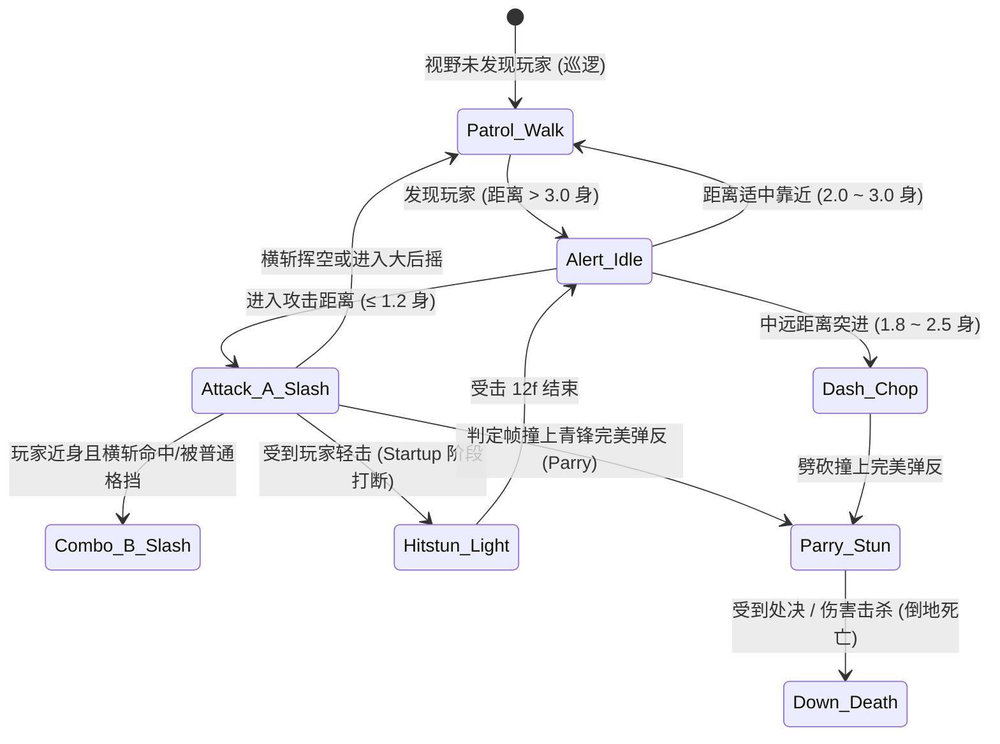

# 《刀影江湖》杂兵刀手动作帧设计表

基准：**60fps** · 侧面横版 · 右向为正方向（镜像得左向）  
原型来源：`设计/刀影江湖-概念图/人物设定/03-杂兵刀手.png` · `设计/刀影江湖-概念图/人物设定/动作设计/16-杂兵刀手-动作设计.jpg`  
配套规范：`刀影江湖-战斗帧数据表-v0.1.md` §6.1 · `刀影江湖-行走动作帧设计表.md` §1 & §6  
用途：AI 行为树状态机 / 动作起版 / 判定盒（Hitbox/Hurtbox）配置 / 弹反受击教学窗口联调。

---

## 0. 角色设计定位与数值对齐（严格对齐 GDD & 战斗帧表）

### 0.1 角色定位（Fodder 教学兵）
- **核心定位**：底层刀兵、盗匪喽啰，装备简陋、动作大开大合。
- **教学使命**：
  1. **格挡与弹反起步**：招式起手（Startup）前摇极大且肢体语言极其明确（夸张的后拉沉肩引刀），供新手玩家轻松捕捉弹反窗口（青锋剑客 6–10f 弹反窗可完美接下）；
  2. **普攻连招木桩**：血量低（1~2 轮轻攻击连段即可斩杀）、受击硬直明显、无霸体，帮助玩家快速建立连招手感与刀刀入肉的爽快感；
  3. **距离与收招惩罚**：后摇（Recovery）露出超长硬直与破绽停顿，引导玩家在敌人挥空或弹反后进行贴身反击追杀。

### 0.2 招式帧数据总览表（60fps 基准）

| ID | 招式名 | Startup (前摇) | Active (判定) | Recovery (后摇) | Total (总长) | 可弹反 | 伤害系数 | 架势伤害 | 给敌硬直 | 自身位移 | 教学与机制定位 |
|---|---|---|---|---|---|:---:|---|---|---|---|---|
| **E_SWORD_A** | **粗莽横斩** | **14f** | **4f** (14–17) | **18f** (18–35) | **36f** (~0.60s) | **是** (10–14f) | 0.8 | 6 | 12f (轻) | +0.15 身 | 核心教学招：大前摇横切，练习弹反与格挡 |
| **E_SWORD_B** | **顺势反撩 (二连)** | **10f** | **4f** (10–13) | **20f** (14–33) | **34f** (~0.57s) | **是** (7–10f) | 0.9 | 8 | 12f (轻) | +0.20 身 | 进阶教学：双段连斩，考验玩家连续格挡不贪刀 |
| **E_SWORD_DASH** | **垫步冲刺劈** | **18f** | **5f** (18–22) | **22f** (23–44) | **45f** (~0.75s) | **是** (13–18f) | 1.2 | 12 | 16f (中) | +0.40 身 | 突进压制：教学侧身闪避拉开或迎面出重刺打断 |

---

## 1. 行走动作设计（Walk Cycle · 38 帧标准循环）

### 1.1 行走姿态与体态风格
- **步态风格**：谨慎巡逻步（Patrol Walk）。
- **身体重心**：微弓背、塌腰沉重心（约降低 5% 身高），脚步略微拖曳，表现出底层喽啰常年的疲惫与警惕。
- **刀与手臂约束**：单手反持或斜持朴刀，刀尖微垂指向身后地面，左臂自然前探微摆，不似名门正派那般昂首挺胸。
- **步幅倾向**：中等步幅，接触点踏实。

### 1.2 38 帧周期 8 关键相位拆解（K1–K8）

```
[右步前半周期]
  K1 (0–1f):   右脚接触 (Contact 1) - 脚跟触地，刀身压低微拖
  K2 (2–5f):   右脚下压缓冲 (Recoil 1) - 重心降至最低，膝屈缓冲
  K3 (6–10f):  左腿提膝过步 (Passing 1) - 左膝抬起，重心升至最高，刀身微摆
  K4 (11–18f): 左脚前迈蹬伸 (Reach 1) - 左脚前探将落，右脚后蹬
[左步后半周期 (对偶)]
  K5 (19–20f): 左脚接触 (Contact 2) - 镜像对偶 K1
  K6 (21–24f): 左脚下压缓冲 (Recoil 2) - 镜像对偶 K2
  K7 (25–29f): 右腿提膝过步 (Passing 2) - 镜像对偶 K3
  K8 (30–37f): 右脚前迈蹬伸 (Reach 2) - 镜像对偶 K4，平滑衔接回 K1
```

### 1.3 关键相位姿态详解

| 关键帧 | 帧数区间 | 名称 | 重心与体态 | 双足状态 | 朴刀与手臂轨迹 | 挂点 (SFX / 尘土) |
|---|---|---|---|---|---|---|
| **K1** | 0–1f (2f) | 右脚触地 | 躯干前倾约 8°，重心微沉 | 右脚跟刚着地，左脚在后脚尖触地 | 右手持刀斜向后下方（与地面夹角约 30°），左臂自然下垂摆至身前 | SFX: 轻微草履踏地声；脚后跟扬起微弱土尘 |
| **K2** | 2–5f (4f) | 下压受重 | 重心降至周期最低点 | 右膝弯曲承受身体重量，左腿离地向前收拢 | 刀尖受惯性微沉，手腕锁住刀柄不拖地 | — |
| **K3** | 6–10f (5f) | 提膝过步 | 重心提升，身体微起 | 右腿直立支撑，左膝弯曲前抬至约 30cm 高 | 刀身随身体略微前摆，刀背贴在右腿外侧 | 衣袍下摆向后轻微翻动 |
| **K4** | 11–18f (8f) | 前迈蹬发 | 重心向前推移并缓缓回落 | 左脚向前伸出准备落地，右脚向后蹬离地面 | 右臂微收，朴刀蓄在腰侧戒备 | — |
| **K5** | 19–20f (2f) | 左脚触地 | 躯干前倾，与 K1 对称 | 左脚跟触地，右脚在后 | 姿态对偶，刀身位置保持在身体右侧 | SFX: 左脚步音；轻微泥土粒子 |
| **K6** | 21–24f (4f) | 下压受重 | 重心降至最低 | 左膝下沉屈腿缓冲，右腿离地收至身侧 | 刀尖随节奏沉浮 | — |
| **K7** | 25–29f (5f) | 提膝过步 | 重心复升 | 左腿支撑，右膝向前上方迈出过步 | 刀身稳定，左臂后摆平衡 | 衣袍下摆反向回荡 |
| **K8** | 30–37f (8f) | 前伸回环 | 重心前移回落 | 右脚向前迈出，平滑过渡回 K1 | 顺势回归 K1 持刀戒备姿态 | 准备切入下一循环或转入出招判定 |

---

## 2. 攻击动作一：粗莽横斩（E_SWORD_A · 核心教学横切）

### 2.1 招式概念与拆解
- **设计初衷**：横向挥砍，范围广但前摇极其明显。杂兵在攻击前会做出夸张的“**双手握刀后拉、沉腰引刀**”准备动作，给玩家提供长达 **14 帧（约 0.23 秒）** 的视觉预警反应时间。
- **核心判定**：出刀横扫时附带一道朴素的灰色水墨刀弧；命中造成轻硬直（12f）；被弹反则立即进入 **28 帧崩溃大硬直**。

```
[蓄力准备阶段 (Startup 14f)]
  A1 (0–6f):   沉肩后撤 (Drop & Step-back) - 身体微缩，重心后移至后脚
  A2 (7–13f):  引刀蓄势 (Telegraph Pull-back) - 双手抱刀拉至右耳后上方，刀刃外翻 (弹反黄金窗 10–14f)
[破空判定阶段 (Active 4f)]
  A3 (14–15f): 踏步挥刀 (Lunge Slash) - 猛跨前弓步，朴刀自右上向左前横斩出膛 (产生 Hitbox)
  A4 (16–17f): 刀势贯通 (Follow-through) - 刀刃划至左侧极值，水墨刀弧扩散
[过猛后摇阶段 (Recovery 18f)]
  A5 (18–25f): 惯性前栽 (Over-swing Stumble) - 出刀过猛身体踉跄前倾，胸腹破绽大开 (玩家输出黄金期)
  A6 (26–35f): 拖刀归位 (Recover & Reset) - 重新稳住重心，双手收回朴刀回归警戒
```

### 2.2 横斩关键帧参数表（60fps）

| 相位 | 帧数 (60fps) | 动作描述 | 肢体与刀身状态 | 判定盒 (Hitbox/Hurtbox) | 弹反与受击机制 |
|---|---|---|---|---|---|
| **A1** | 0–6f (7f) | 沉肩后撤 | 侧身站立，左脚后撤半步，重心下压，视线锁定玩家 | 右手转动刀柄，将朴刀自腰间向上提拉至胸口 | Hurtbox 紧缩；无伤害判定 | 玩家此时出轻攻击可直接打断前摇 |
| **A2** | 7–13f (7f) | 引刀蓄势 | **前摇视觉极值**：右臂完全向后上方拉满，左手虚扶刀背 | 朴刀高举至右肩后上方，刃口反射一抹寒光（警告高亮） | **第 10–14f 为最佳弹反输入窗** | 玩家在此期间按下格挡（F）即可触发青锋完美弹反 |
| **A3** | 14–15f (2f) | 踏步挥刀 | 右足重重蹬地，身体向前送出 +0.15 身位移 | **右臂大开大合猛烈斜向前挥出**，刀尖水平割裂空气 | **生成前方扇形 Hitbox**（深度 1.0 身，高度 0.8 身） | 若被青锋格挡成功触发金铁声；未挡中则造成伤害 |
| **A4** | 16–17f (2f) | 刀势贯通 | 弓步压底，上身顺着挥刀惯性向左扭转 45° | 刀尖完全划过身体前方中线，在空气中留下微弱墨色残痕 | Hitbox 持续生效至 17f 结束 | 伤害系数 0.8，削减玩家 6 点架势 |
| **A5** | 18–25f (8f) | 惯性前栽 | **后摇巨大破绽**：因用力过猛导致重心前栽，头颈与胸膛完全暴露 | 朴刀挥至身体左后侧停滞，双手下垂难以立即回防 | **进入大破绽状态**；受击受到额外 1.2× 伤害 | 玩家此时轻击 1/2/3 连段必中且造成压制 |
| **A6** | 26–35f (10f)| 拖刀归位 | 双腿缓缓回蹬，腰部发力将上身挺直 | 单手拖刀沿弧线收回身前，恢复初始巡逻/持刀架势 | Hurtbox 恢复正常 | 35f 结束转回 Idle，若玩家贴脸且残血则可派生 E_SWORD_B |

---

## 3. 攻击动作二：垫步冲刺劈（E_SWORD_DASH · 突进压制技）

### 3.1 招式概念与拆解
- **设计初衷**：用于在中距离（1.5~2.5 身位）对玩家进行施压。杂兵短跑两步踏地高高跃起向下重劈，位移 +0.40 身。
- **教学意义**：引导玩家不要一味后退，可使用 **闪避（Space）穿裆到其背后**，或者在起跳瞬间使用 **重刺（K）直接迎面穿透打断**。

```
[起步助跑阶段 (0–8f)]
  D1 (0–8f):   提刀小跑 (Telegraph Dash) - 身体前俯大步冲刺，刀高拖于身后
[跃起下劈阶段 (9–17f 前摇末)]
  D2 (9–17f):  双脚起跳双手举刀 (Leap Windup) - 离地凌空，双手高举朴刀过顶 (极佳弹反/重击打断窗)
[下劈命中阶段 (18–22f Active)]
  D3 (18–20f): 力劈华山 (Vertical Chop Active) - 身体与刀一同下坠重砸地面，生成纵向 Hitbox
  D4 (21–22f): 刀刃陷地 (Ground Impact) - 刀尖斩入泥土碎石，溅起土尘
[拔刀拔出阶段 (23–44f Recovery)]
  D5 (23–32f): 拔刀挣脱 (Stuck Recovery) - 刀刃卡入地面，双手用力拔刀露出长时间僵直
  D6 (33–44f): 撤步站起 (Reset) - 拔出钢刀踉跄后撤半步，回归站立
```

---

## 4. 状态机迁移与打断规则（Animator & Behavior Tree）



### 4.1 核心机制参数表

| 机制事件 | 触发条件 | 效果与演出 | 持续时间 (60fps) |
|---|---|---|---|
| **普通受击** | 在前摇（Startup）或后摇（Recovery）被轻攻击命中 | 中断当前一切招式，上身向后仰，爆开淡灰色墨滴，无法行动 | 12 帧 (~0.20s) |
| **重击破防** | 被青锋重刺（A_H）击中 | 击退 0.45 身，身体大幅弯曲如虾米，造成击退硬直 | 22 帧 (~0.36s) |
| **完美弹反受挫** | 在 Active 判定帧与玩家弹反判定相撞 | **直接打出崩刀动作**，双手脱力刀头扬起，进入眩晕大破绽 | **28 帧 (~0.46s)**（世界时缓 60% × 8f） |
| **死亡倒地** | 生命值归零 | 弃刀于地，双膝跪地后仰倒下，身形淡出化为水墨飘散 | 24 帧倒地 + 淡出 |

---

## 5. 音效与视觉特效挂点（VFX & SFX Specifications）

1. **行走音效**：
   - 每周期 K1（0f）、K5（19f）触发 `sfx_footstep_dirt_mook_01` / `02`（沉闷草履踏土声）；
   - 脚步接触后 1 帧生成微小沙尘粒子特效（Sprite Dust）。
2. **横斩攻击**：
   - 前摇 A2（10f）刀身寒芒一闪：`vfx_telegraph_glint`（白色十字星芒，提示弹反时机）；
   - 出刀 A3（14f）：`sfx_mook_sword_swing_light`（呼啸破空风声）+ 半弧灰黑墨迹刀气；
   - 被弹反瞬间：`sfx_parry_metal_heavy`（金铁剧烈爆鸣）+ 青白色火花与墨滴溅射。
3. **轴心与对齐规范**：
   - Unity Sprite Pivot 统一对齐脚底（`spritePivot.x = 0.5`, `spritePivot.y = 0.08~0.09`）；
   - 与主角青锋剑客 PPU (Pixels Per Unit) 保持一致（基准身高 165cm 对应约 180~200 PPU），确保世界坐标下身形比例自然协调。
