# 《刀影江湖》青锋剑客·破空刺 (剑意绽放强化版) 动作帧与特效设计全案

> **招式 ID**：`QF-1E`  
> **招式名称**：破空刺·剑意绽放（Piercing Void Thrust · Sword Intent Bloom / 极·破空刺）  
> **设计基准**：**60 FPS** · 2D 横版纯运动学物理 · 统一切片画布 $680 \times 480\ \text{px}$ (PPU 214)  
> **概念图来源**：《青峰剑派 剑术技能特效设定表》编号 1「破空刺」五阶段视觉演进 + 剑意机制核心规则  
> **核心意境**：**“剑意澄澈，破空化裂空；身化惊芒，瞬透万重敌；剑痕所过，墨碎虚空，霜雪漫天。”** —— 空间穿透、多段引爆、绝对无敌、冰霜场域。

---

## 0. 机制核心与心流体验 (Design Philosophy)

在《刀影江湖》中，普通版的破空刺（`QF-1`）是一招**高风险高收益的高速直线突进中继技**；而当玩家积攒满 **5 层剑意** 达到「剑意澄澈」状态并释放破空刺时，招式将发生**本质性的质变升华**：

1. **从「位移突进」到「空间穿透 (Phasing Through)」**：位移距离从 $0.9$ 单位翻倍至 **$1.8$ 单位**（约 $3.8$ 米）。角色在突刺判定期进入虚化态，**无视敌人体积碰撞，直接穿透重型霸体怪物与持盾敌人，瞬移至其背后**！
2. **从「无防备前冲」到「刚体起手 + 绝对无敌」**：
   - 前摇第 $5\sim8$ 帧享有 **刚体护体（Super Armor）**，不被任何轻重攻击打断；
   - 突进爆发第 $9\sim14$ 帧享有 **完全无敌帧（Invulnerability I-Frames）**，可直接顶着全屏弹幕或 Boss 大招强行穿刺反杀。
3. **从「单次刺击」到「虚空裂隙 + 三度墨痕引爆」**：
   - 穿刺路径不再只是留下残光，而是永久撕开一条持续 $1.2$ 秒的**青黑空间裂隙**；
   - 玩家穿透至敌人背后拔剑的瞬间，裂痕产生共鸣连环碎裂，诱发 **3 段极速二次多段斩击**，造成毁灭性打击与大范围浮空！
4. **环境异象：冰霜寒意结界**：
   - 地面生成一条持续 $3$ 秒的深黑焦墨与冰封霜痕，进入该区域的敌人移速降低 $30\%$，呼应青锋剑派“清冷孤绝、冰霜凝结”的门派意境。

---

## 1. 核心战斗指标对比表 (常规版 vs 剑意绽放强化版)

| 战斗属性维度 | 常规版：破空刺 (`QF-1`) | 剑意绽放强化版：破空刺 (`QF-1E`) | 质变升级与设计目的 |
|---|---|---|---|
| **剑意消耗** | 0 层（命中敌人 +1 层） | **消耗全部 5 层满额剑意** | 终结型爆发资源置换 |
| **前摇 (Startup)** | 8 帧 (1~8f) | **8 帧 (1~8f)** | 保持极速响应，不增加拖沓 |
| **判定 (Active 1)** | 4 帧 (9~12f) | **6 帧 (9~14f)** | 穿透位移翻倍，延长有效判定窗 |
| **判定 (Active 2)** | 无 | **4 帧 (19~22f)** | **【质变】空间裂隙三次二次引爆** |
| **后摇 (Recovery)** | 14 帧 (13~26f) | **16 帧 (15~30f)** | 略微延长收招展示空间破碎与抽剑 |
| **总帧数 (Total)** | 26 帧 (~0.433s) | **30 帧 (~0.500s)** | 节奏紧凑利落，半秒内打完毁灭爆发 |
| **取消窗口 (Cancel)**| 12~20 帧 (翻滚) | **16~24 帧 (翻滚 / 普攻 / 派生)** | 穿透至敌人背后可即刻背刺连击 |
| **霸体与无敌** | 全程无霸体 | **5~8f 刚体 / 9~14f 完全无敌** | **强攻无敌，攻防一体** |
| **自身水平位移** | +0.9 单位 (~192px) | **+1.8 单位 (~384px)** | **位移翻倍，支持全体积穿透** |
| **综合伤害系数** | 1.6× (基准 16 点) | **3.4× (1.6× 首穿 + 0.6× × 3 次裂爆)** | **伤害提升 112.5%** |
| **架势削减 (Poise)**| 12 点 | **28 点 (破甲粉碎)** | 单招即可击溃绝大多数精英敌人霸体 |
| **顿帧 (Hitstop)** | 3 帧 (单体停顿) | **6 帧 (全屏时空停滞 + 镜头微推)** | 剧场级震撼打击停顿 |
| **附加异常状态** | 无 | **冰霜霜痕 (减速 30%，持续 3.0s)** | 控场压制与门派意境升华 |

---

## 2. 八大关键相位 (P1~P8) 逐帧精密时序图谱 (60 FPS)

```mermaid
flowchart LR
    P1["P1 (1-4f)<br>起势·引虚空隙"] --> P2["P2 (5-6f)<br>聚势·四灵剑环<br>[刚体激活]"]
    P2 --> P3["P3 (7-8f)<br>破障·身化残影"]
    P3 --> P4["P4 (9-14f)<br>爆发·虚空穿透<br>[无敌 / 6f时空停滞]"]
    P4 --> P5["P5 (15-18f)<br>裂痕·共鸣蓄爆<br>[穿至敌后]"]
    P5 --> P6["P6 (19-22f)<br>引爆·三度墨爆<br>[二次判定 Active 2]"]
    P6 --> P7["P7 (23-26f)<br>结界·回风抽剑<br>[开放取消窗]"]
    P7 --> P8["P8 (27-30f)<br>余韵·霜华散尽<br>[切入待机]"]

    style P2 stroke:#f66,stroke-width:2px
    style P4 stroke:#0ff,stroke-width:3px,fill:#003344
    style P6 stroke:#ff0,stroke-width:3px,fill:#443300
```



---

## 3. 逐帧动作姿态、特效图层与物理驱动全案

| 相位 | 帧区间 | 相位名称 | 角色本体姿态 (Sprite Layer) | 剑与手臂要点 | 核心视觉特效 (VFX Layer) | 物理与判定 (Collider & Kinematics) |
|:---:|:---:|:---:|---|---|---|---|
| **P1** | **1~4f** (4帧) | **起势·引虚空隙**<br>*(① 起势)* | 重心下潜 25px，双脚踏地呈玄武守势。周身 5 阶剑意青白光芒汇聚于丹田并向右手暴烈引流，发带无风自鼓，外袍青光流转。 | 左手双指如刃直指正前方，指尖空气呈现剧烈高斯热浪扰动；右手在腰际反手握剑，剑身泛起极刺目白炽高光。 | **【虚空裂痕引线】**<br>剑尖与左手指尖前方凭空撕开一条**黑蓝相间、边缘泛着白光的锯齿状虚空引线**，向前穿透延伸 3.5 米，空气中伴有微细黑色墨滴粒子向裂线收敛。 | $v_x = 0$；受击框紧缩；<br>SFX: 沉闷的空气抽吸与空间压缩高频蜂鸣（重力扭曲音）。 |
| **P2** | **5~6f** (2帧) | **聚势·四灵剑环**<br>*(② 聚势)* | 重心完全后坐压实，上身俯冲倾角达 45°。身体周围浮现青白色道家水墨八卦阵环与踏风残影。**刚体激活，周身浮现金青色护体轮廓光**。 | 右臂肌肉高度压缩，剑身前倾 15°，剑脊与小臂并拢蓄势。 | **【四柄悬浮飞剑显现】**<br>虚空中骤然凝结出 **4 柄实质化青晶飞剑虚影**，环绕在剑尖与右小臂周围，呈同轴螺旋向心高速旋转，卷起剧烈水墨旋风。 | **【刚体生效 (Armor)】**；<br>$v_x = 0$；脚底地面凹陷破碎，激荡开一圈环形水墨震波（半径 1.0m）。 |
| **P3** | **7~8f** (2帧) | **破障·身化残影**<br>*(② 聚势末)* | 蹬地离弦！后腿爆裂反弹，整个人身形完全拉长呈一道青白相间的流光剪影，留下 2 道半透明水墨残影（Ghost Trails）。 | 右肘以雷霆万钧之势直线前推，长剑破开空气音障，4 柄飞剑如钻头般先行一步向前射出。 | **【风套化为螺旋钻风】**<br>锥形气套暴涨至直径 1.2 米，青色烈风与墨色狂澜向后猛烈喷发，地面被刮出三道深深的气流擦痕。 | 位移起步（$v_x = 24.0$ 单位/秒）；<br>无视小怪体积阻挡；<br>SFX: 音障爆裂的前置咆哮。 |
| **P4** | **9~14f** (6帧) | **爆发·虚空穿透**<br>*(③ 爆发)* | **【极限穿透态势 · 完全无敌】**<br>大弓步在半空瞬移伸展，身形化作一道纯白极光！**以超越视觉的速度穿透所有目标的身躯并瞬移至其背后**！外袍完全撕扯成墨线。 | **右臂、青锋剑与 4 柄飞剑合而为一**，化为一道长达 4.5 米的超巨型毁灭青白光锥，剑锋直刺天际尽头。 | **【天崩级青白裂空光锥 + 空间裂隙】**<br>轰然爆发直径 1.6 米、长 4.5 米的超巨型光锥，纯白内芯刺破画面！<br>穿刺主轴上撕裂开一道**宽 0.3 米、贯穿全屏的永久性虚空墨痕裂隙**！<br>命中瞬间触发**全屏 6 帧时空静止（Chrono Hitstop）**、色差色散（Chromatic Aberration 0.4）与强力镜头震颤！ | **【Active 1 判定期 / 完全无敌 (I-Frames)】**；<br>位移在 6 帧内走完 **+1.8 单位**；<br>判定盒：宽 3.2m、高 1.4m；<br>首段造成 **1.6× 穿透伤害 + 28 点碎甲断韧**；<br>敌人被击中进入长硬直僵直。 |
| **P5** | **15~18f** (4帧) | **裂痕·共鸣蓄爆**<br>*(④ 收束 1)* | 稳稳踏在敌人身后 1.5 米处！前脚掌咬死地面，身体因惯性微后倾，后足笔直紧绷拉出制动长弓步。背对敌人，气定神闲。 | 长剑顺势平端在前，剑尖在空中划过一道清冽的青色半月弧光，剑身剧烈震颤引发整条穿刺轴线共鸣。 | **【裂痕由静转沸】**<br>留在敌人身上的虚空裂痕开始发出刺耳的高频共振声，裂隙内部的墨汁与青光开始像沸水般急剧膨胀，4 柄穿过敌人体内的飞剑虚影反向定格在敌人体内！ | 角色位移归零；进入 Recovery 1；<br>脚底摩擦生成两道持续 3 秒的冰封墨痕；<br>SFX: 细微且极度密集的飞剑引信共鸣蜂鸣。 |
| **P6** | **19~22f** (4帧) | **引爆·三度墨爆**<br>*(④ 收束 2)* | 保持背对敌人的孤傲弓步，右手手腕骤然向内猛力一拧（抽剑引爆手势），剑尖微挑，剑指凌空一捻！ | 剑锋震出一圈冰蓝音爆光环，引爆空间共鸣！ | **【核心二次爆发 · 三度断空墨爆】**<br>留在穿刺轨迹上的虚空裂痕在 **第 19f、20f、22f 连续爆开 3 团刺目的青白十字星芒与水墨爆轰**！<br>敌人体内被连环切出 3 道交叉墨痕血光，被强劲爆风掀离地面浮空！ | **【Active 2 判定期】**；<br>对穿透路径内所有敌人造成 **3 次连续打击（每次 0.6×，共 1.8× 伤害）**；<br>附加高浮空与强制打断效果；<br>SFX: 连续三声清脆炸裂如碎冰玉崩之音。 |
| **P7** | **23~26f** (4帧) | **结界·回风抽剑**<br>*(⑤ 余韵 1)* | 重心平稳过渡回正，身体舒展回转。脚下冰霜霜痕完全凝结固化，升腾起阵阵清冷白雾。 | 右手屈肘将青锋剑利落自后腰抽回，手腕翻转在身前挽出一朵完美的青碧水墨剑花，顺势垂剑。 | **【冰霜力场成形】**<br>穿刺地表彻底被玄冰霜花覆盖（长 4.0m，宽 1.0m），散发着缕缕青白寒气，形成持续 3.0 秒的**冰霜迟缓结界**。空中开始弥漫飘落青色碎晶与雪花。 | **【开放取消窗口 (16~24f)】**；<br>此时可随时通过闪避、普攻或派生招式取消收剑动作；<br>结界赋予敌人 30% 减速 Debuff。 |
| **P8** | **27~30f** (4帧) | **余韵·霜华散尽**<br>*(⑤ 余韵 2)* | 动作彻底归位，双足并拢呈待机站姿，长袍下摆与青丝自然垂落，神态清冷自若。 | 长剑斜指右下地面 45°，剑锋泛着一层薄薄的清澈寒霜，随后霜气化作星芒悄然散去。 | **【星尘粒子与环境沉降】**<br>天空中飘落的无数青白星尘与冰霜碎屑缓缓落向地面并溶解消失，空间裂痕彻底合拢复原。 | 招式判定完全结算；第 30 帧无缝切回 `Idle` 待机状态。 |

---

## 4. 特效图层结构与渲染合成方案 (Visual Architecture)

强化版破空刺的视觉层级包含更丰富的深度与 Shader 表现：

```
[Layer 5 - Topmost]  Screen Distortion (全屏时空扭曲 / 热浪折射 Shader)
                      └── 9~14f 突进时光锥周围空气产生折射透镜凹陷

[Layer 4 - Foreground] FX_Additive_Bloom (极白发光核 + 裂空十字星芒)
                      ├── 剑尖超巨型青白光锥 (#FFFFFF / #D6F6FF)
                      └── 19~22f 三度墨爆的核心高亮炸裂星斑

[Layer 3 - Character]  Actor_Player (青锋角色精灵本体)
                      ├── 包含青白流光描边 (Outline Shader)
                      └── 7~8f / 9~14f 带 3 层半透明幽蓝残影 (Ghost Trails)

[Layer 2 - Midground]  FX_SwordSpirits (四柄虚空飞剑 + 螺旋钻风水墨)
                      └── 环绕在角色身侧与穿透轴线的流动水墨龙卷 (#18B2DC / #0A1118)

[Layer 1 - Background] FX_SpatialRift (空间裂隙与裂纹)
                      └── 撕裂在背景与中景之间的纯黑墨痕锯齿带，伴随蓝色电流火花

[Layer 0 - Decal/Ground] FX_FrostDecal (地面冰霜焦墨贴花)
                      └── 长 4 米的冰封霜花与焦黑擦痕，带粒子雾气蒸发动画
```

---

## 5. 音效工程与打击感设计 (SFX & Haptics)

| 时间点 | 音效层 (Audio Layer) | 声学特征与设计描述 |
|---|---|---|
| **0.00s (1f)** | **蓄势抽吸** | 沉闷的低频空气倒吸声（Sub-bass 45Hz），伴随极细尖锐的金属蜂鸣（12kHz 激光充电感）。 |
| **0.10s (6f)** | **刚体共鸣** | 清脆的金石交击嗡鸣，四柄飞剑出鞘旋转的“铮铮”金属破风环绕声。 |
| **0.14s (8f)** | **音障引爆** | 沉重的音爆破空声（Sonic Boom），带强烈的空气挤压炸裂感。 |
| **0.16s (10f)** | **时空停顿** | **高频全频带瞬时静音（Muffled Silence）**，模拟耳鸣与时间变慢的真空环境音。 |
| **0.25s (15f)** | **剑意共鸣** | 极具穿透力的高音飞剑颤鸣，如同金属丝线被拉到极限。 |
| **0.32s (19f)** | **墨爆一段** | “咔嚓！”——空间碎裂声，犹如巨厚冰层被瞬间打穿。 |
| **0.34s (20f)** | **墨爆二段** | “崩！”，伴随水墨炸裂的湿润黏稠冲击音。 |
| **0.37s (22f)** | **墨爆三段** | “轰！”，深沉的剑气终结轰鸣，敌人骨肉被重重撕裂震碎的重音打击。 |
| **0.45s (26f)** | **霜华余音** | 清脆细腻的冰晶凝结“簌簌”声与风雪呼啸淡出音。 |

---

## 6. 数值与状态机接入全景 (Unity Engine Integration)

### 6.1 `moves.csv` 生产级参数表配置
```csv
id,school,name,startup,active,recovery,cancelStart,cancelEnd,cancelTo,damage,poise,hitstun,ifStart,ifEnd,chi,reach,boxW,boxH,lunge,hitstop,armorFrom,armorTo,active2Start,active2End,tags,notes
QF-1E,qingfeng,破空刺·绽放,8,6,16,16,24,D,3.4,28,24,9,14,0,2.4,3.2,1.4,1.8,6,5,8,19,22,skill bloom invincible pierce,剑意绽放强化版：全穿透敌后+虚空裂隙3段墨爆+冰霜减速力场
```

### 6.2 触发逻辑与状态转移
1. **触发检测**：
   - 当 `player.swordIntent >= 5` 时，按 `Q` 或 `U`：
     - 扣除全部 5 层剑意：`player.swordIntent = 0;`
     - 切换到 `State.Skill_QF1_Bloom`（对应招式 `QF-1E`）。
   - 若 `player.swordIntent < 5` 时按 `Q` 或 `U`：
     - 正常释放普通版 `QF-1` 破空刺。
2. **运动学位移控制**：
   - 9~14f（Active 1 期间）：每帧施加 $v_x = \text{facing} \times 18.0\ \text{m/s}$，总计位移 $+1.8\ \text{m}$。
   - 碰撞体设置为 `Physics2D.IgnoreLayerCollision(Player, Enemy, true)`，穿透完成后恢复。
3. **二次判定生成 (Active 2)**：
   - 在 19f 时，沿此前位移路径生成一个覆盖长 3.5m、高 1.2m 的范围触发器，并在 19f、20f、22f 触发 3 次 `OverlapBoxAll`，施加 0.6x 伤害、击飞浮空力与冰霜减速 Debuff。

---

## 7. 总结

【剑意绽放·破空刺】将青锋剑派的核心特质发挥到了极致：
- **在视觉上**，完美呼应了概念设定表中“青白剑芒”、“水墨笔触”、“虚空裂缝”与“冰霜凝结”的多层次东方武侠美学；
- **在战斗机制上**，提供从“强攻突围”、“全穿透背刺”、“绝对无敌避险”到“延时范围墨爆”的极致操作爽感，是青锋剑客面对 Boss 杀招与群体包夹时的王牌绝技！
