# 《刀影江湖》青锋剑派·技能动作与特效动画设计全案

> **版本**：v1.0 (生产级设计规范)  
> **设计基准**：60 FPS · 2D 横版纯运动学物理 · 统一切片规格 $680 \times 480\ \text{px}$ (PPU 214)  
> **视觉概念来源**：青锋剑派《剑术技能特效设定表》（能量由淡至浓、形态由虚入实、青白剑芒 + 水墨晕染 + 冰霜凝结）  
> **配套文档**：`刀影江湖-游戏设计文档.md` · `刀影江湖-战斗帧数据表-v0.1.md` · `刀影江湖-重刺动作帧设计表.md` · `刀影江湖-格挡动作帧设计表.md`

---

## 一、 美术与动作概念核心体系 (Production Concept)

根据青锋剑派设定表核心理念：
> **“以剑意为核心，融合青色能量、墨韵留白与冰霜意境，创造飘逸、凌厉、清冷兼具的剑术体系。能量由淡至浓，形态由虚入实，强调剑气流动、墨迹晕染与冰霜凝结的层次美学。”**

### 1.1 色彩与质感分层规范
| 层次 | 视觉元素 | 色值与混合模式 (Blending) | 质感与心理感受 |
|---|---|---|---|
| **内芯能量 (Core)** | 极亮剑芒、贯穿光锥、焦点刃光 | `#FFFFFF` 至 `#D6F6FF`（高光加色 `Additive`） | 刺目、锋利无匹、撕裂空间 |
| **中层剑气 (Body)** | 青碧真气、风环、剑身辉光 | `#18B2DC` 至 `#2EE5D4`（发光加色/屏幕 `Screen`） | 飘逸流动、青峰冷意、纯正道家真元 |
| **外层墨韵 (Rim/Aura)** | 水墨拖尾、破空墨痕、笔触飞白 | `#0A1118`（半透正片叠底 `Multiply` / 局部羽化） | 江湖硬派、浓淡相宜、泼墨写意 |
| **环境余韵 (Atmosphere)**| 冰晶碎屑、霜雪冷雾、地面擦痕 | `#73C7EB` 携带 0.4~0.8 Alpha（带重力下落与微扰动） | 清冷孤绝、战罢余音、霜冻减速 |

### 1.2 动作节奏与特效五阶段范式 (The 5-Stage Cadence)
青锋每个技能动画皆严格遵循五阶段演进规律，动作（肢体、呼吸、重心）与特效（气流、光效、残墨）分秒同步：
```
  [0f 起势] ────> [聚势] ────> [爆发 (Impact)] ────> [收束] ────> [余韵 (Decay)]
   ① 起势: 剑意引线 / 虚影现身 / 姿态下沉敛气
   ② 聚势: 气旋螺旋加速 / 罗盘法阵凝结 / 冰晶蓄劲
   ③ 爆发: 判定生效(Active) / 剑气暴烈贯穿 / Hitstop 顿帧 + 屏幕震颤
   ④ 收束: 剑芒细窄拖曳 / 冲击波向外散开 / 抽剑滑步刹车
   ⑤ 余韵: 碎晶星尘沉降 / 墨斑地面留存 / 空气受热/受冷涟漪消退
```

---

## 二、 核心驱动：剑意机制 (Sword Intent System)

概念图核心机制落地规则：
- **剑意槽（Sword Intent Bar）**：共 5 阶刻度（0~5 档），位于生命/内力槽下方，采用水墨玉质长剑外框，每蓄一格点亮一段清亮碧蓝光芒。
- **积攒途径**：
  1. 基础轻连击（L1/L2/L3）每次命中敌人：**+1 层**
  2. 精准弹反（Parry）完美破招：**+2 层**
  3. 重击（H）蓄满破防命中：**+2 层**
  4. 处于特定技能（如以剑御气反震波、回风舞风暴中心）剑意共鸣场内：每秒自动 **+1 层**
- **剑意绽放（Sword Intent Bloom）**：
  - 达到满额 **5 层** 时，主角身周激活「剑意澄澈」状态，周身浮现青白流转的护体罡气与星芒环绕，角色脚步微浮有踏风声。
  - 在此状态下释放 **1~6 号任一技能**，即刻消耗全部 5 层剑意，触发对应技能的**【剑意绽放·强化版】**形态（特效规模扩充 1.5~2 倍、判定盒变大、附加特殊破霸体/控制/多段切割质变）。

---

## 三、 六大技能动画与动作帧详细拆解 (Skills Breakdown)

### 技能 1：破空刺 (Piercing Void Thrust) · 突进刺击
> **“剑气破空，瞬身突进刺击，瞬息间贯穿敌人。”**

#### 1. 战斗属性与帧时序 (60 FPS)
- **招式定位**：高速位移、单体贯穿、连段取消中继
- **键位建议**：`Q` 键 或 `RB / R1`
- **帧数据**：
  - 前摇 (Startup)：**8 帧**（1~8f）
  - 判定 (Active)：**4 帧**（9~12f），瞬身向前位移 **+0.9 单位**
  - 后摇 (Recovery)：**14 帧**（13~26f）
  - 取消窗 (Cancel Window)：**12~20 帧**（可无缝取消后摇接入闪避或其它剑招）
  - 命中停顿 (Hitstop)：**3 帧**；削韧架势：**12 点**

#### 动态演进与序列全览
| 五阶段动态演进 (GIF) | 五阶段横向分解序列 (①起势 → ②聚势 → ③爆发 → ④收束 → ⑤余韵) |
|:---:|:---:|
| 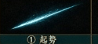 | 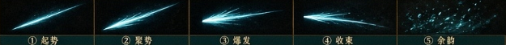 |


#### 2. 角色肢体动作序列 (Key Poses)
- **Pose 1（沉腰出引 · 1~4f）**：上身压低前倾 25°，重心后沉于后足，左手双指平伸在前如引线，右手挽剑于腰际。
- **Pose 2（踏破虚空 · 5~8f）**：后足猛力蹬地，脚下擦出黑色墨迹，整个人化作前冲俯冲姿态，空气被极度压缩。
- **Pose 3（极速贯穿 · 9~12f）**：纯运动学快速平移 0.9 身位。右手青锋如惊芒掣电完全水平笔直刺出，剑柄与手臂平齐，后足拉伸伸直。
- **Pose 4（滑步止刃 · 13~18f）**：前弓步踏定地面卸去前冲力，剑势前伸微震，衣袍长袖受强烈风压向后猛烈翻卷。
- **Pose 5（抽剑回鞘 · 19~26f）**：屈肘后抽利落回旋挽出半个剑花，身形拔正。

#### 3. 特效五阶段视觉序列
- **① 起势 (1~4f)**：剑尖前方 0.3 米处闪现一根极其笔直、极细的青白破空光线，向前延伸指示穿透轨迹，带细微针状高光。
- **② 聚势 (5~8f)**：剑尖周围青色剑气收缩聚敛成尖锐锥形风套，气流顺着剑身向后方呼啸喷射，墨色气浪沿足底向后翻滚。
- **③ 爆发 (9~12f)**：**【核心视觉爆发】** 沿刺击轴线轰然爆开一道巨大的锥状青白剑气光锥，光锥头部纯白极亮，两翼带水墨毛边与青碧色羽化边缘；击中敌人爆出刺目十字裂空星芒与穿透性墨汁飞溅。
- **④ 收束 (13~18f)**：巨大光锥瞬间收拢为一条狭长的流线型光带，伴随丝丝缕缕的青白剑气拖曳残留于穿刺路径上。
- **⑤ 余韵 (19~26f)**：贯穿路径上的细长剑芒化作无数细碎的青色光点星尘徐徐下落，地面留下一道焦黑墨痕擦线，0.4s 内淡出。

#### 4. 【剑意绽放·强化版】
- **贯穿位移增至 1.8 单位**（可直接穿透重型敌人与举盾敌人背后）。
- 光锥体积翻倍，刺出瞬间在贯穿路径留下持续 1.2 秒的「裂空剑痕」，产生连续 3 次墨痕爆碎二次伤害，附带全屏 6 帧极速时空慢放。

---

### 技能 2：回风舞 (Whirling Wind Dance) · 旋风范围
> **“以剑为轴旋风舞动，青气席卷周围，形成范围绞杀。”**

#### 1. 战斗属性与帧时序 (60 FPS)
- **招式定位**：360° 全方位身周解围、多段打击、清杂聚怪
- **键位建议**：`E` 键 或 `LB / L1`
- **帧数据**：
  - 前摇 (Startup)：**10 帧**（1~10f）
  - 判定 (Active)：**双段判定**（一段 11~13f，二段 16~19f）
  - 后摇 (Recovery)：**18 帧**（20~37f）
  - 判定盒范围：角色中心半径 **1.4 单位**（双向判定，打断身前身后敌人）
  - 命中停顿 (Hitstop)：每次命中 **2 帧**；总架势削减：**6 + 6 点**

#### 动态演进与序列全览
| 五阶段动态演进 (GIF) | 五阶段横向分解序列 (①起势 → ②聚势 → ③爆发 → ④收束 → ⑤余韵) |
|:---:|:---:|
| 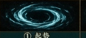 | 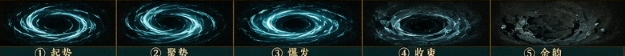 |

#### 2. 角色肢体动作序列 (Key Poses)
- **Pose 1（拧身抱剑 · 1~5f）**：以左足为支点，身体向右后方大幅度拧腰蓄劲，双臂抱剑于胸腹前，剑尖微斜朝下。
- **Pose 2（旋身起舞 · 6~10f）**：脚尖点地发力，身体沿垂直轴急速旋转 360°，腰间飘带与衣袍外张成圆盘状。
- **Pose 3（剑刃飞旋 · 11~19f）**：青锋剑横平在腰际急速平削两周半，手臂完全舒展，剑影连成一道银青色水平圆环。
- **Pose 4（反手按剑 · 20~28f）**：旋转骤停，角色侧步蹲身压低重心，反手将长剑斜插地面侧方减速刹住身形。
- **Pose 5（敛气起身 · 29~37f）**：顺势起立拔剑，衣摆徐徐下落。

#### 3. 特效五阶段视觉序列
- **① 起势 (1~5f)**：角色脚下地面浮现一道淡青色圆形水墨气环，自内向外微微泛开水纹波浪。
- **② 聚势 (6~10f)**：气环急速向中心旋转收拢，层层叠叠的青色风刃环绕角色小腿与腰部逆时针螺旋向上加速。
- **③ 爆发 (11~19f)**：**【核心视觉爆发】** 随着两周旋转，爆发出一道巨大的立体青白双层风暴剑环，向四周半径 1.4 米范围内急速横扫斩割；外圈卷起凌厉青风刃，内圈有厚重墨团随风拉丝。
- **④ 收束 (20~28f)**：外圈狂暴风暴向外扩散并减弱，风刃逐渐虚化拉长，化作细散的风丝。
- **⑤ 余韵 (29~37f)**：地面留下一个完整的圆形水墨风磨盘擦痕，空气中盘旋几道微弱的青风残息与飞旋墨滴，缓缓沉入地面。

#### 4. 【剑意绽放·强化版】
- 旋风化为青白双色「青鸾风暴」，半径扩大至 **2.2 单位**。
- 旋转期间产生向中心的**极强引力旋涡（牵引聚怪效果）**，将范围内的杂兵直接吸入中心连续绞杀 5 次，并在收招瞬间震飞周围敌人。

---

### 技能 3：一剑霜寒 (Frostbound Slash) · 蓄力霜线
> **“蓄力凝霜，一剑斩出，霜气化作锋利寒线延伸。”**

#### 1. 战斗属性与帧时序 (60 FPS)
- **招式定位**：高额削韧、远程破防贯穿、附带减速/冻结
- **键位建议**：长按 `I` 键 或 `RT / R2`（支持按住蓄力）
- **帧数据**：
  - 前摇 (Startup)：基础 **20 帧**（长按可额外蓄力至 **45 帧**）
  - 霸体窗口：蓄力第 12~20 帧具有韧体抗打断
  - 判定 (Active)：**6 帧**（21~26f），向前发射超远霜线（有效判定达 **2.6 单位**）
  - 后摇 (Recovery)：**28 帧**（27~54f）
  - 伤害系数：基础 **3.4×**（满蓄力达 **4.5×**）；架势削减：**35 点（必破格挡）**；Hitstop：**5 帧**

#### 动态演进与序列全览
| 五阶段动态演进 (GIF) | 五阶段横向分解序列 (①起势 → ②聚势 → ③爆发 → ④收束 → ⑤余韵) |
|:---:|:---:|
| 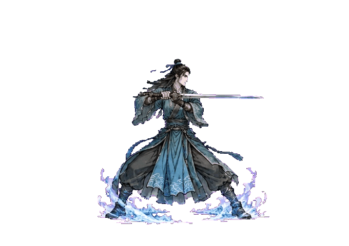 | 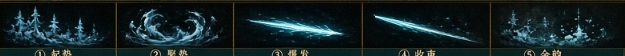 |

#### 2. 角色肢体动作序列 (Key Poses)
- **Pose 1（立地生根 · 1~8f）**：跨步沉肩成坚固马步，双手握剑举至肩侧，剑锋斜指苍穹，呼吸彻底屏息凝神。
- **Pose 2（霜华聚刃 · 9~20f）**：全身微颤承受极寒气劲注入，周身空气急速降温产生白雾，剑身由剑柄至剑尖逐寸被深蓝透明玄冰包裹。
- **Pose 3（雷霆挥斩 · 21~26f）**：双臂带着全身扭腰力道，全力向前挥出一道雷霆万钧的超大弧度水平横斩！
- **Pose 4（冰锋远送 · 27~38f）**：双手持剑前推滞空，剑刃平指前方，冰霜寒意顺着剑尖朝正前方地表疯狂撕裂传导。
- **Pose 5（震落残霜 · 39~54f）**：轻抖手腕震碎剑刃附着的薄冰，回身收剑入怀。

#### 3. 特效五阶段视觉序列
- **① 起势 (1~8f)**：角色脚下与身旁地表瞬间凝结出数支微小的冰晶树枝与霜花，笔直耸立于地面，带喀啦的结冰微响。
- **② 聚势 (9~20f)**：空气中白色的极寒冻气化作漩涡向剑身汇拢，剑刃发出刺骨深蓝与纯白交织的高光冰涡。
- **③ 爆发 (21~26f)**：**【核心视觉爆发】** 挥剑瞬间，一道极其锐利、平直狭长的青蓝冰光寒线贴地破空斩出！寒线所经之处，空间仿佛被寒刃整齐裁开，空气中产生折射畸变。
- **④ 收束 (27~38f)**：寒线击穿目标，地表沿线瞬间爆出齐平生长的锋利冰裂纹，寒光渐次由亮转暗。
- **⑤ 余韵 (39~54f)**：地面残留一条长达 3 米的厚重冰霜结晶带与袅袅升腾的寒白冰雾，存留 **2.0 秒**，踏入其中的敌人移动速度降低 40%。

#### 4. 【剑意绽放·强化版】
- 寒线所过之处，**拔地升起一整排高达 1.8 米的尖锐冰魄玄峰**！
- 命中敌人直接触发 **「绝对霜冻」** 状态，强制冰冻定身 1.5 秒，冰峰碎裂时造成大范围冰片爆破溅射伤害。

---

### 技能 4：御剑飞来 (Returning Blade / Sword Homing) · 追踪飞剑
> **“掷剑御气，飞剑锁定敌人，穿梭而来，自动追踪。”**

#### 1. 战斗属性与帧时序 (60 FPS)
- **招式定位**：中远距离牵制、自动锁定追踪、破除敌方远处抬手
- **键位建议**：`R` 键 或 `Y (长按) / 三角键`
- **帧数据**：
  - 前摇 (Startup)：**12 帧**（1~12f，含索敌瞄准窗）
  - 飞剑存活与追踪阶段：飞剑脱手飞行 **30~60 帧**（最大射程 5.0 单位，自动追踪最近敌人）
  - 命中判定：**单体穿透 1 次或命中爆发**
  - 角色后摇 (Recovery)：**16 帧**（角色脱手后第 13 帧即可移动，飞剑自主飞行）
  - 命中停顿 (Hitstop)：目标陷入 **3 帧** 定身硬直，飞剑滞空折返

#### 动态演进与序列全览
| 五阶段动态演进 (GIF) | 五阶段横向分解序列 (①起势 → ②聚势 → ③爆发 → ④收束 → ⑤余韵) |
|:---:|:---:|
| 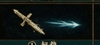 | 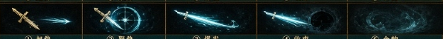 |


#### 2. 角色肢体动作序列 (Key Poses)
- **Pose 1（捏诀引剑 · 1~6f）**：角色右手并起剑指横于眼前，左手将佩剑凌空横托于胸前半米处，长剑失去重力悬浮自转。
- **Pose 2（神念锁定 · 7~12f）**：剑指猛然指向前方敌人，悬浮长剑剑尖瞬间对正目标。
- **Pose 3（掷剑脱手 · 13~18f）**：角色剑指急速前戳，长剑破空化作流光爆射而出，角色顺势后撤半步保持剑诀引道。
- **Pose 4（凌空回旋 · 飞剑飞行期）**：角色处于自由操作状态，右手剑诀仍有微光牵引。
- **Pose 5（剑指归鞘 · 飞剑返程）**：飞剑穿透敌人后在空中划过大弧线自旋飞回，角色单手接剑顺势挽花归位。

#### 3. 特效五阶段视觉序列
- **① 起势 (1~6f)**：悬空古剑周身泛出清亮青金色微芒，剑身周围出现微小旋转的气流涟漪。
- **② 聚势 (7~12f)**：长剑前方展开一道精致繁复的青色八卦星轨法阵/瞄准准星光轮，将目标稳稳套入锁定范围。
- **③ 爆发 (13~24f)**：**【核心视觉爆发】** 飞剑喷射出如同彗星般的极亮青光拖尾，撕裂空气化作一道青色流星激射向目标，飞行轨迹带弧形自修正粒子尾迹。
- **④ 收束 (25~35f)**：飞剑贯穿敌人身躯瞬间，在受击点爆开一轮水墨光晕与极小的空间引力扭曲黑洞，随后从敌人背后冲出。
- **⑤ 余韵 (36~48f)**：飞剑在空中悬空急刹，回旋调头，散落一圈微弱的青金星尘光环，随后化为一道青气钻回角色剑鞘。

#### 4. 【剑意绽放·强化版】
- 剑诀指处，**瞬间一化为三**（1 主剑 + 2 青光符文灵剑）！
- 三柄飞剑呈螺旋品字形盘旋扑向目标，先后穿透造成 3 重连击，并将敌人持续击退打断一切非霸体技能。

---

### 技能 5：以剑御气 (Kinetic Aegis / Qi Guard) · 招架护盾
> **“以剑引气，瞬间构筑护盾，格挡来袭，剑气反震。”**

#### 1. 战斗属性与帧时序 (60 FPS)
- **招式定位**：全向紧急招架、绝对防守、伤害反震击退
- **键位建议**：`Shift + F` 或 `LT + RT` 组合键
- **帧数据**：
  - 护盾构筑启动：**极快 3 帧**（1~3f 瞬间展开）
  - 护盾维持有效：**24 帧**（4~27f），按住可消耗内力延长维持
  - 护盾碎裂/收缩：**10 帧**（28~37f）
  - 特殊判定：在受击前 **1~8 帧** 展开护盾视为「完美御气」，触发 100% 绝对反震（反弹飞行道具，震碎近战敌人 28 点架势条并造成 1 秒大瘫痪）。

#### 动态演进与序列全览
| 五阶段动态演进 (GIF) | 五阶段横向分解序列 (①起势 → ②聚势 → ③爆发 → ④收束 → ⑤余韵) |
|:---:|:---:|
| 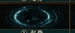 | 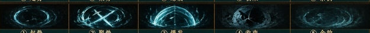 |

#### 2. 角色肢体动作序列 (Key Poses)
- **Pose 1（按剑立桩 · 1~3f）**：双足重重扎入地面成千斤坠扎实马步，右手竖持宝剑于胸前中轴线，左手掌心紧贴剑脊。
- **Pose 2（气运周天 · 4~27f）**：上身沉稳如岳，长剑微微震颤嗡鸣，气流受内力驱动从剑脊向全身奔涌扩散。
- **Pose 3（承受撞击 · 受击瞬时）**：身体向后微沉 2 厘米卸力，双臂刚猛坚挺，剑身激荡出反震光环。
- **Pose 4（震气反弹 · 28~32f）**：双手发力向前猛然一振，长剑横向推展，将蓄积的冲击气压向外掀翻。
- **Pose 5（气定神敛 · 33~37f）**：双手归拢，长剑收归身侧，呼出一口浊气。

#### 3. 特效五阶段视觉序列
- **① 起势 (1~3f)**：角色脚下瞬间炸开一道圆形青墨真气涟漪，自内向外快速贴地席卷。
- **② 聚势 (4~8f)**：两道青白剑气流光在角色周身高速盘旋，勾勒出一道半透明的半球形气罩轮廓，隐约可见内部浮动的八卦剑影。
- **③ 爆发 (9~27f / 受击点)**：**【核心视觉爆发】** 护盾完全致密激活，化为犹如青玉琉璃般无暇的半球形光幕护罩；受到外力打击瞬间，碰撞点爆开水墨裂纹与强烈的青白反震冲击波，将周围近身敌人强行推开！
- **④ 收束 (28~32f)**：护盾完成防御后如冰晶般碎裂成片片水墨流光与青白碎片，向四周飞溅溶解。
- **⑤ 余韵 (33~37f)**：地面向外散布出 3 圈缓缓衰减的环形气纹，在空气中留下微弱的青气残波。

#### 4. 【剑意绽放·强化版】
- 护盾化身「万仞剑罡」，半球护盾外表密布向外凸起的锋利青白剑芒。
- 护盾展开期间对贴近的近战敌人**每 0.2 秒造成割裂伤害**；若成功反弹攻击，则爆发出**全屏「绝剑气浪」**，将全场杂兵直接震倒在地。

---

### 技能 6：万剑归宗 (Ten Thousand Swords Fall) · 终极剑雨
> **“剑意攀至巅峰，万剑归宗，天降剑雨，覆盖战场。”**

#### 1. 战斗属性与帧时序 (60 FPS)
- **招式定位**：青锋剑派终极奥义、全屏清场、超高削韧与爆发斩杀
- **键位建议**：`T` 键 或 `LB + RB / L1 + R1`
- **释放条件**：**必须满 5 层剑意** 或 消耗 100% 怒气/终极槽
- **帧数据**：
  - 起手引剑 (Startup)：**30 帧**（含全屏水墨暗化黑屏与镜头推近特写）
  - 倾泻轰击 (Active)：持续 **90 帧**（1.5 秒内 36 柄青锋灵剑暴雨轰炸全场）
  - 收招恢复 (Recovery)：**30 帧**
  - 全程享受霸体与前 60 帧无敌保护；总伤害达 **12.0×**；强制削光场上一切普通护盾！

#### 动态演进与序列全览
| 五阶段动态演进 (GIF) | 五阶段横向分解序列 (①起势 → ②聚势 → ③爆发 → ④收束 → ⑤余韵) |
|:---:|:---:|
| 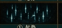 | 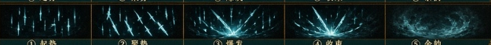 |


#### 2. 角色肢体动作序列 (Key Poses)
- **Pose 1（引剑指天 · 1~15f）**：角色收剑归鞘，单手成剑指笔直向天高举，整个人无风自动、双脚缓缓悬浮离地 15 厘米。
- **Pose 2（剑意共鸣 · 16~30f）**：仰首望天，衣袍长发全数向天激扬，背后虚空撕裂，万千剑芒在角色头顶天幕汇聚。
- **Pose 3（挥手落剑 · 31~40f）**：高举的剑指化为手掌，带着凌厉威严猛烈向下重重按压挥落！
- **Pose 4（剑雨倾天 · 41~120f）**：角色维持单手下压结印姿势，衣袂在暴烈风暴中狂烈翻飞，周身有密集下落的剑光倒影映照。
- **Pose 5（踏地归真 · 121~150f）**：剑雨停歇，角色轻盈落回地面，右足踏地，左手负于身后，闭目纳气。

#### 3. 特效五阶段视觉序列
- **① 起势 (1~15f)**：**【天地色变】** 场景背景全屏水墨暗化，天幕顶端撕开一道巨大的青白裂缝，数百柄晶莹剔透的青光灵剑虚影笔直悬垂于高空，如银河倒挂。
- **② 聚势 (16~30f)**：空中飞剑全部斜向 45° 倾斜对准地面战区，剑尖光芒暴涨，密集的蜂鸣啸声形成震撼人心的金属共鸣音场。
- **③ 爆发 (31~120f)**：**【核心视觉爆发】** 万千飞剑如狂暴暴雨般接二连三倾盆暴射而下！每一柄落地都在地面炸开一道青光剑芒柱、飞溅出水墨墨汁与冰碎气浪；地面被连续轰炸震颤，整屏剧烈上下抖动。
- **④ 收束 (121~135f)**：轰击渐歇，插满大地的数十柄半透明光剑同时发出极亮过载光芒，化作漫天青光剑气向外散射横扫全场。
- **⑤ 余韵 (136~150f)**：整片战场地面弥漫着一层厚重流转的青霜寒雾与深黑墨涡，残留的光剑碎片慢慢升华成蓝色光点消散于天地之间。

---

## 四、 战斗数据表与配置参数 (moves.csv 导入规格)

为将上述技能直接接入 `MoveDatabase` 引擎加载系统，以下为对应的标准 CSV 字段参数配置表：

```csv
id,school,name,startup,active,recovery,cancelStart,cancelEnd,cancelTo,damage,poise,hitstun,ifStart,ifEnd,chi,reach,boxW,boxH,lunge,hitstop,armorFrom,armorTo,active2Start,active2End,tags,notes
QF-1,qingfeng,破空刺,8,4,14,12,20,D,1.6,12,14,0,0,12,1.3,1.7,0.8,0.9,3,0,0,0,0,skill,瞬身破空穿透
QF-2,qingfeng,回风舞,10,9,18,0,0,,1.2,12,10,0,0,22,0,2.8,1.8,0,2,0,0,16,19,skill centerSelf,身周两段旋风
QF-3,qingfeng,一剑霜寒,20,6,28,0,0,,3.4,35,24,0,0,35,2.6,3.2,1.0,1.2,5,12,20,0,0,skill chargeable,蓄力霜线必破盾
QF-4,qingfeng,御剑飞来,12,30,16,13,28,D,1.8,16,18,0,0,28,4.5,1.2,0.8,0,3,0,0,0,0,skill homing,自动索敌追踪飞剑
QF-5,qingfeng,以剑御气,3,24,10,24,37,S,0.5,28,28,1,27,20,0,2.2,2.2,0,4,1,27,0,0,skill guard,全向晶壁绝对招架
QF-6,qingfeng,万剑归宗,30,90,30,0,0,,12.0,80,40,1,60,60,0,6.0,4.0,0,5,1,120,0,0,ultimate screen,终极天降剑雨奥义
```

---

## 五、 美术资产与动画管线落地指引

### 5.1 精灵图集与分层 (Sprite & Layering)
1. **角色本体层 (SortingLayer: Player)**
   - 维持 $680 \times 480\ \text{px}$ 画布，足底基准线 $Y = 437\ \text{px}$，PPU 严格为 **214**。
   - 动作切片保持重心稳定，刺击与旋转幅度充分舒展。
2. **前景剑气特效层 (SortingLayer: FX_Front)**
   - 放置正面破空光锥、回风舞前部风刃、半球护盾前半球、万剑归宗插地剑芒。
   - 混合模式：使用自定义 Shader（支持 `Additive + AlphaBlend` 双通道），核心高光不被背景压暗。
3. **后景水墨与地面层 (SortingLayer: FX_Back / GroundDecal)**
   - 放置回风舞后圈风痕、一剑霜寒地表冰霜裂纹与霜雾、护盾后半球、万剑归宗天幕垂剑。
   - 地面冰霜与墨痕需贴合地面碰撞盒（Collider2D），并附加 2 秒自动渐隐衰减脚本。

### 5.2 音效设计规范 (SFX Guidelines)
- **破空刺**：金属极速出鞘的尖锐“铮——”鸣，紧接一声沉闷的音爆穿透声（`thrust_airburst.wav`）。
- **回风舞**：清脆密集的剑刃切风呼啸，伴随水墨甩出如水珠抽打地面的“沙沙”风声（`whirlwind_slash.wav`）。
- **一剑霜寒**：极寒玄冰寸寸凝结的“喀喀”声，紧随一声刺耳撕裂布匹般的极速冰棱破空音（`frost_laser.wav`）。
- **御剑飞来**：灵巧古剑的高频轻微蜂鸣，破空飞出的彗星尖啸与命中穿胸的实肉闷响（`homing_sword.wav`）。
- **以剑御气**：洪钟大吕般的沉雄气劲聚拢声，受到撞击时发出洪亮坚实的金石交击声与琉璃微碎音（`aegis_reflect.wav`）。
- **万剑归宗**：天际远雷般的万剑共鸣长啸，漫天利刃如暴雨插落大地的连绵不断轰鸣重音（`swords_rain_ultimate.wav`）。

---

## 六、 总结与下阶段生产建议
本设计表严格还原了概念图中青锋剑派**“飘逸、凌厉、清冷”**的艺术风骨，建立了严谨的 **五阶段时序规律** 与 **剑意 0~5 阶绽放机制**。
下阶段可按此规范：
1. 更新 `New Tuanjie Project/Assets/Resources/FrameData/moves.csv`，录入 6 个技能的标准数值；
2. 配合 `agent-sprite-forge` 或专业帧动画工具绘制 6 套技能动作精灵切片与特效序列帧；
3. 在 `States.cs` 中挂载对应的技能状态机（`SkillState`），完成按键监听与剑意槽的结算流转。
